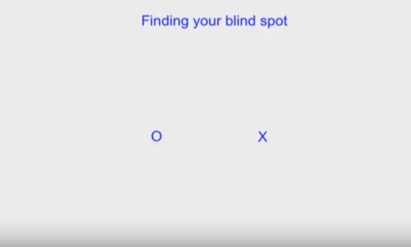
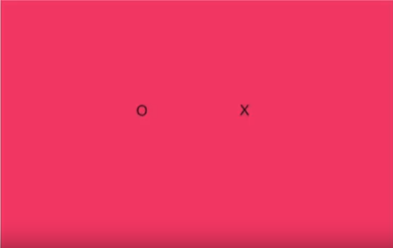
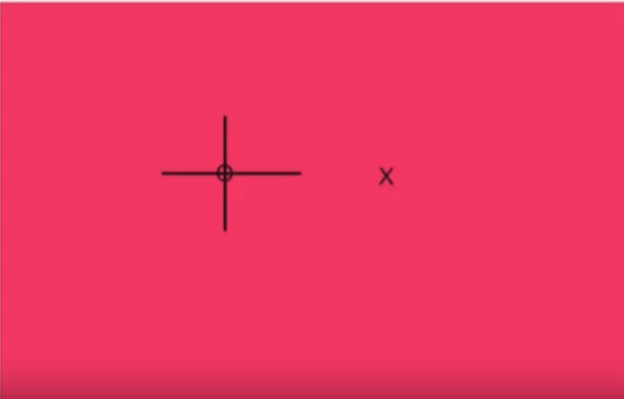
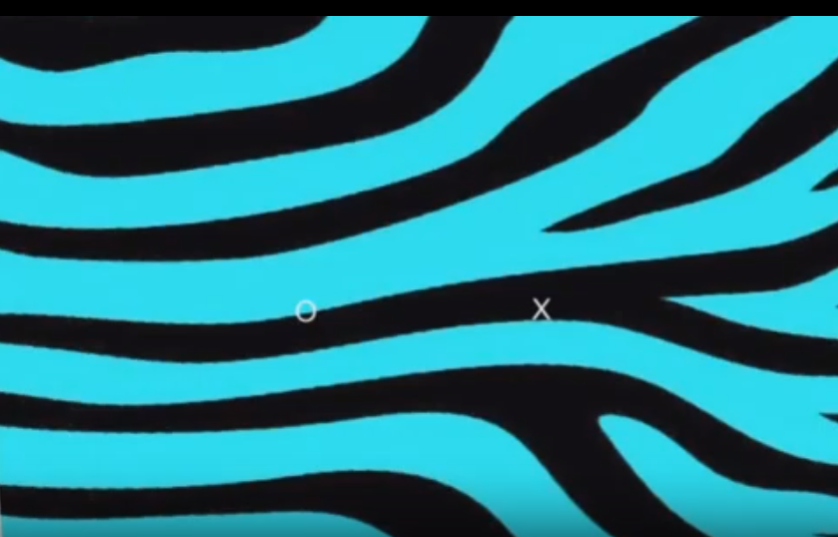
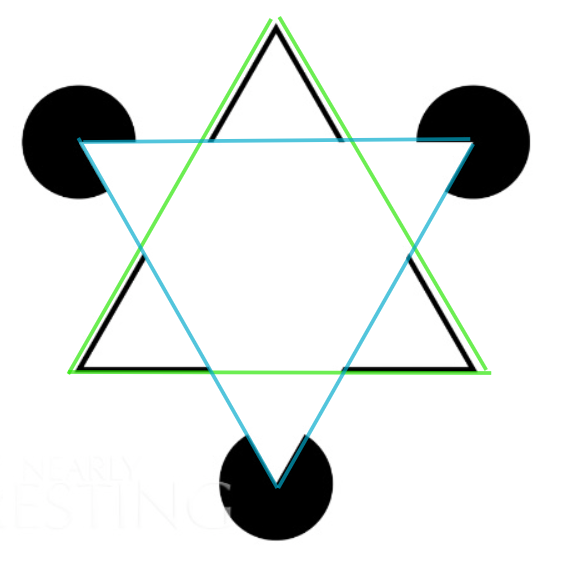
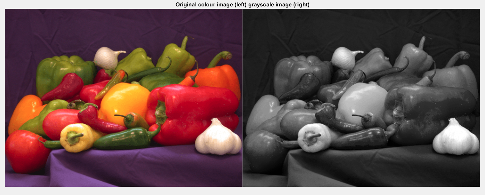
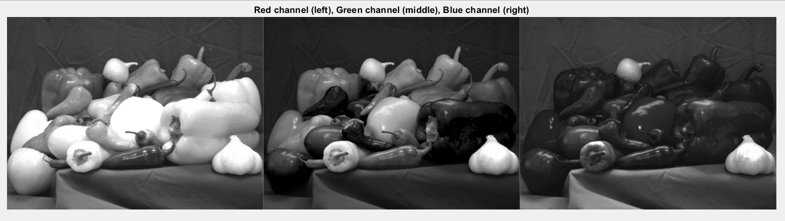
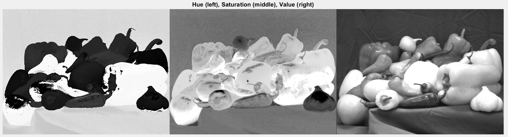
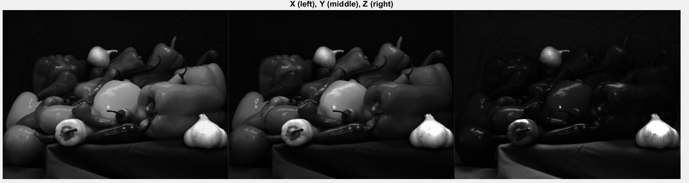

# Lab 2 - Colour and Perception
*_Gabriela Lee, version 1.1, 22 Jan 2026_*

This lab session has two parts. In the first part, you will experiment with various physiological and psychological phenomenons related to your vision, colour perception and how the brain makes up missing visual information.  In the second part, you will explore how colour images are separated into different colour spaces.

Clone this repo to your laptop and do all your work using your local copy.

---
## Part 1 - Seeing Colours and Shapes
---

### Task 1 - Find your blind spot

Play the video [here](http://www.ee.ic.ac.uk/pcheung/teaching/DE4_DVS/assets/blind_spot_test.mp4) and follow its instructions.  Make notes on what you found out.

<p align="center">  </p><BR>

**The circle disappears at one point where it meets with my blind spot, as I put my nose towards the cross direction and move closer to it.** 

<p align="center">  </p><BR>

**Even if the spot is blinking red, it stills disappears when it meets my blind spot.** 

<p align="center">  </p><BR>

<p align="center">  </p><BR>

**Our brain automatically tries to fill in the gap by looking at the regions around the blind spot. So when the spot meets the blind spot. Instead of a white spot missing, it will fill in the pink background so I only see a blank pink background (for image 1) and a pink background with a cross (for image 2), with the spot disappearing in both images.** 

<p align="center">  </p><BR>

**Even if the background has more complicated patterns, our brain can fill in. In the above image, when the spot meets my blind spot, I can still see the strip pattern background.** 

<video src="assets/blind_spot_test.mp4" width="480" height="360" controls></video>

### Task 2 - Ishihara Colour Test

The Ishihara test is a colour vision test designed to detect deficiencies in the long and medium cones.  It consists of one set of pictures containing colour dots with a number embedded within.  Your goal is to identify the number you see in each of them.

You can start the test [here](Ishihara_test.md).

**I identified the correct number in all the test. The Ishihara test is a color vision test for detection of red-green colour deficiencies. In addition to the plates provided in Ishihara_test_md, there are more test designs types. 
Demonstration plates: Designed to be visible by all subjects, whether normal or color vision deficient**
**Transformation plates: Individuals with colour vision deficiency should see a different figure from those with normal colour vision
Vanishing plates: Only individuals with normal colour vision can recognise the figure
Hidden digit plates: Only individuals with color vision deficiency could recognise the figure**

**Colour blindness causes individuals struggle to see/ distinguish colours. It can be caused by genetic condition (congenital red-green colour blindness) or variation in the functionality of one or more of the three classes of cone cells in the retina. Red-green colour blindness is more common in males because the opsin genes responsible are located on the X chromosome.** 

### Task 3 - Reverse colour

1. Get hold of a white sheet of paper and hold it up next to your screen.  
2. Now stare at white dot in the centre of the American flag in funny colours shown below for 10 seconds or more.  
3. Suddenly switch your gaze to the white sheet of paper.

You should see the American flag in the normal red, white and blue colours.

<p align="center">  </p><BR>

<p align="center">  </p><BR>

Explain the reasons why this happens.

**This is known as the Afterimage Effect. By staring at the American flag in green colors for 10 seconds, the cone cells responding to these colours are constantly active. Overtime, these responses become weaker known as sensory fatigue.** 

**Colour vision works using opponent pairs in the brain: Green <-> Red, Yellow <-> Blue, Black <-> White. The origianl image is in green, yellow and black colours. The green area strongly stimulates green-sensitive cones, whilst yellow stimulates red & green cones. These cones become fatigue and their opponent cones are not. So when you look at the white sheet of paper that sends equal light to all cones, green cones will send less signals so brain interprets this as red, the red & green cones from the original yellow colour becomes fatigue, causing the brain to interpret it as blue. Area that were black have no fatigue, so the white appears.** 

Why does the American flag remain visible on the white background? 
**The chemical processes in cone cells take time to rest, fatigue fades gradually over a few secounds. So the American flag remains visible because the pattern of cone fatigue created while staring at the image stays on the retina, an afterimage is formed.** 


### Task 4 - Troxler's Fading

Here is another example to demonstrate the Opponent Process Theory.  Play the video [here](http://www.ee.ic.ac.uk/pcheung/teaching/DE4_DVS/assets/purple_dots.mp4) and follow the instruction.  

<video src="assets/purple_dots.mp4" width="640" height="320" controls></video>

**When I follow the dot around, I can see the dots are disappearing for a split second. When I focus on the plus sign, the gap is replaced by an afterimage with the opposite colour of pink - green. When I focus on the plus sign for over 20 seconds, all the dots disppear by the green dot.** 

Write down in your logbook the reason of what you see.  Read the wikipedia page on Troxler's fading [here](https://en.wikipedia.org/wiki/Troxler%27s_fading), which explains this phenomenon and relates it to the human visual system.

**When we look at the plus sign at the center, since we are fixating on something, it gives unvarying stimulation so the cells gradually ignore the signals, causing all the dots to disappear. Since the original dots are in bright pink, the cone cells to detect pink become fatigure, and our brain uses the opponent colour (green) to compensate for it.**

[Here](http://www.ee.ic.ac.uk/pcheung/teaching/DE4_DVS/assets/blue_circle.mp4) is another experiment to test the phenomenon.  Play the video and comment.

**When I stare at the red dot at the center, the blue ring around it disappears.** 

<video src="assets/blue_circle.mp4" width="640" height="320" controls></video>

### Task 5 - Brain sees what it expects

Our brain interprets what we see based on our expectation.  Here is an example.  The image below shows two tables with blue and red tops.  Which is the longer table?  Measure this on the screen with a ruler (or just marking on a sheet of paper).  Write in your logbook the reason for this phenomenon.


<p align="center">  </p><BR>

**Seemly, the blue table is the longer table. When I measure both tables on the screen, both tables are the same length. This occurs because our brain uses learned expectations about 3D space. The blue table is drawn to appear to be closer, whilst the red table seems further away. So the brain assumes that objects farther away must be larger to produce the same retinal image size.** 

Here is another example, where our brain see what it expects instead of what hits the retina.  Which square is darker, the one labelled A or B?  Why?

<p align="center">  </p><BR>

To verify the result, you need to use an image editor app and cut out one square and put it next to the other for comparison.

<p align="center">  </p><BR>
<p align="center">  </p><BR>

**Square A seems darker than sqaure B. But upon verification, both squares are the same colour. This illusion is known as the Checker Shadow Illusion. It appears because of our brain assumes that the shadow of the cylinder covers square B which makes it darker, whilst square A is fully illuminated. So the original colour of square B must be lighter for compensation. This shows that the brain doesn't simply perceive lightness but the contextual cues as well.** 

### Task 6 - The Grid Illusion

When you stare at the centre of the grid below, you should see black dots at the intersection appearing and disappearing.  You can read more about it [here](https://en.wikipedia.org/wiki/Grid_illusion).

<p align="center">  </p><BR>

**The grid shown is the Scintillating grid illusion. Dark dots seem to appear and disappear rapidly at random intersections. If I look directly on a single intersection, these dark dots don't appear.**  

### Task 7 - Cafe Wall Illusion

Do you see the following brick wall layers are parallel?  Then measure the boundaries of each layer with a ruler.

<p align="center">  </p><BR>

**The lines don't seem parallel but slopey, but when measuring with a ruler, the boundaries are indeed parallel.** 

This phenomenon is not observed for the following image when the contrast is lower.

<p align="center">  </p><BR>

You can find out more about this [here](https://en.wikipedia.org/wiki/Café_wall_illusion).

**This illusion is known as the Café wall illusion. The alternating black and whilte tiles and offset rows causes a strong difference in luminance between adjacent tiles. This creates a strong response in edge-detecting neurons. Neurons in the retina and primary visual cortex respond to local contrast and edges, instead of the whole patterns. The bright-dark edges create asymmetric activation, causing the grey lines to pull visually toward darker tiles on one side and lighter tiles on the other. So the brain misjudges the position of the grey lines, with all the local signals being slightly misaligned, the lines seem titled.** 

**The illusion disappears when contrast is lower because there's smaller luminance differences so the responses in edge-detecting neurons become weaker. The positional distortion has less effect and the brain relies more on the overall geometry.** 

### Task 8 - the Silhouette Illusion

[Here](http://www.ee.ic.ac.uk/pcheung/teaching/DE4_DVS/assets/dancer.m4v) is video of a spinning dancer.  Play the video and looking at it for some time, you may find that the dance would suddenly spinning in the opposite direction.  The explanation for this phenomenon can be found [here](https://en.wikipedia.org/wiki/Spinning_dancer).

**I can't see the dancer changing spinning direction, but only spinning in the anti-clockwise direction.** 

<video src="assets/dancer.m4v" width="640" height="640" controls></video>

### Task 9 - the Incomplete Triangles

The last task in part 1 is to consider the picture below.  How many triangles are in the picture?  What conclusions can you draw from this observation?

<p align="center">  </p><BR>

**I can see 2 big triangles from the picture, with one white borderless triangle pointing upwards and a triangle with black outline pointing downwards. However, the picture doesn't actually construct these triangles. In addition, the white borderless triangle seems brighter than the background. The conclusion is that we can perceive edges without an edge being drawn out, showing that our brains are actively constructing what we see. We fill in missing information automatically.**

<p align="center">  </p><BR>


---
## Part 2 - Exploring Colours in Matlab
---

In the second part of Lab 2, you will import a full colour image from a file and map this to various colour spaces.  You will then examine what each of the components (or channels) in these colour spaces.  

### Task 10 - Convert RGB image to Grayscale

Although full colour images contain more information than grayscale images, we often find that they contain too much information and require unnecessary calculations. Instead it may be better to turn the colour image into a grayscale image before we perform various processing such as feature extraction.

Run Matlab and navigate the current working folder to the matlab folder of Lab 2.  (You do this with the icon  at the top left of the Matlab window).  The photo **peppers.png** is already stored in this folder.  Find out information about this photo file with **imfinfo( )**:
```
imfinfo('peppers.png')
```
Matlab will return some information about this image file such as its size and the format of the image data.

Read the image data into the array RGB and display it:(*_Remember to add the semicolon at the end of the imread statement to suppress printing of all the image data read._*)
```
RGB = imread('peppers.png');  
imshow(RGB)
```
In this task, we will convert the RGB image into a grayscale image. The formula to perform this mapping is:
```
    I = 0.299 * R + 0.587 * G + 0.114 * B 
```

In matrix form, it is:

<p align="center">  </p>

The function **rgb2gray( )** converts RGB values to grayscale values by forming a weighted sum of the R, G, and B components according to the equation above. 

```
I = rgb2gray(RGB);
figure              % start a new figure window
imshow(I)
```

It would easier to compare the two photo if we display them side-by-side with **imshowpair( )** and add a title. This can be done with:

```
imshowpair(RGB, I, 'montage')
title('Original colour image (left) grayscale image (right)');
```

**Below is how the original colour and grayscale images displayed in Matlab:**

<p align="center">  </p>

### Task 11 - Splitting an RGB image into separate channels

Split the image into its red, green, and blue channels with **imsplit( )**. Then display all three images side-by-side as a montage.

```
[R,G,B] = imsplit(RGB);
montage({R, G, B},'Size',[1 3])
```

Note the following: Red peppers have a signal predominantly in the red channel. Yellow and green peppers have a signal in both the red and green channels. White objects, such as the garlic in the foreground, have a strong signal in all three channels.

Examine the information shown on the right side of the Matlab window. Explain their dimensions and data type of the variables RGB, R, G, B and I.

**Below shows how the image looks like under the three channels:** 
<p align="center">  </p>

**Each channel shows how much of that colour is present at each pixel. That's why red peppers are bright in the red channel and dark in the green and blue channels. Since white object such as garlic would reflect all the colours, so garlic is bright in all three channels. 
The variables RGB, R, G, B, and I are integers with value from 0 to 255. RGB have the dimension of 584x777x3, whilst the dimension of R, G, B, and I are: 584 x 777. This is because RGB has 584 rows (height) and 777 columns (width), and 3 colour channels. The R, G, B matrices contain the intensity values for R, G, B channel only whilst the I has the single brightness value computed from R, G and B in each pixel for grayscale image.**  

### Task 12 - Map RGB image to HSV space and into separate channels

Convert the RGB image to the HSV colorspace by using the **rgb2hsv( )** function.  Then split it into H, S and V components.

```
HSV = rgb2hsv(RGB);
[HSV] = imsplit(HSV);
montage({H,S,V}, 'Size', [1 3]))
```

**Below shows how the image looks like in HSV space:** 
<p align="center">  </p>

**The hue represents the type of colour with the values wrapping around a circle. Therefore, in the image, peppers with similar colour have similar gray levels whilst other colours form other clusters. The saturation distinguish vivid colours and grayish colours, which is why all the peppers appear bright with high saturation, and the garlic appear dark. The value channel represents intensity of brightness and looks more similar to a grayscale image. The white garlic appears very bright whilst the dark peppers appear dark.** 

**The H, S, V matrices are stored as double with the range [0, 1]. This is because the RGB-to-HSV conversion invovles division and normalisation, producing fractional values. It is computed per pixel using ratios between that pixel's R, G, and B values, rather than mapping intensities to a fixed global scale like 0-255.** 

### Task 13 - Map RGB image to XYZ space

Finally, map the RGB image to the XYZ colour space with the **rgb2xyz( )** function.  Examine what you get and comment.

**Below shows how the image looks like in XYZ space:** 
<p align="center">  </p>

**The CIE XYZ space is designed to model human visual perception by normalising RGB values. The X channel represents red and green sensitivity, which is why the yellow and red peppers stand out. The Y channel represents luminance and Z roughly corresponds to blue sensitivity. All the XYZ values are double, in the range [0 , 1].**
