# Lab 3 Logbook - Intensity Transformation and Spatial Filtering
*_Gabriela Lee, version 1.2, 7 Feb 2026_*

This lab session aims to demonstrate the topics covered in Lectures 4 and 5 using Matlab.  The choice of Matlab is driven by their excellent set of functions included in the Image Processing Toolbox.  As Design Engineers, it is more important for you to understand the principles and then use ready-made libraries to perform processing on visual data, than to write low-level code to implement the algorithms.

Clone this repo to your laptop and do all your work using your local copy.  Remember to keep a log of your work in your repo.

## Task 1 - Contrast enhancement with function imadjust

### Importing an image

Check what is on image file *_breastXray.tif_* stored in the assets folder and read the image data into the matrix *_f_*, and display it:

```
clear all
imfinfo('assets/breastXray.tif')
f = imread('assets/breastXray.tif');
imshow(f)
```
>Note: Use the semicolon to suppress output. Otherwise, all pixel values will be stream to your display and will take a long time. Use CTRL-C to interrupt.

Check the dimension of _f_ on the right window pane of Matlab. Examine the image data stored:

```
f(3,10)             % print the intensity of pixel(3,10)
imshow(f(1:241,:))  % display only top half of the image
```
Indices of 2D matrix in Matlab is of the format: (row, column).  You can use *_':'_* to *_slice_* the data.  *_(1:241 , : )_* means only rows 1 to 241 and all columns are used.  The default is the entire matrix.

To find the maximum and minimum intensity values of the image, do this:
```
[fmin, fmax] = bounds(f(:))
```
*_bounds_* returns the maximum and minimum values in the entire image f. The index ( : ) means every columns. If this is not specified, Matlab will return the max and min values for each column as 2 row vectors.

Since the data type for _f_ is _uint8_, the full intensity range is [0 255].  Is the intensity of _f_ close to the full range?

The minimum intensity value (fmin) is 21 and the maximum intensity value (fmax) is 255. 


**Test yourself**: Display the right half of the image. Capture it for your logbook.

***Since the image dimension is 571 x 482, so I need tos slice it to only display 241 - 482 columns to display only the right side of the image.*** 
```
imshow(f(:,241:482))  % display only right side of the image
```
<p align="center"> 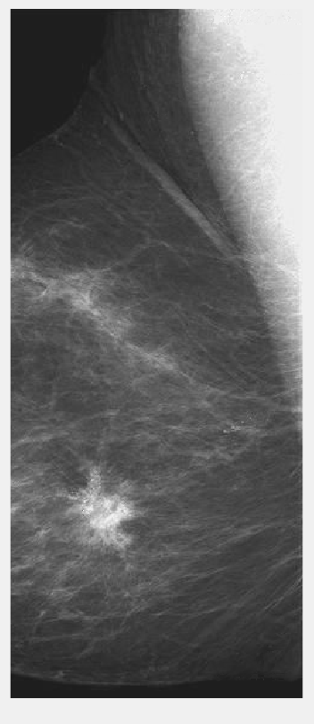 </p><BR>


### Negative image

To compute the negative image and display both the original and the negative image side-by-side, do this:

```
g1 = imadjust(f, [0 1], [1 0])
figure              % open a new figure window
montage({f, g1})
```

<p align="center"> 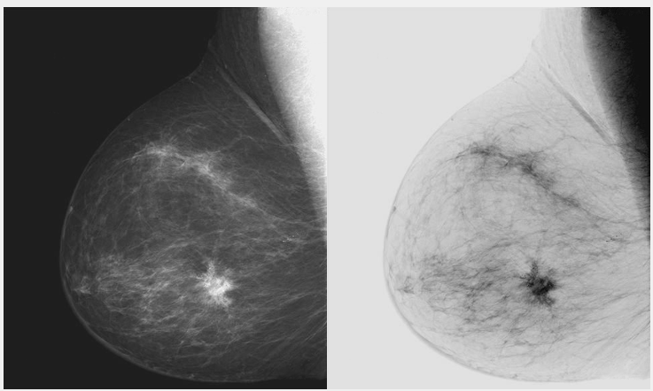 </p><BR>

>The 2nd parameter of _imadjust_ is in the form of [low_in high_in], where the values are between 0 and 1.  [0 1] means that the input image is to be adjusted to within 1% of the bottom and top pixel values.  

>The 3rd parameter is also in the form of [low_out high_out]. It specifies how the input range is mapped to output range.  So, [1 0] means that the lowest pixel intensity of the input is now mapped to highest pixel intensity at the output and vice versa.  This of course means that all intensities are inverted, producing the negative image.  The same thing can be achieved using _function imcomplement_.


### Gamma correction

Try this:
```
g2 = imadjust(f, [0.5 0.75], [0 1]);
g3 = imadjust(f, [ ], [ ], 2);
figure
montage({g2,g3})
```
_g2_ has the gray scale range between 0.5 and 0.75 mapped to the full range.

_g3_ uses gamma correct with gamma = 2.0 as shown in the diagram below. [ ] is the same as [0 1] by default.

<p align="center">  </p><BR>

This produces a result similar to that of g2 by compressing the low end and expanding the high end of the gray scale.  It however, unlike g2,  retains more of the details because the intensity now covers the entire gray scale range.  _function montage_ stitches together images in the list specified within { }.

<p align="center"> 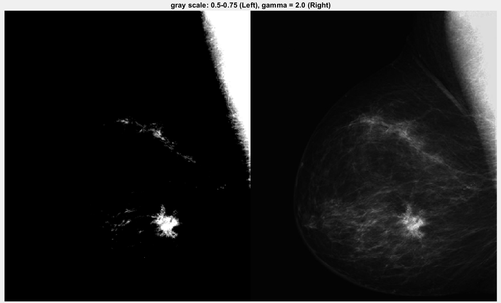 </p><BR>

***g2 is stretching the contrast so that you can identify the lump easier. For any pixels <= 0.5, it maps them to 0 (black), whilst for any pixels >= 0.75, it maps them to 1 (white), for any pixels between 0.5-0.75, it stretches them linearly to fill [0, 1]. However, it loses the details in dark and birght regions.***

***g3 uses gamma correction which is nonlinear 𝑠 = 𝑐𝑟^ γ , the gamma is 2.0, causing the image to be darker. With the gamma equation, the low intensity value gradually compresses and the high intensity gradually expands. Gamma correction ensures all intensities remain represented.***

## Task 2: Contrast-stretching transformation

Instead of using the *_imadjust function_*, we will apply the constrast stretching transformation function in Lecture 4 slide 4 to improve the contrast of another X-ray image.  The transformation function is as shown here:

<p align="center">  </p><BR>

The equation of this function is:

$$s = T(r) = {1 \over 1 + (k/r)^E}$$

where *_k_* is often set to the average intensity level and E determines steepness of the function. Note that the 

```
clear all       % clear all variables
close all       % close all figure windows
f = imread('assets/bonescan-front.tif');
r = double(f);  % uint8 to double conversion
k = mean2(r);   % find mean intensity of image
E = 0.9;
s = 1 ./ (1.0 + (k ./ (r + eps)) .^ E);
g = uint8(255*s);
imshowpair(f, g, "montage")
```
_eps_ is a special Matlab constant which has the smallest value possible for a double precision floating point number on your computer.  Adding this to _r_ is necessary to avoid division by 0.

Matlab function *_mean2_* computes the average value of a 2-D matrix.  Since the equation operates on floating numbers, we need to convert the image intensity, which is of type _uint8_ to type _double_ and store it in _r_.  We then compute the contrast stretched image by applying the stretch function element-by-element, and store the result in _s_.  

The intensity values of s are normalized to the range of [0.0 1.0] and is in type _double_.  Finally we scale this back to the range [0 255] and covert back to _uint8_.

Discuss the results with your classmates and record your observations in your logbook.

***We observed that the original image has a low global constrast and most of the pixels are clustered in a limited gray-level range. After the transformation, the bones such as the skull, ribs, and joints in the image have now been became more prominent and easier to separated from soft tissue. However, the low-intensity regions are also amplified, causing the image to look grainier.***  
<p align="center"> 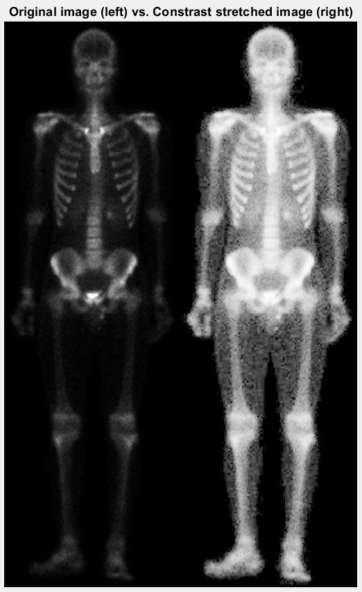 </p><BR>

***The constrast stretching transformation redistributes the light intensity of the original image (r) around the mean intensity of image (k). When r > k, k/r < 1, so the output s increases. It stretches the intensities above k, making brighter structures more distinguishable. When r < k, k/r > 1, so the output s decreases, compressing the intensities below k and making dark pixels darker. The value E determines the steepness of the curve hence deciding the strength of compression and expansion. Larger E controls how strongly the transformation separates intensities around the mean level, and it can be any positive number. So E = 0.9 has a moderate enhancement.*** 


## Task 3: Contrast Enhancement using Histogram

### PLotting the histogram of an image

Matlab has a built-in function _imhist_ to compute the histogram of an image and plot it.  Try this:

```
clear all       % clear all variable in workspace
close all       % close all figure windows
f=imread('assets/pollen.tif');
imshow(f)
figure          % open a new figure window
imhist(f);      % calculate and plot the histogram
```

<p align="center"> 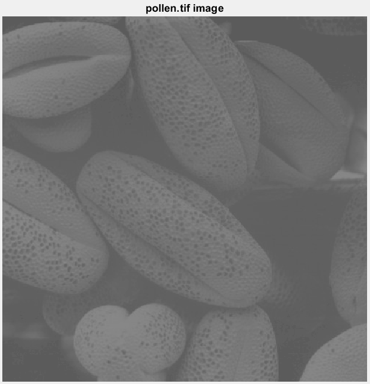 </p><BR>
<p align="center"> 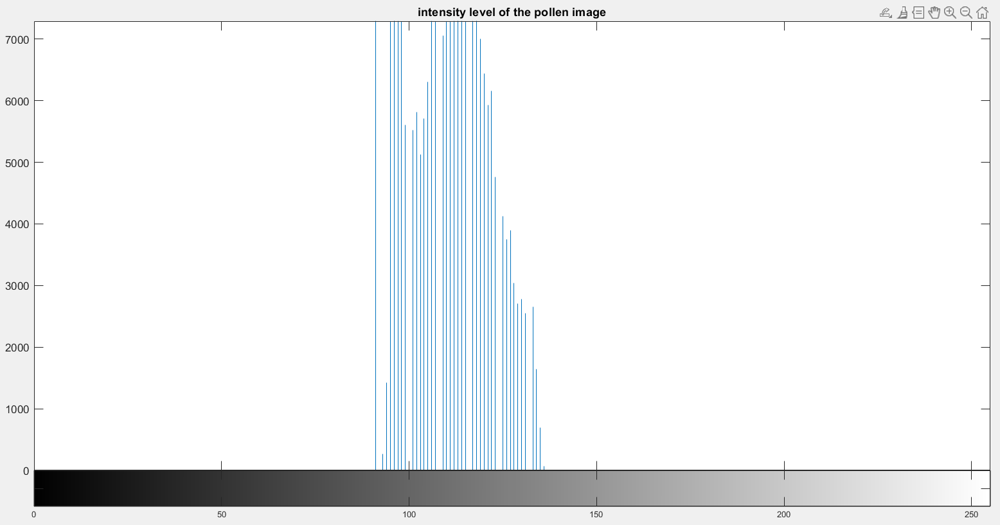 </p><BR>

It is clear that the intesity level of this image is very much squashed up between 70 to 140 in the range [0 255].  One attempt is to stretch the intensity between 0.3 and 0.55 of full scale (i.e. 255) with the built-in function _imadjust_ from the previous tasks. Try this:

```
close all
g=imadjust(f,[0.3 0.55]);
montage({f, g})     % display list of images side-by-side
figure
imhist(g);
```
The histogram of the adjusted image is more spread out.  It is definitely an improvement but it is still not a good image.


***Before the transformation, the image has low contrast, with the overall tone being grey and blurry. The textures on the poll grains are difficult to identify and the histogram is squashed between 70-140, underutilising the full range of [0 255]. After the transformation, the image contrast improves, it looks clearer although still a bit blurry, the dark spots on the pollen grains and the shadows between them becomes a lot deeper. It appears more like a 3D image. The histogram is now wider and stretched between 58-234, covering near the full range. However, the histogram is still not uniform, suggesting that the constrat is improved but not optimal.***

<p align="center"> 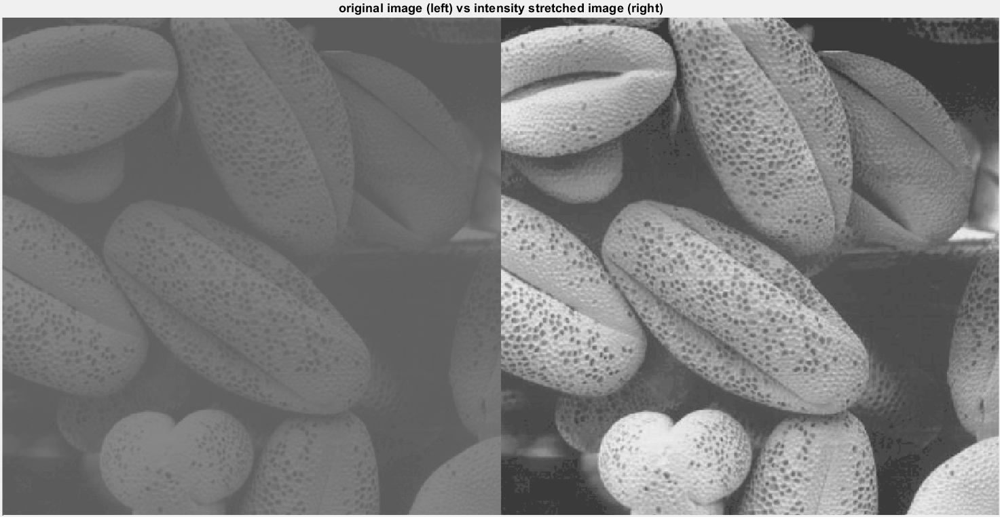 </p><BR>
<p align="center"> 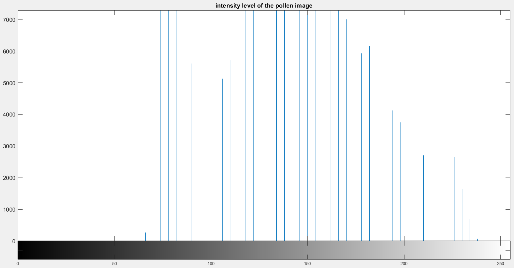 </p><BR>


### Histogram, PDF and CDF

Probability distribution function (PDF) is simply a normalised histogram.  Cumulative distribution function (CDF) is the integration of cumulative sum of the PDF.  Both PDF and CDF can be obtained as below.  Note that _numel_ returns the total number of elements in the matrix.  The following code computs the PDF and CDF for the adjusted image _g_, and plot them side-by-side in a single figure.  The function _subplot(m, n, p)_ specifies which subplot is to be used.

```
g_pdf = imhist(g) ./ numel(g);  % compute PDF
g_cdf = cumsum(g_pdf);          % compute CDF
close all                       % close all figure windows
imshow(g);
subplot(1,2,1)                  % plot 1 in a 1x2 subplot
plot(g_pdf)
subplot(1,2,2)                  % plot 2 in a 1x2 subplot
plot(g_cdf)
```

***The PDF divide the number of pixels at each intensity level (imhist(g))by the total number of pixels in the image (numel(g)). The y-axis shows the probability that a randomly selected pixel will have that specific intensity. According to the PDF, there is a high probability for the pixel to be at 59 (~7%), 75 (~4.5%), and 79 (7.6%) intensity level, whilst the remaining of the plot to be more "normally distributed". This is because the surface and shadow of the pollen grains in the original image have very similar grey values, causing the values to all mapped to a single "bin" during stretching.*** 

***The CDF informs the probability that a pixel has an intensity less than or equal to a certain intensity level. A perfectly straght diagonal line would represent an image with perfectly uniform contrast. The plot has a flat horizontal line between 0 - 50, indicating there are no pixels at those intensity levels. This shows the image contains no dark shadows in that specific range, and the darkest region starts around intensity 55. The gradient between 55 - 100 is very steep due to the spikes in the PDF plot (in 59, 79). Whilst between 100 - 200, it has a relatively uniform gradient, the image pixels' intensities are uniformly distributed. At 200 and above, the gradient levels off and becomes smoother as it approaches to 1. There are very few pixels at very bright levels.*** 

<p align="center"> 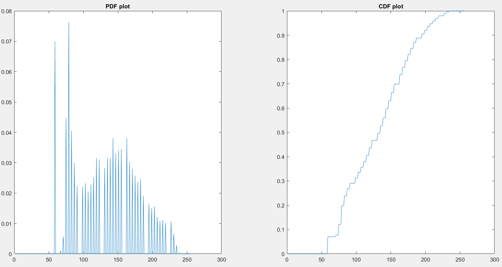 </p><BR>


### Histogram Equalization

To perform histogram equalization, the CDF is used as the intensity transformation function.  The CDF plot made earlier is bare and axes are not labelled nor scaled.  The following code replot the CDF and make it looks pretty.  It is also an opportunity to demonstrate some of Matlab's plotting capabilities.

```
x = linspace(0, 1, 256);    % x has 256 values equally spaced
                            %  .... between 0 and 1
figure
plot(x, g_cdf)
axis([0 1 0 1])             % graph x and y range is 0 to 1
set(gca, 'xtick', 0:0.2:1)  % x tick marks are in steps of 0.2
set(gca, 'ytick', 0:0.2:1)
xlabel('Input intensity values', 'fontsize', 9)
ylabel('Output intensity values', 'fontsize', 9)
title('Transformation function', 'fontsize', 12)
```

***The CDF now shows how an input intensity (x-axis) maps to an output intensity (y-axis). Both the x-axist and y-axis values have now been normalised in the range of 0 - 1. From the plot, there are no pixels between 0 - 0.21, and the y-axis ranges more between 0.22 - 0.4 reflecting the steep gradient between 55 - 100 in the original CDF plot.***
<p align="center"> 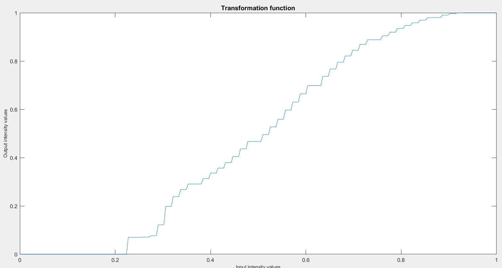 </p><BR>


The Matlab function _histeq_ computes the CDF of an image, and use this as the intensity transformation function to flatten the histogram.  The following code will perform this function and provide plots of all three images and their histogram.

```
h = histeq(g,256);              % histogram equalize g
close all
montage({f, g, h})
figure;
subplot(1,3,1); imhist(f);
subplot(1,3,2); imhist(g);
subplot(1,3,3); imhist(h);
```

***The histogram equalised image is now a lot brighter and very clear with no blurrness. The dark spots and texture of the pollens are more pronounced due to the high contrast. Dark and bright regions are clearly separated. The histogram of the equalised image distributes across almost the entire intensity range, with the distribution being closer to uniform. Compared to the original and constrast stretched histograms, the equalised histogram has a much broader and uniform range.*** 
<p align="center"> 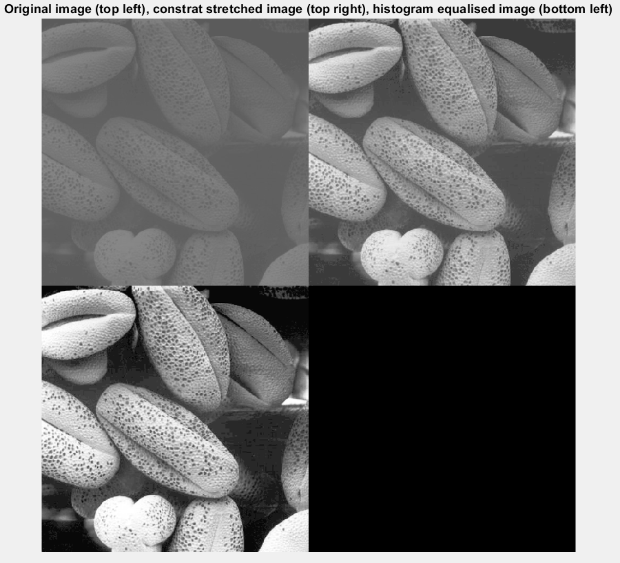 </p><BR>
<p align="center"> 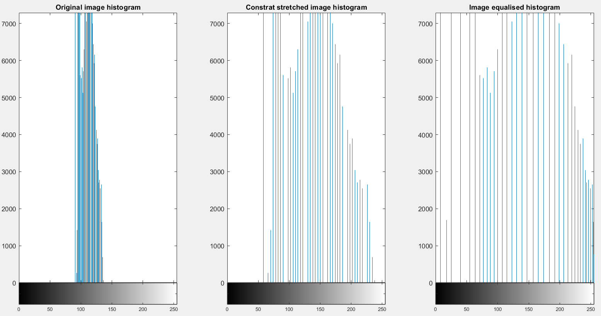 </p><BR>


## Task 4 - Noise reduction with lowpass filter

In Lecture 5, we consider a variety of special filter kernels, including: Averaging (box), Gaussian, Laplacian and Sobel. In this task, you will explore the effect of each of this on an image.  In this task, you will explore two type of smoothing filter - the moveing average (box) filter and the Gaussian filter.

Before filtering operation can be performed, we need to define our filter kernel.  Matlab provides a function called _fspecial_, which returns different types of filter kernels.  The table below shows the types of kernels that can generated.

<p align="center">  </p><BR>

Import an X-ray image of a printed circuit board.

```
clear all
close all
f = imread('assets/noisyPCB.jpg');
imshow(f)
```

<p align="center"> 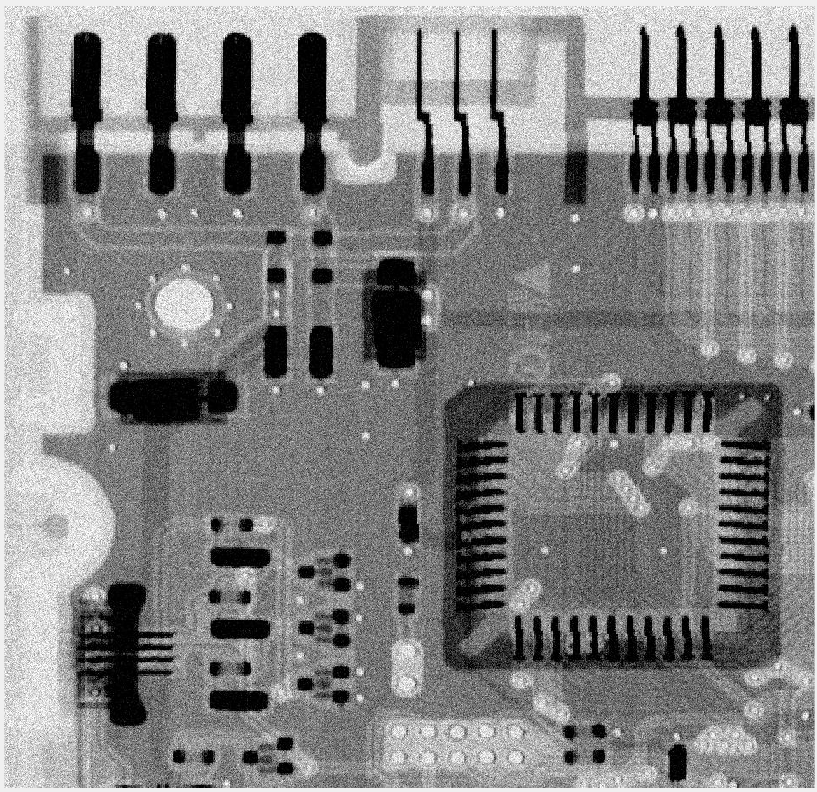 </p><BR>

The image is littered with noise which is clearly visible.  We shall attempt to reduce the noise by using Box and the Gaussian filters.

Use the function _fspecial_ to produce a 9x9 averaging filter kernel _ and a 7 x 7 Gaussian kernel with sigma = 0.5  as shown below:

```
w_box = fspecial('average', [9 9])
w_gauss = fspecial('Gaussian', [7 7], 1.0)
```
Note that the coefficients are scaled in such a way that they sum to 1.

Now, apply the filter to the image with:
```
g_box = imfilter(f, w_box, 0);
g_gauss = imfilter(f, w_gauss, 0);
figure
montage({f, g_box, g_gauss})
```
Comment on the results.  

***The image with the averaging filter kernel has a noticeable blurring with reduced noise. The edges of components become smoother and the overall image appears softer. This is because the averaging filter is a lowpass filter that replaces each pixel's value with the average of its neighbors to dilute sudden changes. This is also why the edges of the components and fine textures become blurred with noise reduced. The 9 x 9 kernel distributes equal weightage for the center pixel and the pixels at the far croners, blurring the noise across a large area.*** 

***The image with the Gaussian kernel is a lot clearer than the image with the averaging filter. The component edges remain sharp with details retained, whilst noise is reduced and the overall appearance is smoother than the original image. The Gaussian filter gives more weight to central pixels and less to peripheral ones, which helps preserve edges better than the uniform averaging.*** 

***The image with the Gaussian kernel*** 
<p align="center"> 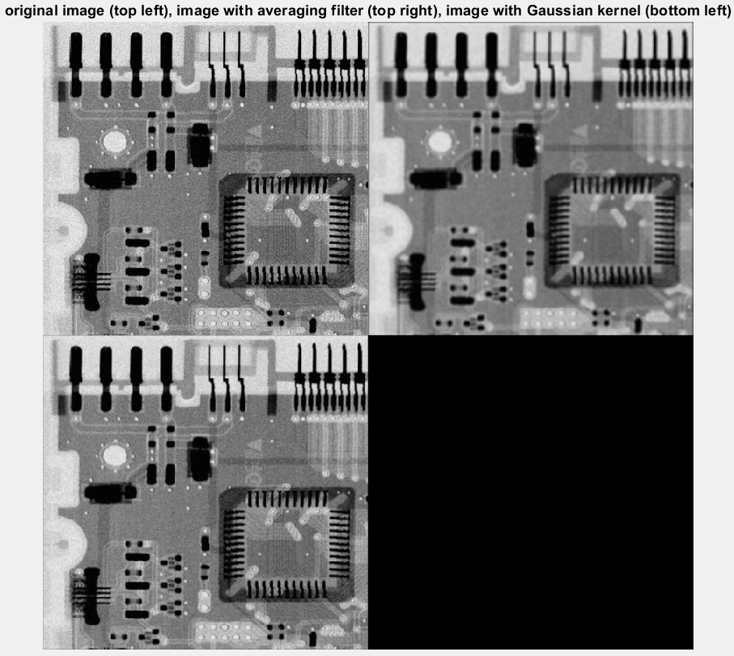 </p><BR>


>Test yourself: Explore various kernel size and sigma value for these two filters. Comment on the trade-off between the choice of these parameters and the effect on the image.

***I tested averaging filters with various sizes: 4x4, 9x9, 14x14, and 20x20. I observed that larger kernels offer stronger noise reduction by averaging over more pixels but the image appears more blurry, smoother, and softer, with severe detail loss. The edges are poorly defined too. Whilst smaller kernel size (4x4) maintains the component boundaries so it has a higher spatial resolution although noise is still visible.*** 

<p align="center"> 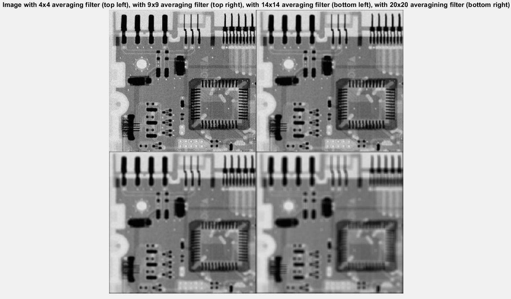 </p><BR>

***I tested Gaussian filters with various sizes with sigma value being kept constant (1.0): 2x2, 7x7, 12x12, and 17x17. All the image look remarkably similar to each other with little visible differences, unlike the averaging filters. This is probabily because when sigma is small, the Gaussian distribution is very narrow so most of the weight is in the central few pixels, regardless of kernel size.*** 

<p align="center"> 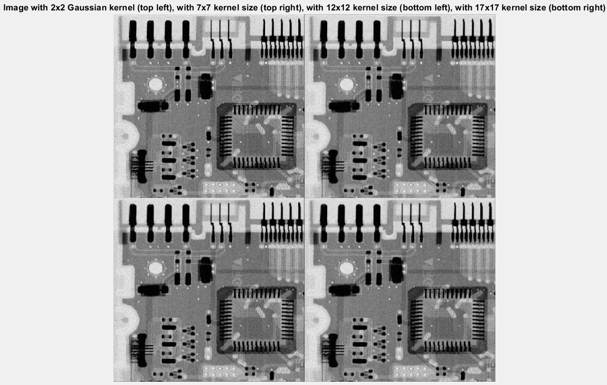 </p><BR>

***I then used a fixed 7x7 Gaussian filters with various sigma values: sigma = 0.5, 1.0, 3.0, and 5.0. As seen in the following image, the larger the sigma, the more blurred and smooth the PCB becomes with greater noise reduction. Unlike the averaging filter however, the edges remain preserved. This is because as sigma increases, the spread of the Gaussian distribution widens, causing each pixel to be influenced by more neighbors, resulting in more smoothing. However, keeping the kernal size the same would cut off the tails of the distribution, where the Gaussian curve extends beyond the kernel boundaries. Therefore, there is less blurring than sigma would normally produce.*** 

<p align="center"> 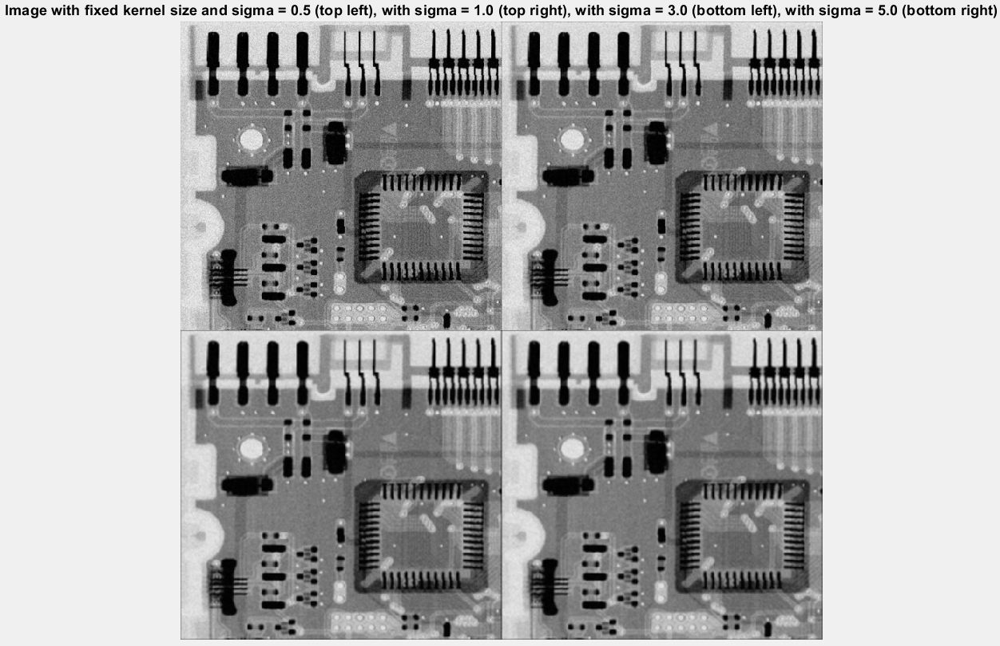 </p><BR>

***I then proportionally scaled kernel sizes with sigma with kernel size being approximately 6 x sigma to capture ~100% of the Gaussian distribution. This ensures filter coefficients sum to 1.0 to preserve image brightness. The parameters control the trade-off between noise reduction and detail preservation. The smaller the sigma, the more details are retained with minimal noise reduction (sigma = 0.5), whilst larger sigma (5.0) loses more details and heavy blurring. Although the component boundaries are very soft, they are still defined instead of being completely washed out like in averaging filters. For the purpose of PCB inspection, sigma = 1.0 in 7x7 kernel size seems to be the optimal.***

<p align="center"> 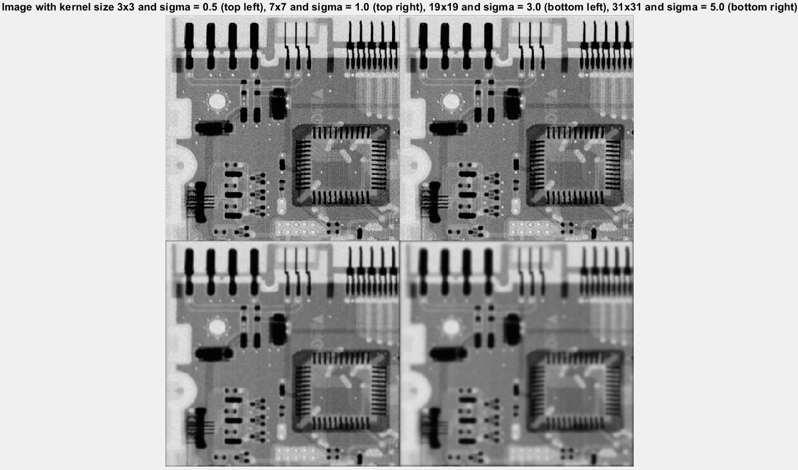 </p><BR>


## Task 5 - Median Filtering

In both cases with Average and Gaussian filters, noise reduction is companied by reducing in the sharpness of the image.  Median filter provides a better solution if sharpness is to be preserved.  Matlab provides the function _medfilt2(I, [m n], padopt)_ for such an operation.  [m n] defines the kernel dimension. _padopt_ specifies the padding option at the boundaries.  Default is 'zero', which means it is zero-padded.

Try this:
```
g_median = medfilt2(f, [7 7], 'zero');
figure; montage({f, g_median})
```
Comment on the results.

***The median filtered image almost completely eliminated the noise whilst preserving component boundaries. The IC pins are still clearly distinguishable and the background appears clean without the blurring seen in averaging and Gaussian filters. The median filter selects the middle value from the neighborhood pixels and replaces the target pixiel with the median value to avoid the influence from the outliers. This non-linearity avoids the median filter to cause blurring and preserve sharpness better.*** 

<p align="center"> 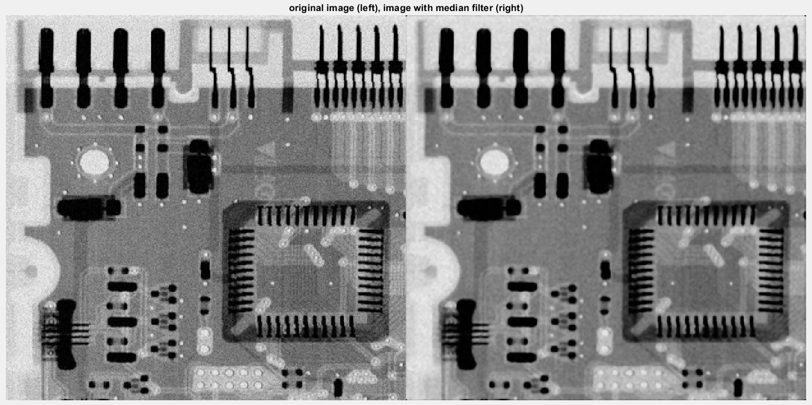 </p><BR>


## Task 6 - Sharpening the image with Laplacian, Sobel and Unsharp filters

Now that you are familiar with the Matlab functions _fspecial_ and _imfilter_, explore with various filter kernels to sharpen the moon image stored in the file _moon.tif_. The goal is to make the moon photo sharper so that the craters can be observed better.

***Laplacian filters:***
```
clear all
close all
f = imread('../assets/moon.tif');

% Create a Laplacian filter kernel, Alpha range: 0 to 1
w_laplacian = fspecial('laplacian', 0.5); 
% Convert image to double precision [0, 1] to preserve negative values
f_double = im2double(f);
% Apply Laplacian filter to detect edges and high-frequency components
g_laplacian = imfilter(f_double, w_laplacian, 'replicate');

amount = 1.0;   % Set sharpening strength
% Sharpen the image by subtracting the Laplacian response from the original
% Subtract negative edge responses will add edge enha
sharpenedImage = f_double - amount * g_laplacian;
% Clip the values to valid range [0, 1]
sharpenedImage = max(0, min(1, sharpenedImage));

% Visualise Laplacian properly
g_laplacian_display = mat2gray(g_laplacian);

figure; montage({f_double, g_laplacian_display sharpenedImage})
title("original image (left), Laplacian filter (mid), sharpened image (right)")
```

<p align="center"> 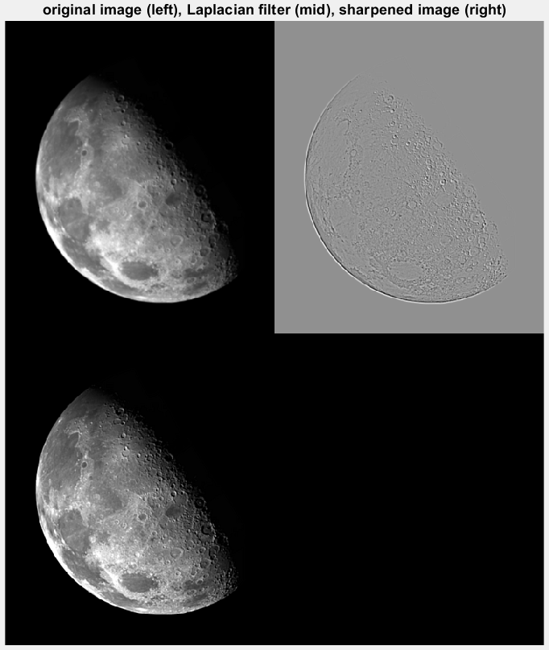 </p><BR>

***As seen in the processed images, the craters become a lot sharper and visible after applying the Laplacian filter. The original moon craters are soft and gradual, and the image is a bit blurry. After sharpening, even small craters are clear with more detailed overall surface texture. The top right image shows where the Laplacian response detects edges. The Laplacian filter is a second-order derivative operator that detects regions of rapid intensity change in an image. This is why it produces strong responses at craters, where brightness changes from the sunlit crater walls to the shadowed crater floors. By subtracting these responses from the original image, we add back the high-frequency edge information which make the transitions more pronounced.*** 


***Sobel filters:***
```
clear all
close all
f = imread('../assets/moon.tif');

f_double = im2double(f);

% Create Sobel filters for horizontal and vertical edge detection
v_sobel = fspecial('sobel');    % Horizontal edges
h_sobel = v_sobel;   % Vertical edges

% Apply Sobel filters to detect edges in both directions
gx = imfilter(f_double, h_sobel, 'replicate');
gy = imfilter(f_double, v_sobel, 'replicate');
% Gradient magnitude for the edge strength
gradient_mag= sqrt(gx.^2 + gy.^2);

% Sharpening strength
amount = 0.5;
% Sharpen by adding the gradient magnitude to the original
sharpenedImage = f_double + amount * gradient_mag;
sharpenedImage = max(0, min(1, sharpenedImage));

gradient_display = mat2gray(gradient_mag);

figure; montage({f, gradient_display sharpenedImage})
title("Original image (top left), Sobel gradient (top right), sharpened image (bottom left)")
```

<p align="center"> 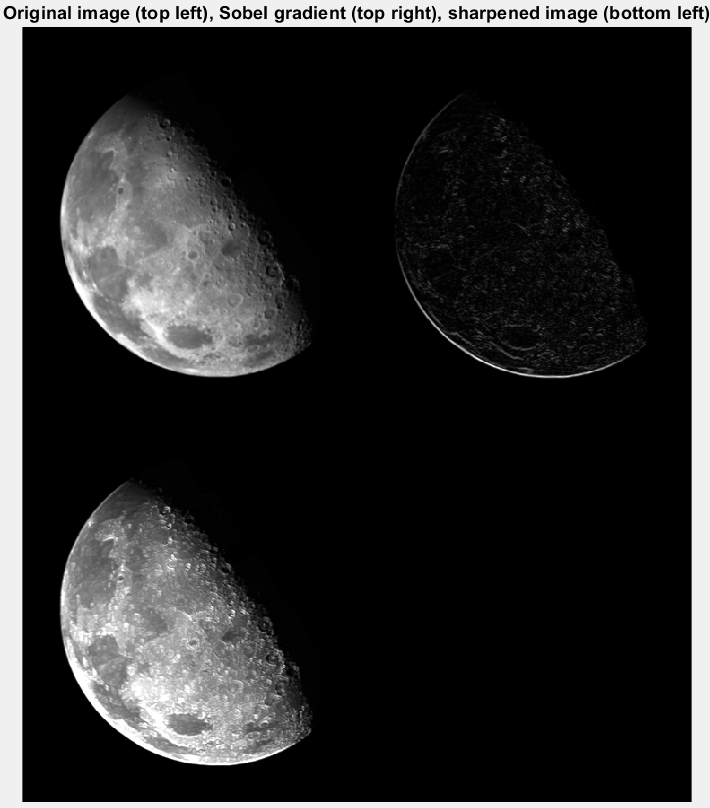 </p><BR>

***As seen in the sharpened image, the craters are more pronounced with enhanced surface texture throughout the lunar surface. THe Sobel gradient magnitude image (top right) shows the filter primarily detected directional intensity changes along crater boundaries and surface features. Unlike the Laplacian which is a second-order derivative operator, the Sobel filter is a first-order derivative operator that detects edges by both horizontal and vertical gradients. It uses 2 separate kernels to measure the rate of intensity change in the x and y directions, then combines these using the gradient magnitude formula. Since the magnitude will always be positive, it's added back to the original image to boost edge contrast. Compared to the Laplacian sharpening, Sobel offers a smoother and more gradual edge enhancement for the craters but the fine details are less enhanced.*** 


***Unsharp filters:***
```
sharpenedImage = imsharpen(f);

figure; montage({f, sharpenedImage})
title("Original image (left), Unsharp Masking (right)")
```

***Using the default value of the unsharp masking (sharpening radius = 1.0, sharpness strength = 0.8), the moon craters look slightly sharper but the overall image still looks blurry, possibly due to the parameters being too conservative.***  
<p align="center"> 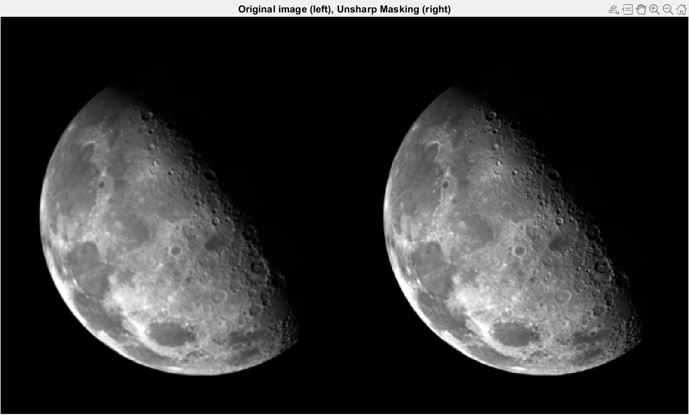 </p><BR>

***After increasing the radius of sharpening to 2.0, and sharpness strength to 1.5, the craters and textures on the moon became a lot more visible and distinct.***
<p align="center"> 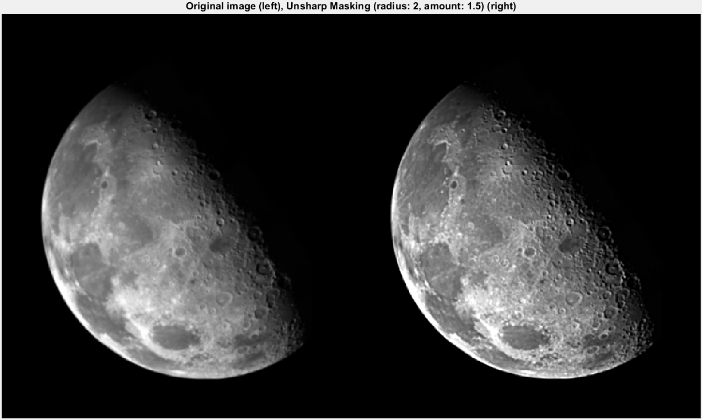 </p><BR>

***Unsharp masking creates a blurred version of the original image using a Gaussain filter with a specified radius. This blurred image contains only the low frequency components such as smooth gradients and large features. It is then subtracted from the original image to isolate the edges and fine details, which is called the unsharp mask. THis mask is then multiplied by the amount parameter and added back to the original image to boost details and edges. A larger radius allows the sharpening effect extends further from an edge. Compared to Gaussian and Sobel filtering, unsharp mask is more gentle and less sensitive to noise.*** 

***Personally, I like the Gaussian filtered moon image the best because it creates that dramatic effect for the moon craters whilst the moon texture being relatively smooth.*** 

## Task 7 - Test yourself Challenges

* Improve the contrast of a lake and tree image store in file _lake&tree.png_ use any technique you have learned in this lab. Compare your results with others in the class.

***The original lake and tree image is underexposed, making it difficult to differentiate between the sky, mountains, tree, and water. I used gray scale range mapping, gamma correction and constrast stretching transformation to improve the contrast:***
```
clear all
close all
f = imread('../assets/lake&tree.png');
r = double(f);
k = mean2(r);
E = 3.2;
s = 1 ./ (1.0 + (k ./ (r + eps)) .^E);
g = uint8(255*s);
g2 = imadjust(f, [0.1 0.5], [0 1]);
g3 = imadjust(f, [0.1 0.5], [  ], 0.85);
figure; montage({f, g2, g3, g}, 'Size',[1 4])
title("(1): Original image, (2): Image with gray scale range, (3): Image with gamma correction, (4): Image with contrast-stretching transformation")
```
<p align="center"> 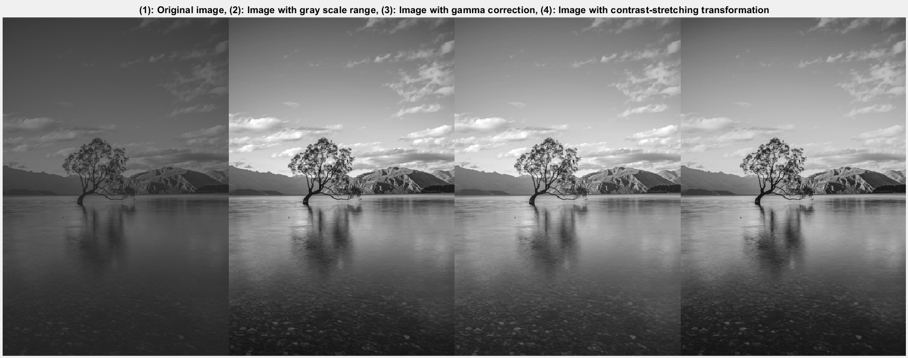 </p><BR>

***For the gray scale range mapping, I remapped the intensity range so that any pixels with or below intensity 0.1 are mapped to 0 (black), and any pixels with or above intensity 0.5 are mapped to 1 (white). Values between 0.1 and 0.5 are linearly stretched across the full range. Since the original image uses only a narrow range of intensities, stretching this range increases contrast and enhances visibility. The sky becomes much brighter with clear cloud details.***

***Along with gray scale range mapping, gamma correction is also applied in image (3) to create a slightly more aggressive brightneing image. With gamma < 1 (0.85), the mid-tone regions such as the water and lower mountains become more apparent.***

***For the contrast-stretching transformation, the exponent controls the steepness of the transformation curve. With a high E value (3.2), the steep sigmoid curve strongly compresses dark values upward while being gentler on brighter values. Therefore, the enhancement is the most balanced among all three methods, and the contrast is improved the most. The image appears more natural and continuous.*** 

***Personally, I like the gray scale range mapping image the most because I prefer the prominent details and highlights on the clouds whilst I appreciate the natural feeling contrast-stretching transofmration gives.*** 


* Use the Sobel filter in combination with any other techniques, find the edge of the circles in the image file _circles.tif_.  You are encouraged to discuss and work with your classmates and compare results.

***To detect the edge of the circles accurately, I combined the Sobel filter with the median filter, histogram equalisation, Otsu's thresholding, and morphological cleanup techniques:***
```
clear all
close all
f = imread('../assets/circles.tif');
f_original = f;  % Keep original for comparison

% Noise reduction using Median filter
f_median = medfilt2(f, [7 7], 'zeros');

% Contrast enhancement using histogram equalisation
f_histeq = histeq(f_median);

f_double = im2double(f_histeq);
v_sobel = fspecial('sobel');    
h_sobel = v_sobel;   

gx = imfilter(f_double, h_sobel, 'replicate');
gy = imfilter(f_double, v_sobel, 'replicate');
gradient_mag= sqrt(gx.^2 + gy.^2);

% Threshold using Otsu's method
threshold = graythresh(gradient_mag);
edges_binary = imbinarize(gradient_mag, threshold);

% Mask out brush
[rows, cols] = size(f);
mask = true(rows, cols);
mask(240:391, 1:130) = false;
edges_binary = edges_binary & mask;

% Clean up with morphology
edges_cleaned = bwareaopen(edges_binary, 25);
edges_final = imclose(edges_cleaned, strel('disk', 2));

figure; montage({f, f_median, mat2gray(gradient_mag), edges_final}, 'Size', [1 4]);
title("(1): Original image, (2): Noise reduced image, (3): Sobel gradient, (4): Edge detected image")
```
<p align="center"> 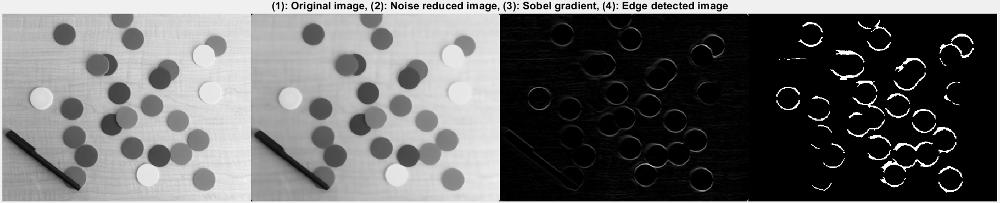 </p><BR>

***Median filter was used to reduce noise since it's important to preserve the sharpness of the edge boundaries. As seen in image 2, the background table texture had been smoothened with the circle edges remaining sharp. The contrast was then enhanced by applying histogram equalisation. By redistributing pixel intensities to the full range, the edge gradients became easier to detect. The Sobel kernels were then applied, it computed gradients in both x and y directions separately, making it perfect for circular shapes. As seen in image 3, the Sobel gradient had strong responses at circle boundaries where intensity changes rapidly, but it also included a weak response to the boundaries of the brush at the bottom left corner. Therefore, that region was masked out. The optimal threshold was then determined by Otsu's method, converting the gradient magnitude to a binary edge map. It analysed the gradient magnitude histogram and found the threshold value that best divides pixels into two classes: edges and non-edges. Using the Otsu's method prevents the trial-and-error approach in manual thresholding. Two morphological oeprations were then used to isolate small noise artifacts and connect nearby edge segments to create a well-defined circular edges map.***


* _office.jpg_ is a colour photograph taken of an office with bad exposure.  Use whatever means at your disposal to improve the lighting and colour of this photo.

***In the original office.jpg image, the interior such as the desk and the chair are underexposed, whilst the window and computer screen are overexposed. The overall image has a greenish tint and it's difficult to see the details on the desk since it is also a bit pixelated.*** 

***To improve that, I processed the image multiple times. First, I upscaled the image by a factor of 2 using bicubic interpolation to increase its resolution. Upscaling the image makes it physically larger and reduces the visible pixelated appearance.*** 
```
% Step 1: Edge-directed interpolation
f_upscaled = imresize(f, scale_factor, 'bicubic');
f_double = im2double(f_upscaled);
```

***However, simple upscaling often results in a soft, blurry appearance, so I applied a bilateral filter to each colour channel. Unlike standard Gaussian blurring, the bilateral filter preserves sharp edges around objects like the desk, monitor, and window frame to maintain the image clarity.*** 
```
% Step 2: Bilateral upsampling
% Process each channel separately for better quality
f_bilateral = zeros(size(f_double));
for c = 1:3
    f_bilateral(:,:,c) = imbilatfilt(f_double(:,:,c), ...
        'DegreeOfSmoothing', 0.03, ...
        'SpatialSigma', 3);
end
```

***I then used a multi-scale detail enhancement technique to make the image appear sharper by separating the image into 3 frequency layers and boosting each layer: fine details (small textures like fabric on the chair, boosted the most), medium details (object boundaries, bossted moderately), and coarse details (large structures like walls, boosted gently). This created the perception of higher resolution and brought out textures that were previously hidden.*** 
```
% Step 3: Extract details at different scales
detail_fine = f_bilateral - imgaussfilt(f_bilateral, 1);
detail_medium = imgaussfilt(f_bilateral, 1) - imgaussfilt(f_bilateral, 3);
detail_coarse = imgaussfilt(f_bilateral, 3) - imgaussfilt(f_bilateral, 7);

% Enhance each scale
detail_fine_enhanced = detail_fine * 2.0;
detail_medium_enhanced = detail_medium * 1.5;
detail_coarse_enhanced = detail_coarse * 1.2;

% Recombine
base = imgaussfilt(f_bilateral, 7);
f_enhanced_details = base + detail_coarse_enhanced + ...
                     detail_medium_enhanced + detail_fine_enhanced;
f_enhanced_details = max(0, min(1, f_enhanced_details));
```

***I then enhance the exposure and colors by converting the image to LAB color space. It separates brightness (L channel) from color information (a and b channels). By creating a brightness-based mask that identified the dark areas (left side of the image), I selectively brightened only the underexposed regions by adding up to 18 units of luminance, whilst leaving the already-bright window area unchanged. This prevents the overexposed areas from becoming completely washed out. I then applied contrast stretching to the L channel to spread out the tonal range between the darkest and brightest areas to make the image more visually appealing.*** 
```
% Step 4: LAB enhancement for exposure/color
lab = rgb2lab(f_enhanced_details);
L = lab(:,:,1);

% Selective brightening
dark_mask = (100 - L) / 100;
dark_mask = imgaussfilt(dark_mask, 50);
L_adjusted = L + dark_mask * 18;
L_adjusted = min(L_adjusted, 100);

% Contrast boost
L_adjusted = imadjust(L_adjusted / 100, [0.05 0.95], []) * 100;
```

***For the color correction, I boosted the a and b channel by 35% to create more vivid and saturated colours, and shifted the a channel (which controls the green-red axis) toward a more neutral tone.*** 
```
% Vivid colors
a_vivid = lab(:,:,2) * 1.35 - 3;
b_vivid = lab(:,:,3) * 1.35;

lab_final = cat(3, L_adjusted, a_vivid, b_vivid);
f_color_enhanced = lab2rgb(lab_final);
```

***Finally, I applied adaptive sharpening to restore the edges. I calculated an edge map using gradient detection, which identifies strong edges in the image. Areas with prominent edges like the window frames received stronger sharpening while smooth areas like walls and the sky were sharpened more gently.*** 
```
% Step 5: Sharpen edges more than smooth areas
gray = rgb2gray(f_color_enhanced);
edge_map = imgradient(gray);
edge_map_norm = edge_map / max(edge_map(:));

% Variable sharpening based on edge strength
sharpen_amount = 0.4 + 0.6 * edge_map_norm;  

f_final = f_color_enhanced;
for c = 1:3
    channel = f_color_enhanced(:,:,c);
    detail = channel - imgaussfilt(channel, 1.5);
    f_final(:,:,c) = channel + detail .* sharpen_amount;
end
f_final = max(0, min(1, f_final));
```

<p align="center"> 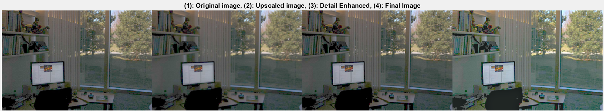 </p><BR>

***This resulted in a more natural image with the interior being properly exposed and details on the desk now being visible. The colors are more vivid and saturated and the edges are preserved throughout.*** 


