# Lab 4 Logbook- Morphological Image Processing
*_Gabriela Lee, version 1.3, 11 Feb 2026_*


In this laboratory session, you will explore the use of various morphological operators and get a feel of how they modify visual information.  

As before, clone this repository to your laptop and keep your experimental logbook on your repo.  Some students add their results, observations, reflections, etc. directly onto the README.md file.  This turns the Lab Instruction into their logbook.  Clever move!

## Task 1: Dilation and Erosion

Matlab provides a collection of morphological functions.  Here is a list of them:

<p align="center">  </p>

### Dilation Operation
```
A = imread('assets/text-broken.tif');
B1 = [0 1 0;
     1 1 1;
     0 1 0];    % create structuring element
A1 = imdilate(A, B1);
montage({A,A1})
```

***Dilation thickens the white regions so the text in the binary image. The image A has been dilated by the 3x3 matrix B1, so the structuring element B1 slides across every pixel in the image. If any part of B1 overlaps with a white pixel in the image, the center pixel becomes white which thickens the text. The structuring element forms a plus sign (+) pattern with where the 1s are positioned, it expands in 4 directions: up, down, left and right, so the overall character shape of the text can be preserved better.***

***As shown on the image below, the broken strokes in the original image had reconnected after the dilation operation with most of the small gaps between nearby components being filled. ***

<p align="center">  </p>

> Change the structuring element (SE) to all 1's.  Instead of enumerating it, you can do that with the function _ones_:
```
B2 = ones(3,3);     % generate a 3x3 matrix of 1's
```

***Changing the SE to all 1's would expand the component in all directions, including diagonals. So from the image below, the right image with all 1s kernel has slightly thicker characters with tiny messy whiskers on the character edges. This is because sharp corners got rounded and small protrusions near edges were amplified.***

<p align="center">  </p>

> Try making the SE larger.

***Making the SE larger would enhance the thickening effect, making the characters bolder. This is because as B1 becomes bigger, there are more chances for B1 to overlap with a white pixel in the image, turning more center pixels into white and increasing the bolding weight.*** 

<p align="center">  </p>

> Try to make the SE diagonal cross:
```
Bx = [1 0 1;
      0 1 0;
      1 0 1];
```

***Making the SE diagonal cross expands the stroke in only the 4 diagonal directions: northeast, northwest, southeast, and southwest. This causes the vertical and horizontal strokes to be thickened less than the plus sign (+) and all 1s kernels, whilst the corners were emphasised more. The text appears more spiky and some of horiztonal and vertical gaps appear less connected than previous dilation operations. ***

<p align="center">  </p>


> What happens if you dilate the original image with B1 twice (or more times)?

***If I dilate the original image with B1 twice, the characters became thicker and thicker. Each dilation iteration expands the white regions by one pixel in each of the 4 cardinal directions. It creates a diamond shape that grows outward. After dilating the image five times, all the large gaps have been filled and the separate characters are starting to merge which degrades text quality.***

<p align="center">  </p>

### Generation of structuring element

For spatial filtering, we used function _fspecial_ to generate our filter kernel.  For morphological operations, we use function _strel_ to generate different kinds of structuring elements.

Here is a list of SE that _strel_ can generate:

<p align="center">  </p>

For example, to generate a disk with radius r = 4:

```
SE = strel('disk',4);
SE.Neighborhood         % print the SE neighborhood contents
```

_strel_ returns not a matrix, but an internal data structure called _strel_. This speeds up the execution of the morphological functions by Matlab.

***SE.Neighborhood displays a 2D binary matrix that appxoimates a filled circle with radius 4 shown below:***
<p align="center"> 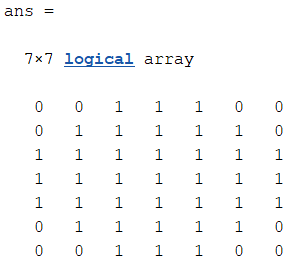 </p>

### Erosion Operation

Explore erosion with the following:

```
clear all
close all
A = imread('assets/wirebond-mask.tif');
SE2 = strel('disk',2);
SE10 = strel('disk',10);
SE20 = strel('disk',20);
E2 = imerode(A,SE2);
E10 = imerode(A,SE10);
E20 = imerode(A,SE20);
montage({A, E2, E10, E20}, "size", [2 2])
```
Comment on the results.

<p align="center"> 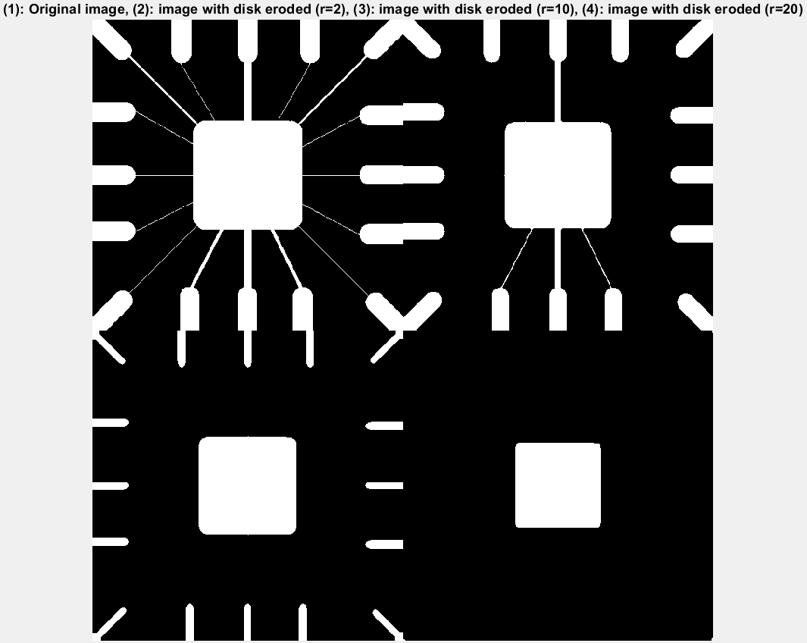 </p>

***Erosion thinners objects in a binary image, by shrinking the white regions and removing thin structures. The disk SE slides across the image, and a pixel remains white only if the entire disk fits completely within the white region at that position. It shrinks component uniformly in all direction and rounds sharp corners. As observed from the image above, the larger the structuring element radius, the more aggressive the erosion. The original image includes a circuit pattern with 4 white rectangular components in a grid-like arrangement, and radiating lines with varying thickness. With the eroding disk being radius 2, it removes the radiating lines that are thin whilst slightly shrinking all white components. As the radius increased to 10, all the connecting lines disappear and there is significant shrinkage in all features, the corners of rectangular pads become noticeably rounded and smaller. When the radius reaches 20, more features are removed, leaving only the middle square with a drastically reduced size.  *** 


## Task 2 - Morphological Filtering with Open and Close

### Opening = Erosion + Dilation
In this task, you will explore the effect of using Open and Close on a binary noisy fingerprint image.

1. Read the image file 'finger-noisy.tif' into _f_.
2. Generate a 3x3 structuring element SE.
3. Erode _f_ to produce _fe_.
4. Dilate _fe_ to produce _fed_.
5. Open _f_ to produce _fo_.
6. Show _f_, _fe_, _fed_ and _fo_ as a 4 image montage.

Comment on the the results.

***The original noisy fingerprint image*** (f) ***contains significant noise*** (small white dots) ***in the background and between the fingerprint ridges. The erosion operation (fe) eliminates all these small noise pixels because they are thinner than the sturcturing element, whilst also shrinking the fingerprint ridges themselves. The subsequent dilation operation (fed) increases the fingerprint ridges back to approximately their original width, restoring the fingerprint structure. ***
***The opening oepration*** (fo) ***achieves the same result in a single operation. Opening is mathematically defined as erosion followed by dilation: fo = dilate(erode(f, SE), SE). This composite operation effectively removes small isolated white objects such as noise while preserving the shape and size of larger structures. It "opens up" gaps between objects and smooths outer contours.***

<p align="center"> 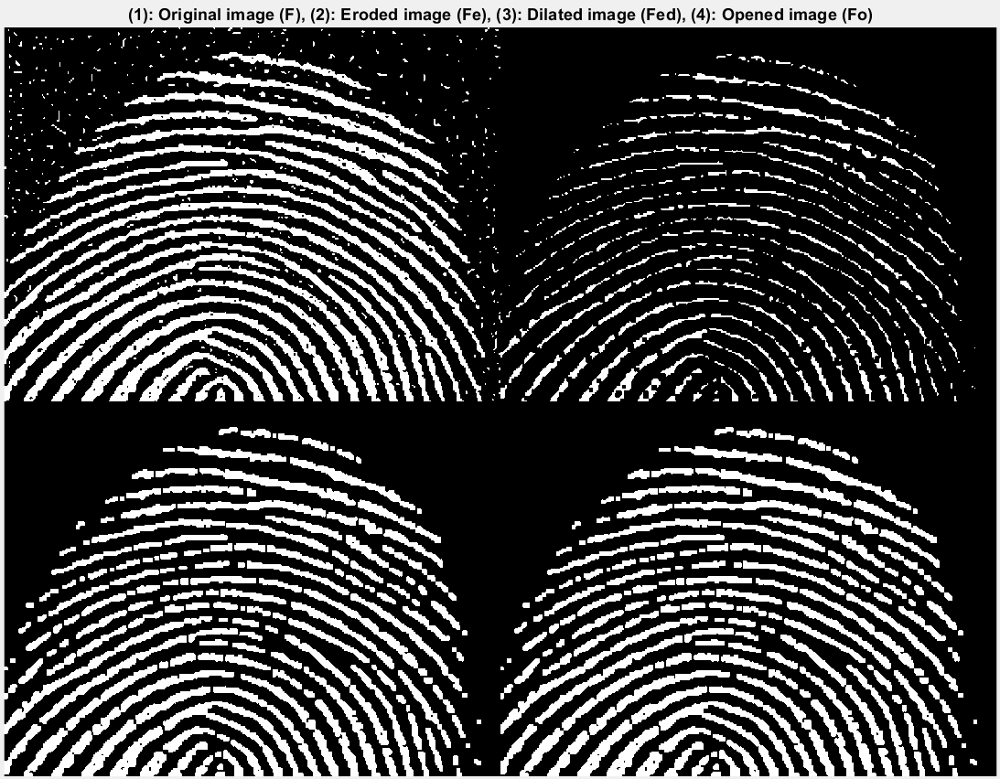 </p>


Explore what happens with other size and shape of structuring element.

***The structuring element is now replaced by a disk with a radius of 2. The circular SE removes more noise than the 3x3 sqaure SE above, but also eliminates some of the thinner parts of the fingerprint ridges. This created fragmented ridges sections. The dilated and opened images show thicker and rounder ridges due to the circular shape of the SE. However, some ridge details have been lost because the fragmented ridges created during erosion can't be fully recovered by dilation, leaving gaps in the fingerprint pattern.***
<p align="center"> 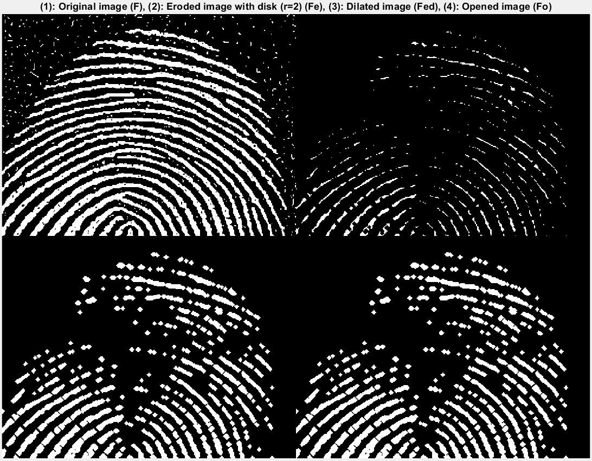 </p>

***Replacing the structuring element with a 2x2 rectangle also yields a different result. With the SE being smaller than the original 3x3 square SE, it removes less background noise, leaving some tiny nosie dots. However, it preserves the fingerprint ridges the best. The ridges remain continuous with very few breaks with a slight reduced in ridge thickness during erosion. The dilated and opened images still contain tiny noise tho the overall fingerprint pattern is preserved the best.*** 
<p align="center"> 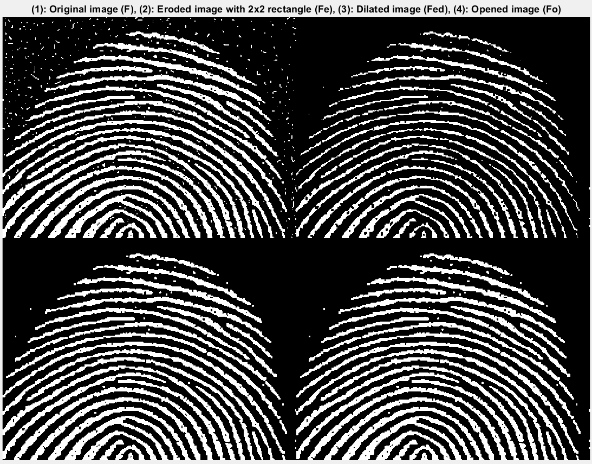 </p>

***Therefore, the size of the SE requires a fine balance between noise removal and feature preservation. In addition, regardless of the shape and size of the structuring element, the opening operation always produce the same result as erosion followed by dilation opertions.***

Improve the image _fo_ with a close operation.

***Applying the close operation to the opened image causes the ridges to look more continuous. This is because the closing operation is the opposite of opening - it is the same as dilation followed by erosion. The opened image contains ridge with small breaks, in the dilation step, these gaps are filled and the ridges are bridged and thickened.***
<p align="center"> 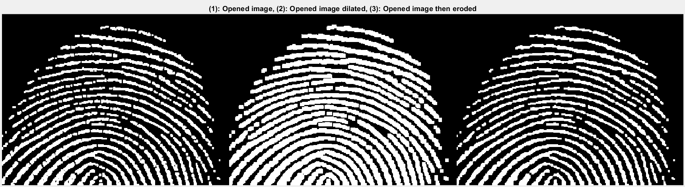 </p>

***In the erosion step, the ridges are shrunk back to approximate original width whilst the filled gap remains closed and structure appears to be continuous. The gap will only be filled if it's smaller than the SE diameter.*** 

<p align="center"> 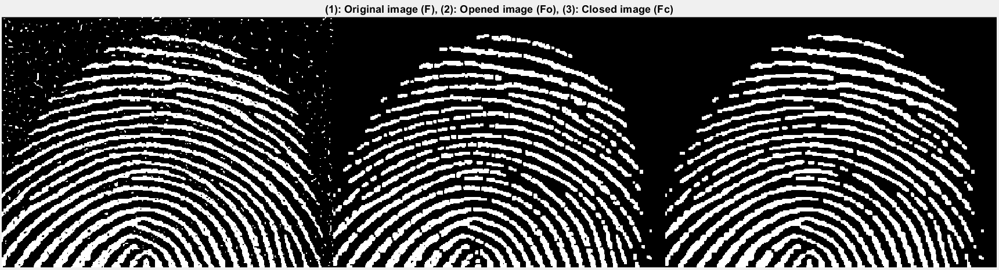 </p>

***By closing the opened image, it reconnects broken ridges caused by over-erosion during opening and smooths inner contours of ridges, resulting in a clean fingerprint.***


Finally, compare morphological filtering using Open + Close to spatial filter with a **Gaussian filter**. Comment on your comparison.


***I applied a 8x8 Gaussian filter to the original image to remove noise, and there are 2 main key differences compared to morphological filtering.***
  1. ***Gaussian filtering results in softer edges with the ridges being continuous and more details were preserved. It maintains the original ridge contours with less geometric distortion. Morphological filtering creates sharper edges with some discontinuity, and imposes SE geometry to the original image***
  2. ***Gaussian filtering mainly blurs noise into the background with some noise remain visible whislt the open and close operations remove noise completely with a clean background***

<p align="center"> 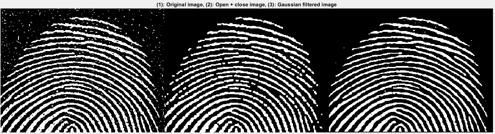 </p>

***Depending on what the purpose is, both morphological and Gaussian filters can be used. If the goal is to preserve the original ridge shapes and cahracteristics, then it's better to use the Gaussian filter. Whilst if the goal is to completely remove all the noise and the fingerprint shape doesn't have to be exact as the original image, then the morphological filtering would be better.***

## Task 3 - Boundary detection 

The grayscale image 'blobs.tif' consists of blobs or bubbles of different sizes in a sea of noise. Further, the bubbles are dark, while the background is white.  The goal of this task is to find the boundaries of the blobs using the boundary operator (Lecture 6, slide 17).

<p align="center">  </p>

First we turn this "inverted" grayscale image into a binary image with white objects (blobs) and black background. Do the following:

```
clear all
close all
I = imread('assets/blobs.tif');
I = imcomplement(I);
level = graythresh(I);
BW = imbinarize(I, level);
```
The Matlab function  _graythresh_ computes a global threshold _level_ from the grayscale image I, by finding a threshold that minimizes the variance of the thresholded black and white pixels. (This method is known as the [Otsu's method](https://cw.fel.cvut.cz/b201/_media/courses/a6m33bio/otsu.pdf).)  The function *_imbinarize_* turns the grayscale image to a binary image **BW**: those pixels above or equal to _level_ are made foreground (i.e. 1), otherwise they are background (0).

Now, use the boundary operation to compute the boundaries of the blobs. This is achieved by eroding BW  with SE, where SE is a 3x3 elements of 1's. The eroded image is subtract from BW. 

```
% SE is a 3x3 elements of 1's
SE = ones(3,3);
% Erode BW with SE
BWE = imerode(BW,SE);

% The eroded image is subtracted from BW
Boundary = BW - BWE;
montage({I, BW, BWE, Boundary}, "size", [1 4])
title("(1): Original image (I), (2): Binary image (BW), (3): Eroded binary image, (4): Boundary image")
```

Diplay as montage {I, BW, erosed BW and boundary detected image}.  Comment on the result.

***After converting the image into a binary image (BW) using Otsu's method, the blobs appear as white regions on a black background. Tiny white noise dots also appear in the background. The erosion operation shrinks all white regions inward by one pixel layer. It therefore successfully removes the background noise entirely since they are smaller than the 3x3 structuring element. ***

***By subtracting the eroded image from BW, it isolates only the pixels that were removed during erosion, which includes the outermost layer (edges) of each object. In the boundary-detected image, thin white outlines trace the edge of each blob. However, the background noise is also visible as small white dots because these noise pixels also have boundaries.***

<p align="center"> 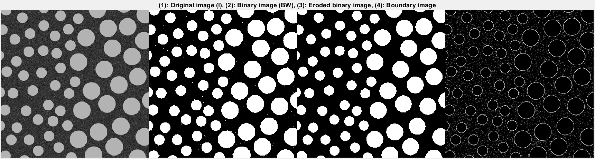 </p>


How can you improve on this result?

***To improve this and completely remove the noise, I filtered the boundary by size and removed any objects that are smaller than 6 pixels to ensure only the edge of the blobs are kept. ***

```
Boundary_clean = bwareaopen(Boundary, 6);
```

***As shown below, the background of the boundary image is now a lot cleaner and only the edge of the blob is displayed.***
<p align="center"> 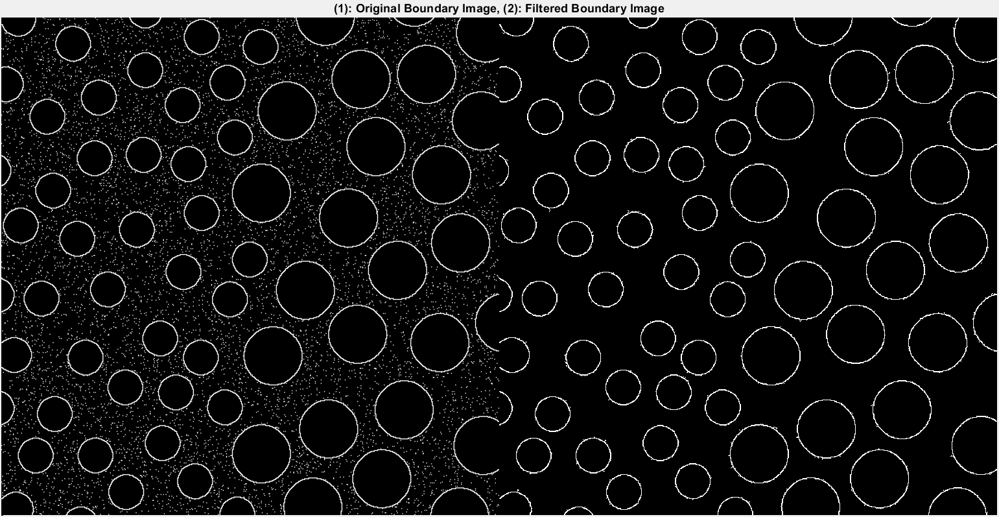 </p>


## Task 4 - Function bwmorph - thinning and thickening

Matlab's Image Processing Toolbox includes a general morphological function *_bwmorph_* which implements a variety of morphological operations based on combinations of dilations and erosions.  The calling syntax is:

```
g = bwmorph(f, operations, n)
```
where *_f_* is the input binary image, *_operation_* is a string specifying the desired operation, and *_n_* is a positive integer specifying the number of times the operation should be repeated. (n = 1 if omitted.)

The morphological operations supported by _bwmorph_ are:

<p align="center">  </p>

To test function *_bwmorph_* on thinning operation, do the following:

1. Read the image file 'fingerprint.tif' into *_f_*.
2. Turn this into a good binary image using method from the previous task. 
3. Perform thinning operation 1, 2, 3, 4 and 5 times, storing results in g1, g2 ... etc.
4. Montage the unthinned and thinned images to compare.

To perform the above:
```
clear all
close all
f = imread('assets/fingerprint.tif');
f = imcomplement(f);
level = graythresh(f);
BW = imbinarize(f, level);

% Perform thinning operation 1 time and store result in g1
g1 = bwmorph(BW, "thin", 1);
g2 = bwmorph(BW, "thin", 2);
g3 = bwmorph(BW, "thin", 3);
g4 = bwmorph(BW, "thin", 4);
g5 = bwmorph(BW, "thin", 5);

montage({f BW g1 g2 g3 g4 g5}, "size", [2 4])
title("(1): Original Image, (2): Binary Image, (3 - 5): Thinning operation 1,2,3,4 and 5 times")
```

<p align="center"> 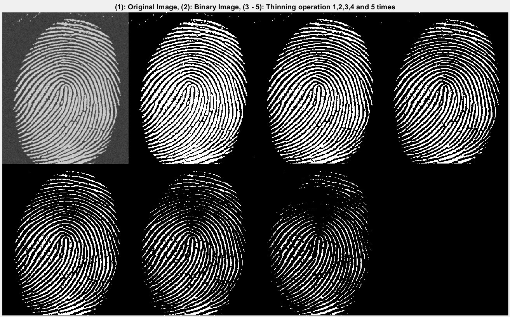 </p>

***The thinning operation thins objects without holes to minimally-connected strokes, reducing binary objects to their skeletal structure. Unlike simple erosion, thinning uses the hit-and-miss transform to decide which boundary pixels can be safetly removed without breaking connectivity between ridge sections and creating holes in the structure. It applies a series of structuring element pairs that "hit" specific pixel patterns on the object boundary while "missing" the background. Only pixels that match both conditions are removed and the process is repeated iteratively with different orientations of SEs to thin uniformly in all directions. ***

***As you keep thinning the image, the fingerprint ridge width gradually decreases with the valley gaps widens correspondingly. As it progressively thins the image, some of the weaker ridge connections are broken, and minutiae features such as bifurcations and ridge endings become increasingly prominent and easier to identify as the surrounding ridge mass is removed. ***


What will happen if you keep thinning the image?  Try thinning with *_n = inf_*.  (_inf_ is reserved word in Matlab which means infinity.  However, for _bwmorph_, it means repeat the function until the image stop changing.)

<p align="center"> 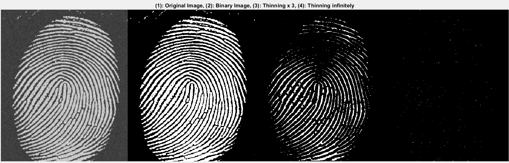 </p>

***When thinning infinitely, all ridges reduced to 1-pixel white dots on a predominantly black background. These dots represent the skeletal representation of the fingerprint and their distribution follow the ridge structure. Thinning would preserve topology features such as the number of ridge components, their connectiity, and branching structure. Ridge endings and bifurcations are now defined at single-pixel precision.***

Modify your matlab code so that the fingerprint is displayed black lines on white background instead of white on black.  What conclusion can you draw about the relationship between thinning and thickening?

***To invert the binary image:***
```
% Invert the binary image to get black on white
BW = ~BW;
```
<p align="center"> 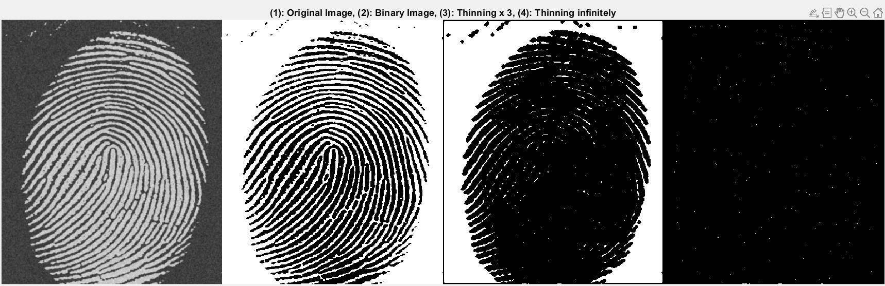 </p>

***The thinning operation removes pixels from the boundaries of foreground (white) regions whilst preserving connectivity and topology. It doesn't operate on background (black) pixels. This directional behaviour creates a fundamental duality with thickening when image polarity is inverted.***
***By inverting the binary image, the ridges are now black, the foreground becomes the white background and the background is the black ridges. So when thinning is carried out, it shrinks the white background by eroding its boundaries inward. s the white valleys become narrower, the black ridges correspondingly expand and thicken. Thinning the image infinitely causes the black ridges to be thicker, eventually merging them. The white valleys are reduced to 1-pixel wide white skeleton whilst the black ridges have expanded to fill most of the image. This shows that thinning the inverted image = thickening the original image, and the two operations are morphological duals.***


## Task 5 - Connected Components and labels

In processing and interpreting an image, it is often required to find objects in an image.  After binarization, these objects will form regions of 1's in background of 0's. These are called connected components within the image.  

Below is a text image containing many characters.  The goal is to find the **largest connected component** in this image, and then **erase it**.

<p align="center">  </p>

This sounds like a very complex task. Fortunately Matlab provides in their Toolbox the function _bwconncomp_ which performs the morphological operation described in Lecture 6 slides 22 - 24. Try the following Matlab script:

```
t = imread('assets/text.png');
imshow(t)
CC = bwconncomp(t)
```

*_CC_* is a data structure returned by *_bwconncomp_* as described below.

<p align="center">  </p>

***A connected component in a binary image is a set of adjacent pixels. There are two standard connectivities: 4-connectivity (pixels are connected if their edges touch), 8-connectivity (pixels are connected if their edges or corners touch). For the *_bwconncomp_* function, it uses 8-connecitivity by default. According to the CC details image, 88 connected components are found, and each component represents either a single character, a group of touching characters, or noise. ***

<p align="center"> 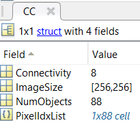 </p>

To determine which is the largest component in the image and then erase it (i.e. set all pixels within that componenet to 0), do this:

```
numPixels = cellfun(@numel, CC.PixelIdxList);
[biggest, idx] = max(numPixels);
t(CC.PixelIdxList{idx}) = 0;
figure
imshow(t)
```
These few lines of code introduce you to some cool features in Matlab.

1. **_cellfun_** applies a function to each element in an array. In this case, the function _numel_ is applied to each member of the list **_CC.PixelIdxList_**.  The kth member of this list is itself a list of _(x,y)_ indices to the pixels within this component.


2. The function **_numel_** returns the number of elements in an array or list.  In this case, it returns the number of pixels in each of the connected components.

3. The first statement returns **_numPixels_**, which is an array containing the number of pixels in each of the detected connected components in the image. This corresponds to the table in Lecture 6 slide 24.

4. The **_max_** function returns the maximum value in numPixels and its index in the array.

5. Once this index is found, we have identified the largest connect component.  Using this index information, we can retrieve the list of pixel coordinates for this component in **_CC.PixelIdxList_**.

***@numel counts the number of elements in each cell so that numPixels(k) = number of pixels in component k. This effectively creates the size table (Headers: connected component, no. of pixels in connected comp.) mentioned in Lecture 6 slide 24. It then stores the component[idx] with the most pixels (biggest pixels total) and set the list of all pixel indices belonging to it to be black (0). This erases the largest component from the image, which is then reflected on the modified image. ***  

<p align="center"> 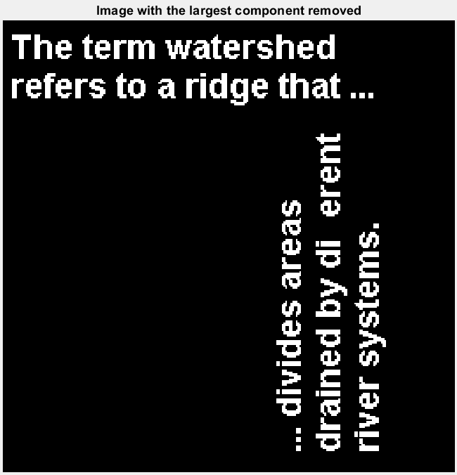 </p>

***The largest connected component is "ff" in the word "different" on the right, which is now removed.*** 


## Task 6 - Morphological Reconstruction

In morphological opening, erosion typlically removes small objects, and subsequent dilation tends to restore the shape of the objects that remains.  However, the accuracy of this restoration relies on the similarly between the shapes to be restored and the structuring element.

**_Morphological reconstruction_** (MR) is a better method that restores the original shapes of the objects that remain after erosion.  

The following exercise demonstrates the method described in Lecture 7 slide 10.  A binary image of printed text is processed so that the letters that are long and thin are kept, while all others are removed.  This is achieved through morphological reconstruction.

MR requires three things: an **input image** **_f_** to be processed called the **_mask**, a **marker image** **_g_**, and a structuring element **_se_**.  The steps are:

1. Find the marker image **_g_** by eroding the mask with an **_se_** that mark the places where the desirable features are located. In our case, the desired characters are all with long vertical elements that are 17 pixels tall.  Therefore the **_se_** used for erosion is a 17x1 of 1's.

2. Apply the reconstruction operation using Matlab's **_imreconstruct_** functino between the **marker** **_g_** and the **mask** **_f_**. 

The step are:

```
clear all
close all
f = imread('assets/text_bw.tif');
se = ones(17,1);
g = imerode(f, se);
fo = imopen(f, se);     % perform open to compare
fr = imreconstruct(g, f);
montage({f, g, fo, fr}, "size", [2 2])
```

Comment on what you observe from these four images.

***Morphological reconstruction operation can extract meaningful information about shapes in an image, in this context, the letters in the text_bw file. It processes the marker (the eroded image with the structuring element) based on the characteristics of the mask (the original image). So the marker image includes a binary image with small white dots at locations where tall characters exist. It then iteratively dilates the marker but constrains growth to stay within the mask so that only regions connencted to market points are restored. By using the original image as a "template" to guide the restoration process, the actual shapes of objects can be preserved. *** 

<p align="center"> 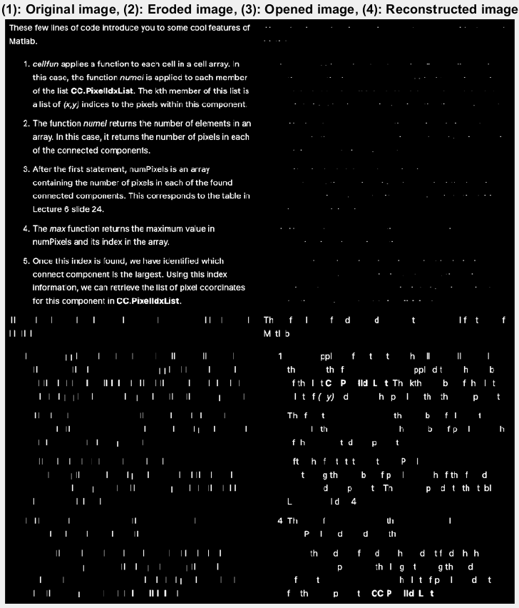 </p>

***The structuring element we defined has a size of 17 x 1, which isolates tall vertical characters (>= 17 pixels tall, e.g. f, l, d, b) in erosion. The locations of these characters are extracted successfully, and represented by the white dots. The opening image (erosion -> dilation) using the same structuring element restores objects as vertical strokes of that exact 17 pixels tall, 1 pixel wide shape, regardless of the original character's actual appearance. It causes significant shape distortion and loses original character forms such as curves and width. This demonstrates why opening alone is inadequate for shape-preserving filtering.***

***Meanwhile, reconstruction by erosion of the original image using the same structuring element accurately extracts those characters without deforming their appearances. It successfully shows tall characters (b, d, h, T, p, f) at marked locations.     ***


Also try the function **_imfill_**, which will fill the holes in an image (Lecture 6 slides 19-21).

```
ff = imfill(f);
figure
montage({f, ff})
```

***A hole is defined as a backgroun region surrounded by a connected border of foreground pixels. As seen in the image below, all the holes within the text characters have been filled by the imfill function. Letters such as "o", "e", "a", "d" and "R" contain black regions (holes) and have now been converted to white.  ***

<p align="center"> 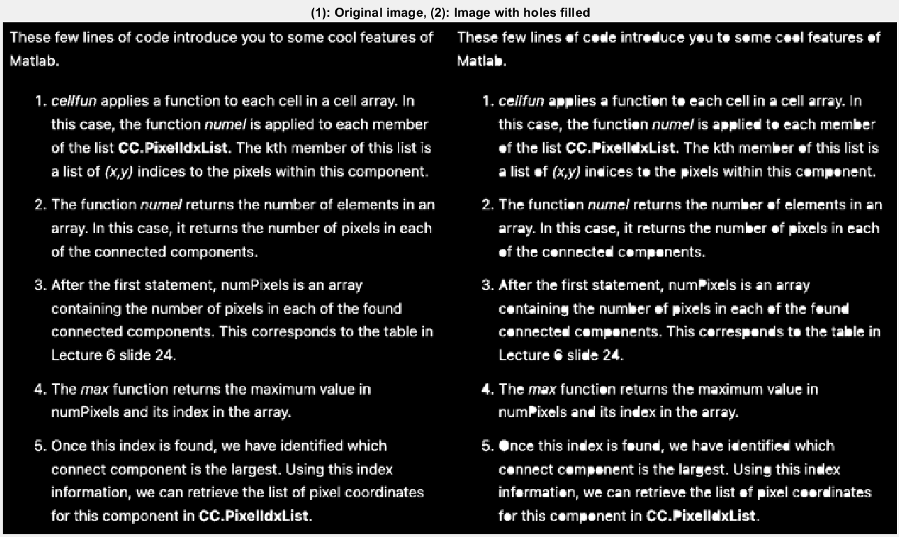 </p>

***The imfill function uses morphological reconstruction by dilation. It uses the inverted version of the image with all border pixels set to white (1) as the marker. This marker contains the exterior background but excludes any interior holes. It then uses the complement image as the mask and carries out morphological reconstruction. The reconstruction performs conditional geodesic dilation and identifies all exterior background (non-holes), where every background pixel with a path to the borders, while leaving holes (surrounded by foreground barriers) unreached. The difference between the full complement and the reconstructed result (exterior background only) isolates the holes. Finally, complementing the reconstruction would fill in the holes.***


## Task 7 - Morphological Operations on Grayscale images

So far, we have only been using binary images because they vividly show the effect of morphological operations, turning black pixels to white pixels insted of just change the shades of gray.

In this task, we will explore the effect of erosion and dilation on grayscale images. 

Try the follow:

```
clear all; close all;
f = imread('assets/headCT.tif');
se = strel('square',3);
gd = imdilate(f, se);
ge = imerode(f, se);
gg = gd - ge;
montage({f, gd, ge, gg}, 'size', [2 2])
```
Comments on the results.


<p align="center"> 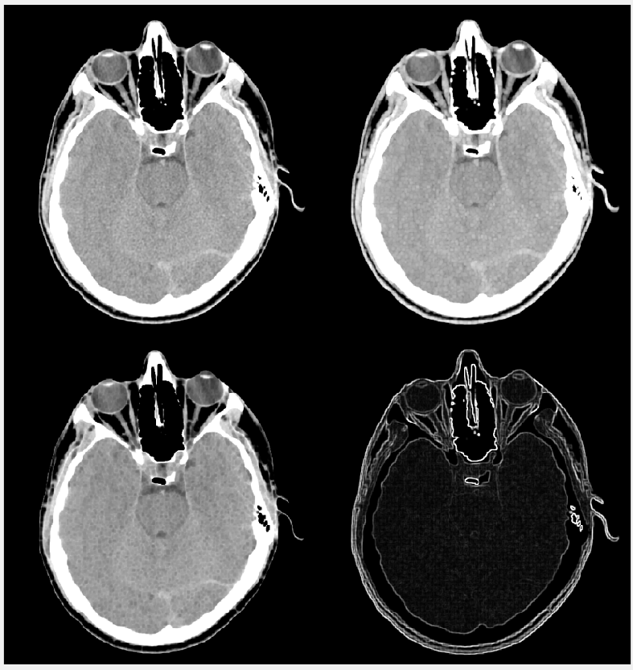 </p>

***The original image is a head CT scan with clear anatomical structures with varying intensity levels. After dilating the image with a 3x3 square structuring element, the image appears slightly brighter overall. Bright regions have expanded with increased intensity values. Unlike binary dilation which simply expands white regions, grayscale dilation replaces each pixel with the maximum intensity value within the structuring element neighborhood. That's why bright pixels expand into darker neighborhoods with an overall brightening effect.***

***The eroded image, on the other hand, appears slightly darker overall. Bright regions have shrunk with the darker regions such as air cavities and soft tissue expanding. Grayscale erosion replaces each pixel with the minimum intensity value within the structuring element neighborhood. This is why there is an overall darkening effect and bright features disappear.***

***The last image represents the morphological gradient (gg = gd - ge). It reveals the edges and boundaries in the CT scan with bright white outlines. Since dilation thickens regions in an image and erosion shrinks them, their difference highlights regions of intensity change and creates an edge detection effect. The gardient = max(neighborhood) - min(neighborhood) = intensity variation in each neighborhood. Areas with small gradient are homogeneous regions with small intensity difference, so these areas are represented by the dark pixels.***

## Challenges

You may like to attemp one or more of the following challenges. Unlike tasks in this Lab where you were guided with clear instructions, you are required to find your solutions yourself based on what you have learned so far.  

1. The grayscale image file _'assets/fillings.tif'_ is a dental X-ray corrupted by noise.  Find how many fills this patient has and their sizes in number of pixels.


<p align="center"> 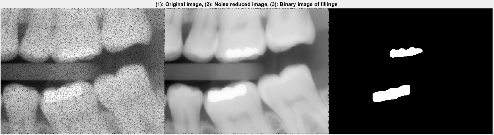 </p>

***The original dental x-ray image was highly corrupted with visible grainy texture throughout. To reduce this noise while preserving the edges and boundaries of the fillings (for accurate size measurement), a 5x5 median filter was applied. The 5x5 kernel size was chsoen because it is large enough to effectively suppress noise without excessive blurring of filling edges.***
```
% Reduce noise using median filtering
f_med = medfilt2(f, [5 5]);
```
***Fillngs are represented as the brightest white regions in dental X-rays. To isolate these filling pixels from the background, a percentile-based threshold was utilised. The threshold was set as the 97th percentile of the filtered image's intensity distribution, which means only pixels in the top 3% brightest are classified as fillings. Rather than using a fixed intensity value, percentile-based thresholding adapts to the specific intensity distributino of this image, so that it can be applied under various exposure settings. ***
```
% Use the top 3% as threshold to find the bright fillings 
threshold  = prctile(f_med(:), 97);
```

***A binary image was then created where pixels exceeding the threshold become white (1) and all others become black (0). The binary image was analysed using bwconncomp(bw) to identify and label connected groups of white pixels. The size of each filling was calculated using cellfun(@numel, CC.PixelIdxList) similar to the computation in Task 5. ***

```
% Binary image where pixels above the threshold become white
bw = f_med > threshold;

% Count all the white pixels which represent fillings
CC = bwconncomp(bw);
num_fillings = CC.NumObjects;
sizes = cellfun(@numel, CC.PixelIdxList);
```

***The results are shown below:***
<p align="center"> 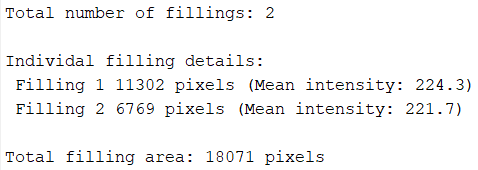 </p>


2. The file _'assets/palm.tif'_ is a palm print image in grayscale. Produce an output image that contains the main lines without all the underlining non-characteristic lines.


<p align="center"> 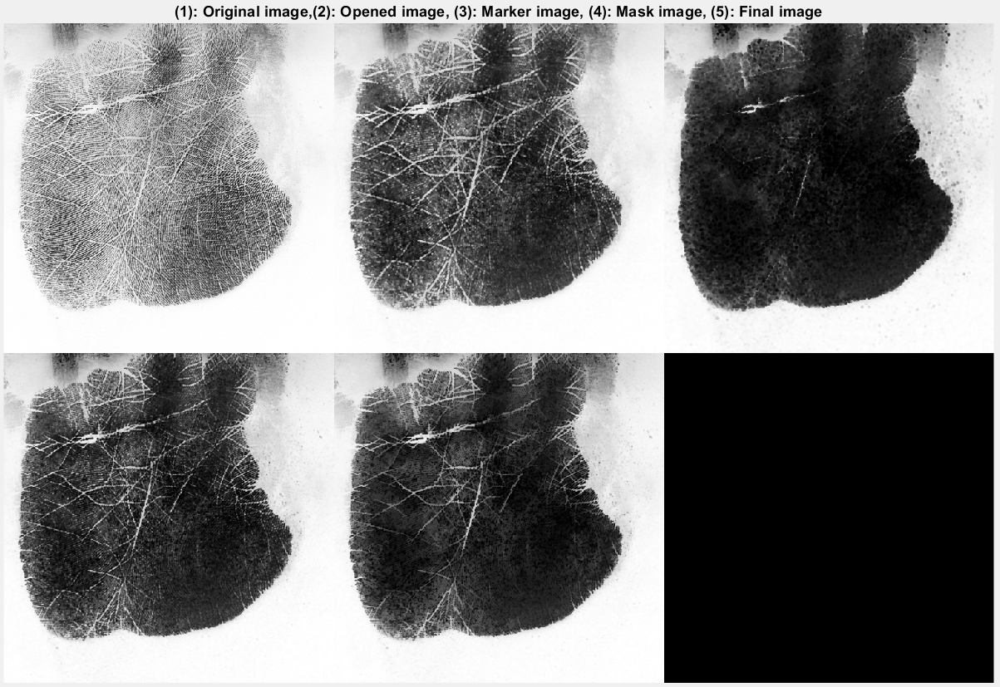 </p>

***The original palm print image contains white lines on a dark palm against a white background. There are numerous thin ridges overlaying the main palm lines, which are thicker. To remove thin ridges, morphological opening was applied. The erosion operation removes thin ridges with a SE disk of radius of 5, while the subsequent dilation restores surviving thick lines approximately to their original width. A disk-shaped SE was used because palm lines are naturally curved where a circular shape matches the curved geometry better. The opened image shows significant reduction in fine ridge texture, with the palm appearing darker and cleaner. However, some medium-thickness ridges remain and the image contains more non-characteristic features than wanted. Hence, opening alone is insufficient.***   
```
se = strel('disk', 5);
f_open = imopen(f, se);
```

***Reconstruction is therefore used to preserve the exact shapes of the main lines whilst removing non-needed features. To identify locations of only the thickest main lines, a marker is by applying aggressive erosion to the opened image with a disk SE of radius 8. It acts as a filter to ensure only the thickest palm lines remain visible. The marker image shows only the 2 main structural palm lines. ***

***A mask is then created to define the boundary within which reconstruction can operate. The mask image shows that it excludes most fine ridges and is slightly more eroded around the edges compared to the opened image. Reconstruction then restores the shape of main palm lines by dilating the marker within the boundary of the mask. imadjust is applied to enhance the contrast of the final image to improve visibility.*** 
```
marker = imerode(f_open, strel('disk', 6));
mask = imerode(f_open, strel('disk',3));
f_reconstructed = imreconstruct(marker, mask);
f_reconstructed = imadjust(f_reconstructed);
```

***The final image contains main palm lines as clearly visible, distinct white lines while the underlying ridge texture is significantly reduced compared to original and opened images. The lines maintain their natural curved shapes without blur. ***


3. The file _'assets/normal-blood.png'_ is a microscope image of red blood cells. Using various techniques you have learned, write a Matlab .m script to count the number of red blood cells.

***The normal-blood.png image is in RGB color. To make it easier to process, I converted it into a grayscale image since the primary difference between the cells and the background is intensity. The binary image is inverted because the bwconncomp function counts white foregounrd objects on a black background. The pale center of the red blood cells appear as black holes due to the intensity difference. I applied imfill to fill these holes.*** 
```
clear all; close all;
f = imread('assets/normal-blood.png');
f = rgb2gray(f);
% Binarise and invert the image since it counts the white items
bw = ~imbinarize(f);
bw_filled = imfill(bw, "holes");

CC = bwconncomp(bw_filled,8);
num_cells = CC.NumObjects;
fprintf(' Number of cells: %d\n\n', num_cells);

figure; montage({f, bw,  bw_filled}, "size", [1 3]); title(['(1): Original image,' ...
    '(2): Binary image, (3): Image with holes filled']);
```
<p align="center"> 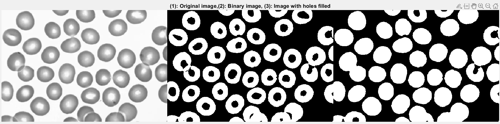 </p>

***The script counted 43 cells are presented in the image whilst there are 44 cells presented. This is most likely due to cell overlapping which causes bwconncomp unable to distinguish between two circles that share a border. In addition, some cells are partially cut off by the image border. While the script included these in the count, if a hole in an edge-cell is open to the border, imfill function can't close it which can lead to fragmentation of that cell. *** 


---
## DRAW Week Assessment
---

The first half of this module is assessed on your effort in completing Lab 1 to Lab 4.  This is done through your repo or "logbook", which should record what you have done in Lab 1 to Lab 4, including explanations and reflections on observations.  

This assessment accounts for 15% of the module.  The preferred route of submitting your logbook is through GitHub, but you may use other tools such as Notion or Obsidian.  You must complete the [SURVEY](https://forms.cloud.microsoft/e/mgcDRn9QdM) and grant me access to them.  My GitHub account name is 'pykc'.

The deadline for this is **16.00 on Friday 13 February 2026**.  
