# Lab 5 - Segmentation and Feature Detection
*_Peter Cheung, version 1.2, 19 Feb 2026_*


In this laboratory session, you will explore techniques to identify features and regions in an image. As before, clone this repository to your laptop and keep your experimental logbook on your repo.  

## Task 1: Point Detection

The file "crabpulsar.tif" contains an image of the neural star Crab Nebula, which was the remnant of the supernova SN 1054 seen on earth in the year 1054. 

The goal is to try to remove the main nebular and only highlight the surrounding stars seen in the image.

Try the following code and explain what hapens.

```
clear all
close all
f = imread('assets/crabpulsar.tif');
w = [-1 -1 -1;
     -1  8 -1;
     -1 -1 -1];
g1 = abs(imfilter(f, w));     % point detected
se = strel("disk",1);
g2 = imerode(g1, se);         % eroded
threshold = 100;
g3 = uint8((g2 >= threshold)*255); % thresholded
montage({f, g1, g2, g3});
```

<p align="center"> 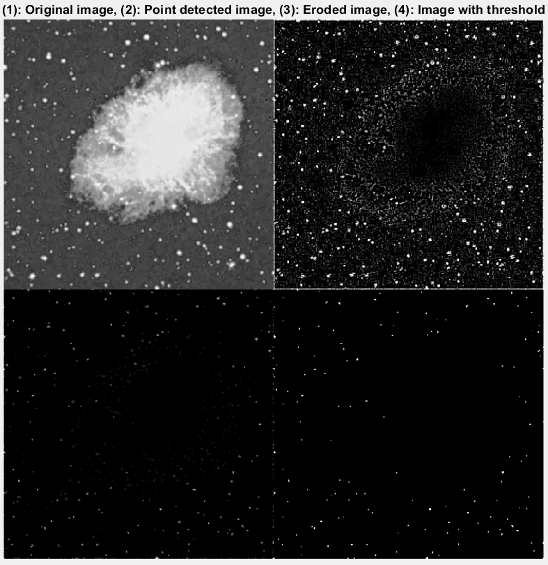 </p>

**The oringinal image is a grayscale image with the Crab Nebula (a bright and diffuse cloud) at the centre of the frame with some small stars scattered across the darker background. A 3x3 Laplacian kernel is applied to the image to detect sudden intensity changes within the image such as the stars and the edges of the Nebula. These points are detected by convolution with the Laplacian where regions with uniform intensity produce near-zero output whilst regions with sharp and sudden intensity spikes have high values. As shown on the image, the Crab Nebula is rendered nearly entirely black and the stars stand out as bright white dots. The image is then eroded by a disk of radius 1 structuring element to capture the strongest points and remove small noise. Hence the image has less and smaller bright points captured than before. Finally, a threshold of 100 is applied to produce a binary image where only pixels with an eroded Laplacian response >= 100 are set to white (255). Everything else becomes black (0) and so the image highlights the surrounding stars and the nebula region is entirely black.**   


## Task 2: Edge Detection 

Matlab Image Processing Toolbox provides a special function *_edge( )_* which returns an output image containing edge points.  The general format of this function is:

```
[g, t] = edge(f, 'method', parameters)
```
*_f_* is the input image.  
*_g_* is the output image.  *_t_* is an optional return value giving the threshold being used in the algorithm to produce the output.  
*_'method'_* is one of several algorithm to be used for edge detection.  The table below describes three algorithms we have covered in Lecture 8.

<p align="center"> 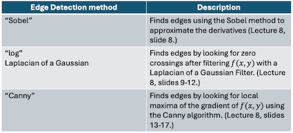 </p>

**Sobel finds edges by calculating the gradient magnitude between neighbouring pixels and comparing it with the threshold to identify edges. Laplacian of a Gaussian first smooths the image with a Gaussian filter using convolution to suppress noise then measures how the second derivative changes. Edges correspond to zero-crossings fo the Laplacian output. The Canny edge detector has 5 steps: (1) Apply Gaussian filter to smooth the image and remove noise, (2) Calculate the intensity gradients including both the gradient magnitude and direction, (3) Apply non-maximum suppression to thin the edges, (4) Apply double threshold to determine potential edges, (5) Using hysteresis method, produce the final edge using the strong edge points.**

The image file *_'circuits.tif'_* is part of a chip micrograph for an intergrated circuit.  The image file *_'brain_tumor.jpg'_* shows a MRI scan of a patient's brain with a tumor.

Use *_function edge( )_* and the three methods: Sobel, LoG and Canny, to extract edges from these two images.

The function *_edge_* allows the user to specify one or more threshold values with the optional input *_parameter_* to control the sensitivity to edges being detected.  The table below explains the meaning of the threshold parameters that one may use.

<p align="center">  </p>

Repeat the edge detection exercise with different threshold to get the best results you can for these two images.

<p align="center"> 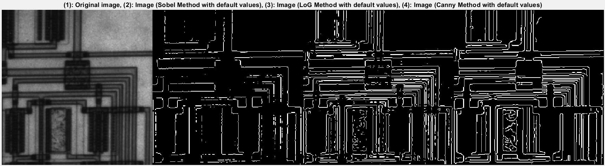 </p>
<p align="center"> 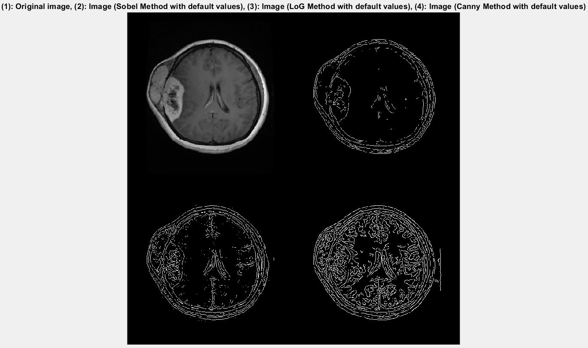 </p>

**The default edge detection function with no threshold defined automatically estimates an optimal threshold based on the image's own histogram. For the circuit image, the threshold for Sobel is 0.0821, for LoG is 0.0054, and for Canny is [0.1063, 0.2656].The Sobel method only identifies strong edges with some of the internal details being lost. The boundaries are not very clean and connected. LoG produces thinner edges than Sobel and captures most of the curved internal features. However, there is some visible noise and the boundaries are not very smooth and continuous. The Canny method results in the best and cleanest edge detection image. The identified edges are in similar width as the LoG method's but there is significant less noise. The structure of the chip is most readable with most of the details being preserved with cleanly defined boundaries.**  

**For the brain tumor image, the default threshold for Sobel is 0.058, for LoG is 0.002, and for Canny is [0.0125, 0.0313]. As shown in the image, Sobel highlights the overall outline but misses finer edges like the brain soft tissue textures, whilst LoG captures more edges especially in the tumor regions, and the Canny method identifies the most fine details including in the tumor regions and brain soft tissue textures. However, the Canny method also included a lot of noises as edges in some regions.** 

**Since the Sobel image with default threshold have thick edges, the threshold needs to be increased.**
<p align="center"> 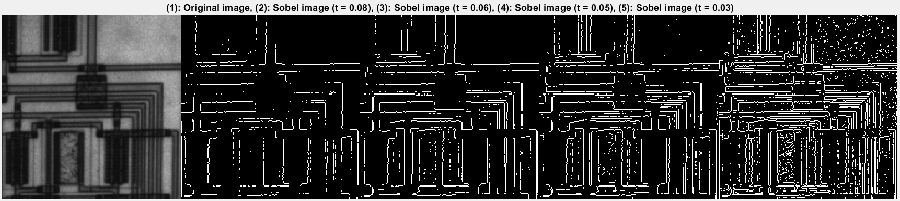 </p>

**A range of threshold is applied to the image, from 0.08 to 0.03. As seen from the above image, the smaller the threshold, the more edges are being detected including weak and noisy ones. The image with threshold = 0.03 includes cluttered and false edges and appears noisy. However, when the threshold is too high, only the strongest edges survivie resulting in incomplete edge maps and details lost. Therefore, the ideal threshold for the Sobel edge detection for the circuit.tif would fall between 0.05-0.06, where the edges are being defined cleanly without including too much noise.**

**Since the Sobel brain tumor image doesn't capture enough details, the threshold decreases to detect more edges. The threshold from 0.03 to 0.05 is applied, and as shown on the below image, the smaller the threshold, the more intricate details Sobel can detect. However, it struggles to identify smooth weaker edges of the brain tissue and the edges on the skull and brain tumor region become overwhelming as the threshold decreases. Therefore, the ideal threshold range would fall between 0.04-0.05 to balance the details of the tumor region without mapping too many irrelevant edges.**

<p align="center"> 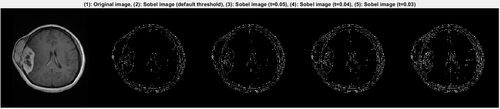 </p>


**The LoG image with default threshold already does decent, with the major edges being defined with fine details. A range of threshold between 0.003 and 0.007 and the ideal threshold seems to fall between 0.006-0.007. When threshold = 0.006, the circuit lines in the bottom left are defined with noise, whilst when t = 0.007, less noise is included in the image.**

<p align="center"> 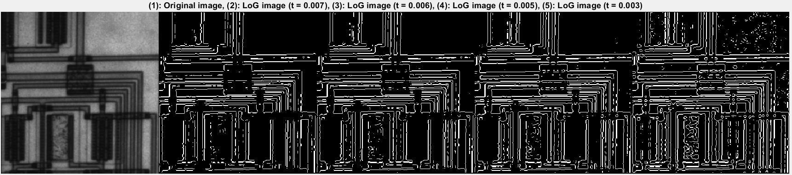 </p>


**The LoG brain tumor image with default threshold captures noise as weak edges, indicating that the default threshold is too low. This effect is further emphasised by reducing the threshold to 0.001, where the image is cluttered with false edges and the genuine structural edges become hard to distinguish. After increasing the threshold to 0.003 and 0.004, the background becomes a lot cleaner with only the stronger boundaries remain and the edges become more fragmented. The ideal threshold range falls around 0.004 where the details in the tumor region are kept with minimal noise.**

<p align="center">  </p>


**The Canny edge detection methods use two thresholds: a low threshold and a high threshold. It disregards all edges with edge strength below the lower threshold and preserves all edges with edge strength above the higher threshold. These threshold by default in the circuit image is [0.1063, 0.2656]. The Canny image with default threshold has relatively clean and well-connected edges, so only minor tunning is needed. To result in cleaner edges, a higher threshold was used.**  

<p align="center"> 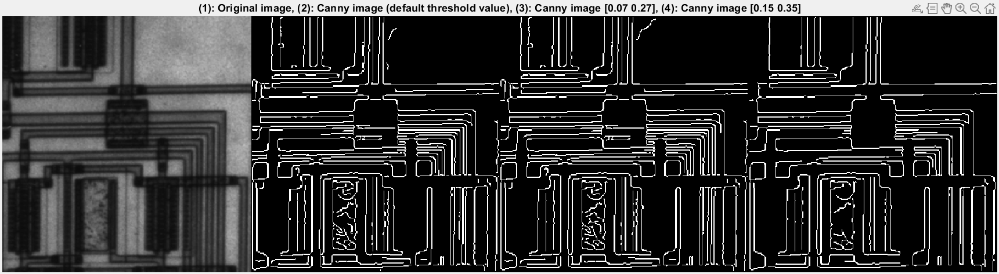 </p>

**The higher threshold is therefore increased to 0.35 so that less pixels qualify as definite edges to retain only the stronger edges, whilst the lower threshold is increased to 0.15 so less weak pixels can connect to those strong edges. This results the image to be cleaner whilst including fine details.** 

**The thresholds [0.07, 0.27] is also tested to see the effect of only reducing the lower threshold. As seen in the image, compared to the default threshold values, more weak pixels can connect to strong edges, resulting more noise and continuous edge chains.** 

<p align="center"> 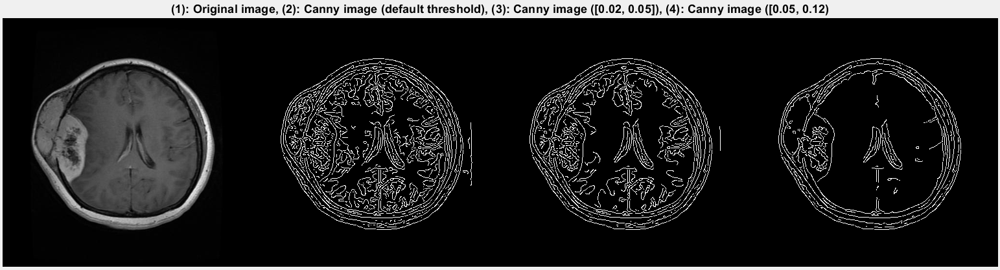 </p>


**The default [0.0125, 0.0313] range of Canny method captures lots of fine edges in the brain tumor image, with edges heavily cluttered but also inludes excessive texture edges from brain folds and MRI noise. The tumour region is indistinguishable from surrounding tissue edges. So The thresholds are increased slightly to [0.02, 0.05] to minimise brain fold texture edges but the overall image remains cluttered, causing the tumour boundary not clearly isolated from surrounding edges. The thresholds are hence increased to [0.05, 0.12] to achieve the optimal image. The outer skull boundary is well-defined and the tumour region is now more distinguishable as a distinct enclosed region without excessive fragmentation.**


## Task 3 - Hough Transform for Line Detection

In this task, you will be lead through the process of finding lines in an image using Hough Transform.  This task consists of 5 separate steps.


#### Step 1: Find edge points
Read the image from file 'circuit_rotated.tif' and produce an edge point image which feeds the Hough Transform.

```
% Read image and find edge points
clear all; close all;
f = imread('assets/circuit_rotated.tif');
fEdge = edge(f,'Canny');
figure(1)
montage({f,fEdge})
```
This is the same image as that used in Task 2, but rotated by 33 degrees.

<p align="center"> 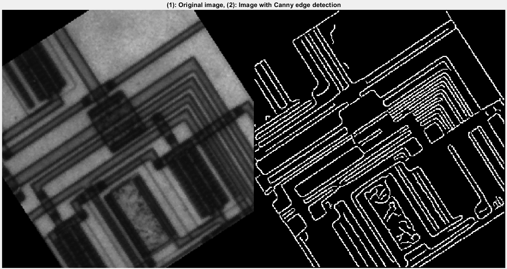 </p>

**The Hough Transform works by mapping the image space to the parameter space and identifies lines based on intersection in the parameter space. Without Canny, every pixel will be mapped to a curve in the parameter space and ireelevant pixels generate curves that intersect randomly all over the parameter space, creating false peaks in bins that don't correspond to any real line.** 

**In more technical terms, Hough Transform works by voting, where every edge pixel records votes for all possible lines that could pass through it. Edges are then found based on which line parameters received the most votes. So an edge map is needed to feed the Hough Transform instead of the raw image so that only geometrically relevant pixels participate in voting. Otherwise, there will be overwhelming noise in the accumulator and very slow to compute.**


#### Step 2: Do the Hough Transform
Now perform the Hough Transform with the function *_hough( )_* which has the format:
```
[H, theta, rho] = hough(image)
```
where *_image_* is the input grayscale image, *_theta_* and *_rho_* are the angle and distance in the transformed parameter space, and *_H_* is the number of times that a pixel from the image falls on this parameter "bin".  Therefore, the bins at (theta,rho) coordinate with high count values belong to a line.  (See Lecture 8, slides 19-25.)  The diagram below shows the geometric relation of *_theta_* and *_rho_* to a straight line.

<p align="center"> 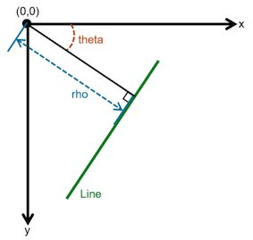 </p>


<p align="center"> 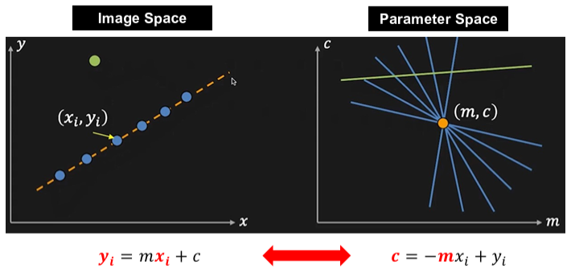 </p>

**From the above image from Lecture 8 Slide 21, a point in the parameter space (m, c) represents a line in the image space. This explains why when multiple pixels fall on the bin at (theta, rho) (a point in the parameter space), it shows a line in the image. The count in a bin represents how many edge pixels have that particular (theta, rho) comobination, so how many edge pixels are consistent with that specific line in the image space. So a bin with a high count (maxima) means many edge pixels on that line and suggests a long, well-defined, continuous line in image space. Whilst a bin with a low count means the line is very short and fragmented, or it may be a coincidental alignment of a few unrelated edge pixels that happen to be collinear.**


Now perform Hough Transform in Matlab:
```
% Perform Hough Transform and plot count as image intensity
[H, theta, rho] = hough(fEdge);
figure(2)
imshow(H,[],'XData',theta,'YData', rho, ...
            'InitialMagnification','fit');
xlabel('theta'), ylabel('rho');
axis on, axis normal, hold on;
```

The image, which I shall called the **_Hough Image_**, correspond to the counts in the Hough transform parameter domain with the intensity representing the count value at each bin.  The brighter the point, the more edge points maps to this parameter.  Therefore all edge points on a straight line will map to this parameter bin and increase its brightness.

<p align="center"> 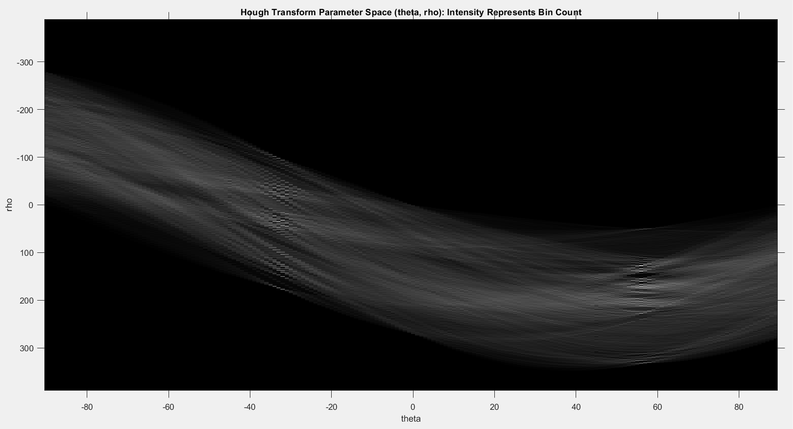 </p>

**As seen on the image, there's a diagonal bright band across the space representing the dominant orientation of edges. In a non-rotated circuits image, the dominant lines are mostly horizontal and vertical, so the bright peaks in parameter space would cluster around θ = 0° (horizontal) and θ = 90° (vertical). Since the circuit image is rotated at an angle, all the horizontal and vertical lines are tilted. This is shwon in the Hough Image, where the bright bands and peaks are located around θ = -33° (rho = 110-175) and θ = 56° (rho = 125-230), reflecting the titled orientation of the circuit traces. These are the bins with the highest counts and many collinear edge pixels agree on the same line. The largely black regions indicate that no edge pixels have those (theta, rho) combinations, whilst the dimmer regions represent shorter or less well-defined edges in the image.** 


#### Step 3: Find peaks in Hough Image
Matlab  provides a special function **_houghpeaks_** which has the format:
```
peaks = houghpeaks(H, numpeaks)
```
which returns the coordinates of the highest *_numpeaks_* peaks. 

The following Matlab snippet find the 5 tallest peaks in H and return their coordinate values in *_peaks_*.  Each element in *_peaks_* has values which are the indices into the *_theta_* and *_rho_* arrays.  

The *_plot_* function overlay on the Hough image red circles at the 5 peak locations.

```
% Find 5 larges peaks and superimpose markers on Hough image
figure(2)
peaks  = houghpeaks(H,5);
%peaks  = houghpeaks(H,5,'threshold',ceil(0.3*max(H(:))));
x = theta(peaks(:,2)); y = rho(peaks(:,1));
plot(x,y,'o','color','red', 'MarkerSize',10, 'LineWidth',1);
```
<p align="center"> 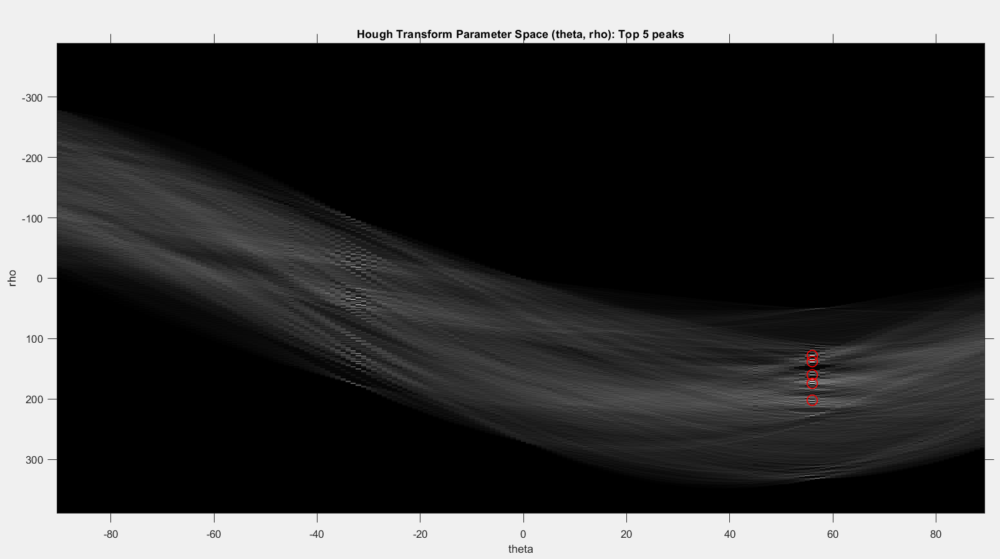 </p>

**The 5 peaks appear in a perfectly vertical line on the plot and the intensity under those red circles are relatively similar. The coordinates of the 5 peaks are: (θ = 56, ρ = 128), (θ = 56, ρ = 138), (θ = 56, ρ = 160), (θ = 56, ρ = 174), (θ = 56, ρ = 202). They all share the same θ (56°), meaning that the 5 most well-defined lines are parallel and titled at the same angle. The ρ values allow us to calculate the distance between these lines. For example, the first two lines are 10 units apart while the gap between the third and fourth is 14 units.**   


> Explore the contents of array *_peaks_* and relate this to the Hough image with the overlay red circles.

**The array peaks returns a 5 x 2 matrix, where each row represents one peak. Instead of returning the actual (θ, ρ) values, it returns the row and column indices of those peaks within the Hough matrix H. Hence the column index and row index are then converted into angle in degrees and distance in pixels in the code:**
```
x = theta(peaks(:,2)); y = rho(peaks(:,1));
```
**The contents of array peaks are:** 
**(528, 147), (564, 147), (550, 147), (592, 147), and (518, 147). This aligns with the peak coordinates where θ is the same for all (all the column indices in the array are the same). This is because all the lines have the same orientation, so in the Hough matrix H, all the edge pixels fall on bins in the same vertical column (147) but at different vertical positions (rows).**

#### Step 4: Explore the peaks in the Hough Image
It can be insightful to take a look at the Hough Image in a different way.  Try this:

```
% Plot the Hough image as a 3D plot (called SURF)
figure(3)
surf(theta, rho, H);
xlabel('theta','FontSize',16);
ylabel('rho','FontSize',16)
zlabel('Hough Transform counts','FontSize',16)
```
You will see a plot of the Hough counts in the parameter space as a 3D plot instead of an image.  You can use the mouse (or track pad) to rotate the plot in any directions and have a sense of where the peaks occurs.  The **_houghpeak_** function simply search this profile and fine the highest specified number of peaks.  

<p align="center"> 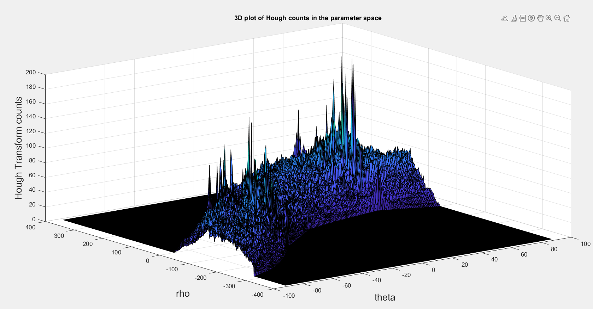 </p>

**In the 3D Hough transform plot, the physical height of the peaks represents the Hough Transform counts. The overall plot is very clean, with clear sharp peaks indicating that the original image has thin well-defined edges.** 

**As seen in the below image, at θ = 56, there are at least 5 peaks lined up perfectly straight, similar to the 2D plot. There are also a high peak density at θ = -33 although the peak height is lower than θ = 56. This observation aligns with the 2D Hough image in step 2. There are some shorter lines in the image that are roughly perpendicualr to the main lines (56 + 34 = 90).**

<p align="center"> 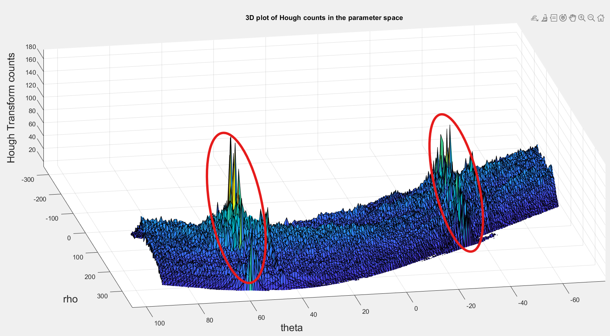 </p>

 **In addition, when rotating the 3D plot to match the axes range of the 2D plot, the overall outline appears nearly identical.**  

<p align="center"> 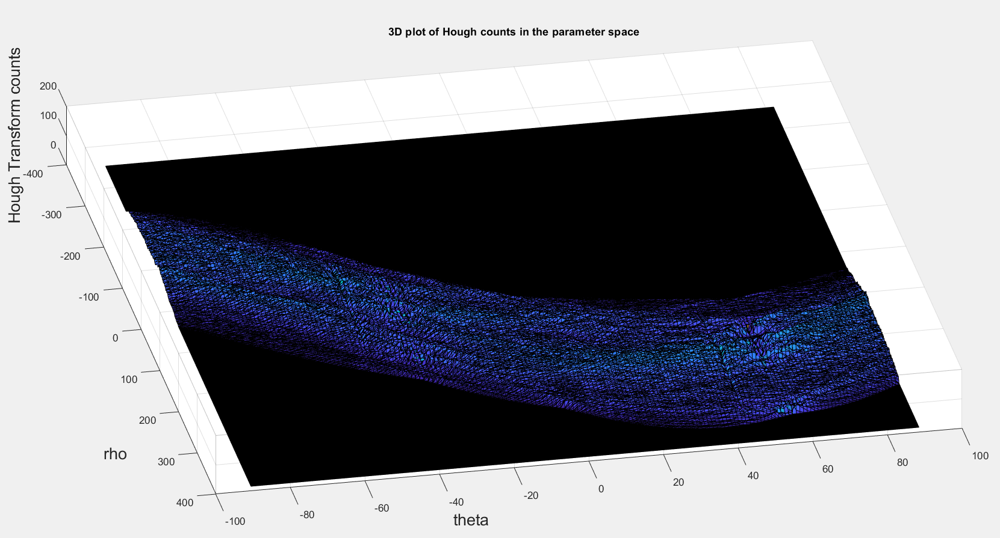 </p>


### Step 5: Fit lines into the image

The following Matlab code uses the function **_houghlines_** to 

```
% From theta and rho and plot lines
lines = houghlines(fEdge,theta,rho,peaks,'FillGap',5,'MinLength',7);
figure(4), imshow(f), 
figure(4); hold on
max_len = 0;
for k = 1:length(lines)
   xy = [lines(k).point1; lines(k).point2];
   plot(xy(:,1),xy(:,2),'LineWidth',2,'Color','green');
```

The function **_houghlines( )_** returns arrays of lines, which is a structure including details of line segments derived from the results from both **_hough_** and **_houghpeaks_**.  Details are given in the table below.


<p align="center">  </p>

The start and end coordinates of each line segment is used to define the starting and ending point of the line which is plotted as overlay on the image.

**The houghlines function uses the peaks to look at the binary edge image (fEdge) and determines where a line actually starts and ends. If a line has a small break (up to 5 pixels, by 'FillGap', 5), the gap will be ignored and the segment will be continued. A line will only be drawn if the detected segment is at least 7 pixels long ('MinLength', 7).**
```
lines = houghlines(fEdge,theta,rho,peaks,'FillGap',5,'MinLength',7);
```

> How many line segments are detected? Why it this not 5, the number of peaks found?
> Explore how you may detect more lines and different lines (e.g. those orthogonal to the ones detected).


**Inspecting the lines array and the image overlay, 12 segments were found. The number of peaks doesn't always equal to the number of line segments because one single peak might correspond to multiple broken segments in the image. A peak in the Hough Transform represents a specific (θ,ρ) trajectory that many pixels "voted" for. However, that trajectory might be linked by several disconnected objects.**

<p align="center"> 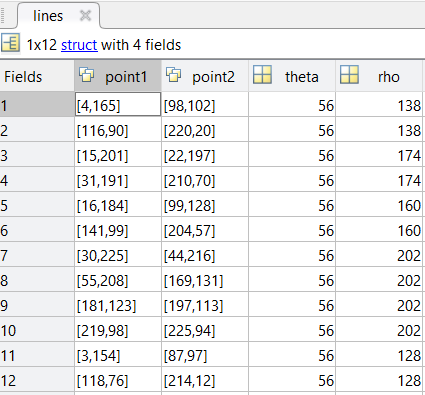 </p>

**Whereas, the houghlines function checks the connectivity, it traverses the path defined by the peak and groups white pixels into a single segment only if they are close enough. Including the influence of FillGap (5), any break in the lnie larger than 5 pixels causes the current segment to end and a new one to start if more pixels further down the same path are found.** 

<p align="center"> 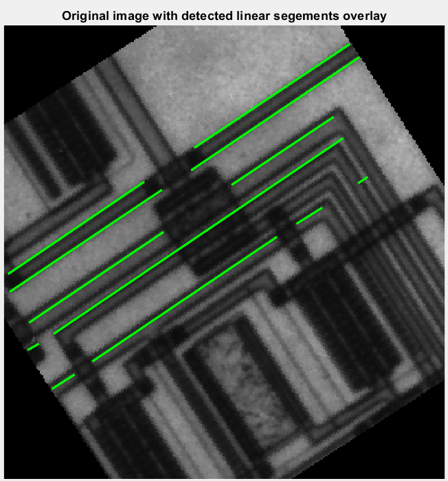 </p>

**To detect more lines, increasing the peak count to 20 allows the algorithm to look for shorter peaks in the accumulator space that were previously ignored. As seen in the below image with peak count increased to 20, more shorter and fainter edges are highlighted.** 

<p align="center"> 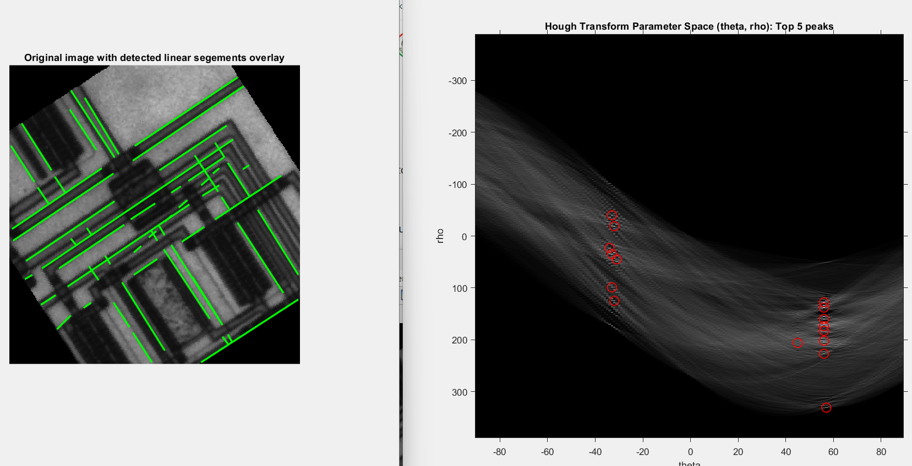 </p>

**To detect different lines such as those orthogonal to the ones detected, the peaks array can be filtered to specifically look for values where θ is roughly 90° apart from the current 56° peaks.**
```
all_peaks  = houghpeaks(H,20);
ortho_indices = find(abs(theta(all_peaks(:,2))-(-34))<5);
peaks = all_peaks(ortho_indices, :);
```
**The ortho_indices variable keeps only the peaks with θ value within 5° tolerance of the target -34°. As shown on the image below, the orthogonal lines are now highlighted.** 

<p align="center"> 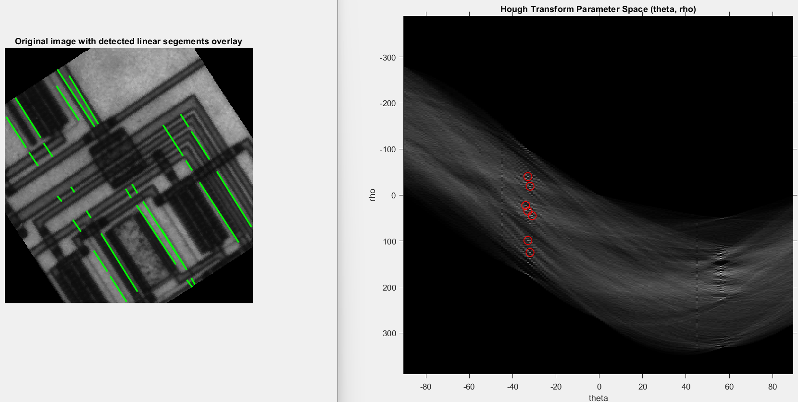 </p>


> Optional: Matlab also provides the function **_imfindcircles( )_**, which uses Hough Transform to detect circles instead of lines.  You are left to explore this yourself.  You will find two relevant image files for cicle detection: *_'circles.tif'_* and *_eight.png_* in the *_assets_* folder.

## Task 4 - Segmentation by Thresholding

You have used Otsu's method to perform thresholding using the function **_graythresh( )_** in Lab 3 Task 3 already.  In this task, you will explore the limitation of Otsu's method.

**Thresholding is the process of converting a grayscale image into a binary (black & white) image by choosing a cutoff value, where pixels below become black and pixels above become white.** 

You will find in the *_assets_* folder the image file *_'yeast_cells.tif'_*. Use Otu's method to segment the image into background and yeast cells.  Find an alternative method to allow you separating those cells that are 'touching'. (See Lecture 9, slide 9.)

**Otsu's method determines the optimal threshold by summing the variances of background pixels and foreground pixels for all possible thresholds, and choosing the one with the lowest sum of variances. This is because low variance means the pixels in that group are similar to each other, both background and foreground have been cleanly separated as two distinct populations. Therefore, Otsu's method works best with bimodal histogram.**
```
% Otsu's thresholding
t_otsu = graythresh(f);   % Otsu's optimal threshold
g_otsu = imbinarize(f, t_otsu);
```
<p align="center"> 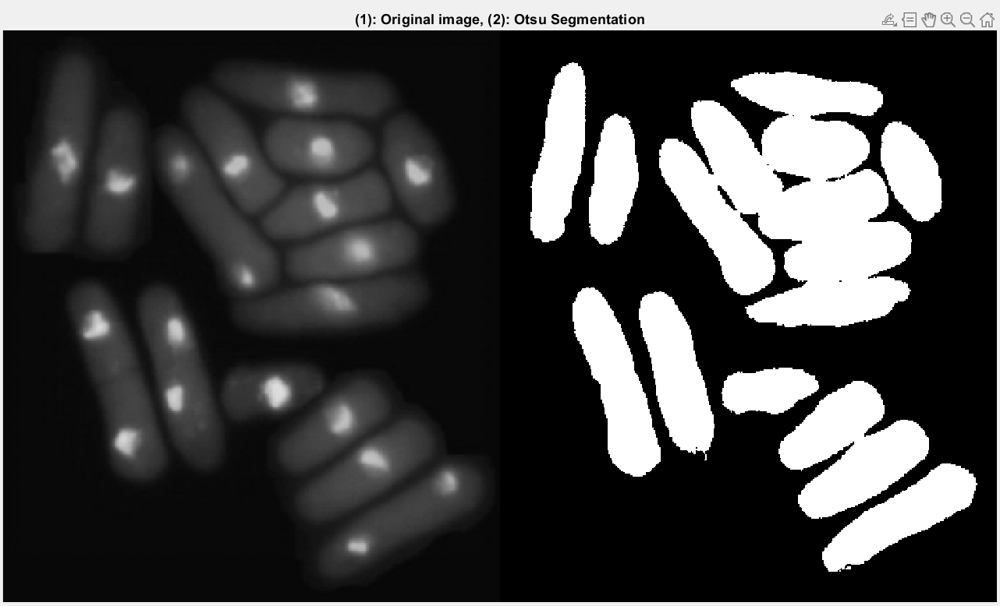 </p>

**So the graythresh() function implements Otsu's method by looking at all possible thresholds and returning the one with the minimum within-class variance. t_otsu stores this normalised optimal value (0 to 1), and imbinarize applies the threshold where pixel below t_otsu becomes black (background) and above becomes white (foreground) on the image.**  

**As seen on the above image, the Otsu's method successfully splits the yeast cells from the background and creates a binary image with higher contrast. It preserves the overall elongated shapes of individual cells, but loses internal feature like nuclei and some close touching cells are represented as a single white segment. This is because Otsu's method applies a single threshold across the entire image so it can't distinguish the subtle intensity drop that exists between two touching objects. This is a limitation if the goal is to count the number of cells or to measure the length or area of individual cell.**

**An alternative method would to compute multiple thresholds using local statistical property of the image such as mean and standard deviation. The alternative method we used is taking a 25 x 25 window in each pixel's neighbourhood to calculate the mean and standard deviation to compute the threshold value.**
<p align="center"> 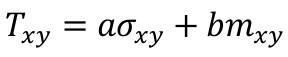 </p>

```
% Variable thresholding
w = 25;    % Window size
a = 0.4;   % Standard deviation weight
b = 0.9;   % Mean weight

localngb = ones(w, w);
m = imfilter(double(f), localngb/sum(localngb(:)), 'replicate');
sigma = stdfilt(double(f), localngb);
T = a * sigma + b * m;

g_variable = double(f) >= T;
```

**b is the mean coefficient whilst a is the standard deviation coefficient. The variable b determines the baseline level a pixel must reach to be considered foreground (white pixels). Increasing b (from b = 0.7 to 0.9, whilst a = 0.6) raises the overall threshold T across the entire image, so the black outlines look thicker and clearer. Whilst decreasing b (from b = 0.7 to 0.5, whilst a = 0.6), the cells lose their definition and merge into amorphous white segment as the threshold fails to filter out lower-intensity regions.**

<p align="center"> 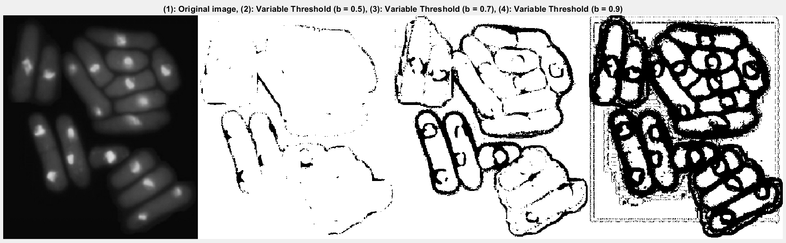 </p>

**The variable a reinforces edges. Increasing a (from a = 0.5 to 0.8, b = 0.9) would increase the threshold specifically at transitions between high and ow intensities (edges) and result in thicker, more defined black outlines around the cells. Whilst lowering a (from a = 0.5 to 0.2, b = 0.9) would make the threshold less sensitive to edges.**

<p align="center"> 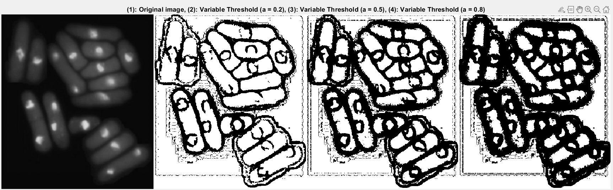 </p>

**Following some trials, the optimal values for a and b were set to be 0.4 and 0.9.**

<p align="center"> 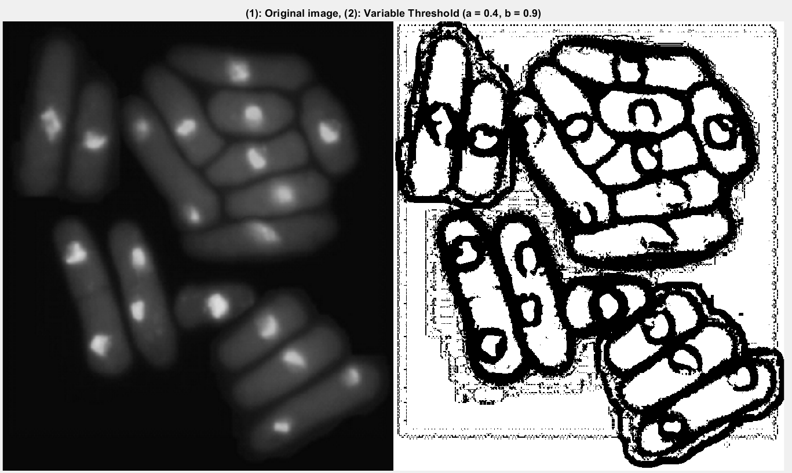 </p>

**By using a = 0.4, b = 0.9, the resulting image separates yeast cells with thick black outlines so that the number of yeast cells can be counted accurately. This is because the local standard deviation and mean identified the subtle intensity drops between the cells. The internal structure can also be visualised. However, there are some noise near the borders of the cells and on the image border. There are extra outlines around the cells because of the window size. As the window is being slided across the image, when the cell enters the window, the local mean and standard deviation increase significantly, raising the threshold for the background pixel and creates a secondary border. The noise around the entire frame is due to padding, when the window is cenered on a pixel at the edge of the image, hald of the window is outside the image os these missing areas must be paded, creating a false local mean and standard deviation.**

**These effects are mitigated by morphological closing (dilation followed by erosion). As seen in the image below, the border noise have been mostly eliminated. The dilation grows the black outline, closing the small white gaps between black noise before shrinking these regions.**

<p align="center"> 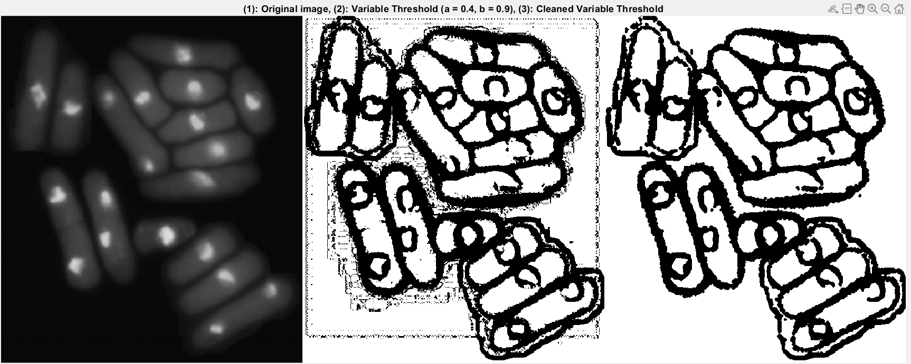 </p>


## Task 5 - Segmentation by k-means clustering

In this task, you will learn to apply k-means clustering method to segment an image.  

Try the following Matlab code:
```
clear all; close all;
f = imread('assets/baboon.png');    % read image
[M N S] = size(f);                  % find image size
F = reshape(f, [M*N S]);            % resize as 1D array of 3 colours
% Separate the three colour channels 
R = F(:,1); G = F(:,2); B = F(:,3);
C = double(F)/255;          % convert to double data type for plotting
figure(1)
scatter3(R, G, B, 1, C);    % scatter plot each pixel as colour dot
xlabel('RED', 'FontSize', 14);
ylabel('GREEN', 'FontSize', 14);
zlabel('BLUE', 'FontSize', 14);
```

This code reproduces the scatter plot in Lecture 9 slide 12, but in higher resolution.  Each dot and its colour in the plot corresponds to a pixel with it [R G B] vector on the XYZ axes.  The Matlab function **_scatter3( )_** produces the nice 3D plot.  
The first three inputs R, G and B are the X, Y and Z coordinates. The fourth input '1' is the size of the circle (i.e. a dot!).  The final input  is the colour of each pixel.

<p align="center"> 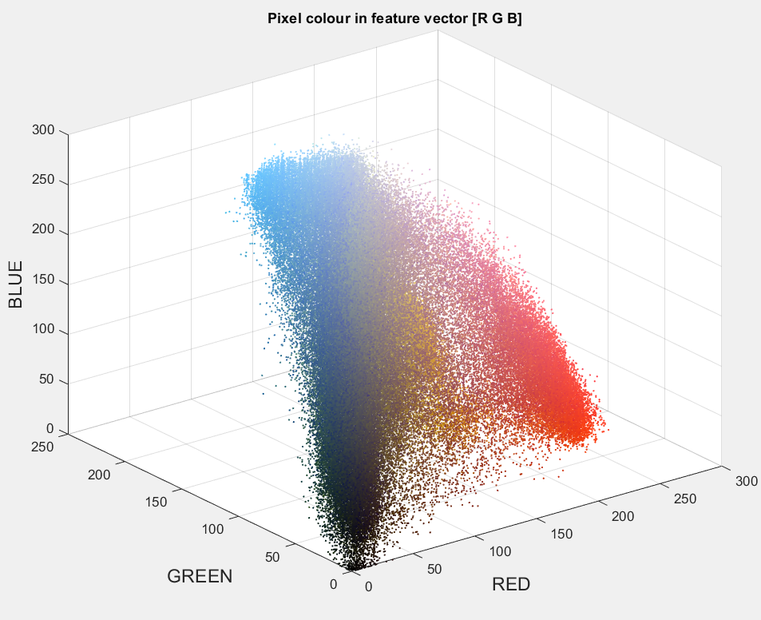 </p>

**By plotting each pixel's [R G B] vector on the XYZ axes, we see clusters are being formed, where each cluster represents a dominant colour theme in the baboon image (e.g. red and blue of the nose, brown of the fur). We can then predict how well K-means clustering would perform based on how dinstinct and dense the clusters are.**


Note that **_scatter3( )_** expects the X, Y and Z coordinates to be 1D vectors.  Therefore the function **_reshape( )_** was used to convert the 2D image in to 1D vector.
> You can use the mouse or trackpad to move the scatter plot to different viewing angles or to zoom into the plot itself. Try it.

Matlab provides a built-in function **_imsegkmeans_** that perform k-means segmentation on an image.  This is not a general k-means algorithm in the sense that it expects the input to be a 2D image of grayscale intensity, or a 2D image of colour.  The format is:

```
[L, centers] = imsegkmeans(I, k)
```
where **_I_** is the input image, **_k_** is the number of clusters, **_L_** is the label matrix as described in the table below.  Each element of **_L_** contains the label for the pixel in **_I_**, which is the cluster index that pixel belongs.  **_centers_** contains the mean values for the k clusters.

<p align="center">  </p>

Perform k-means clustering algorithm as shown below.

```
% perform k-means clustering
k = 10;
[L,centers]=imsegkmeans(f,k);
% plot the means on the scatter plot
hold
scatter3(centers(:,1),centers(:,2),centers(:,3),100,'black','fill');
```
The last line here superimposes a large black circle at each means colour values in the scatter plot.

**From the image below, black centroids (mean colour value) can be clearly identified within the scatter plot. The centroids are positioned mainly in the red, blue and brown colour regions which are the dominant colour of the baboon image. Area with more black circles are where most of the pixels are, so in the baboon image, it would be the fur and cheeks (brown colours) regions.**

<p align="center"> 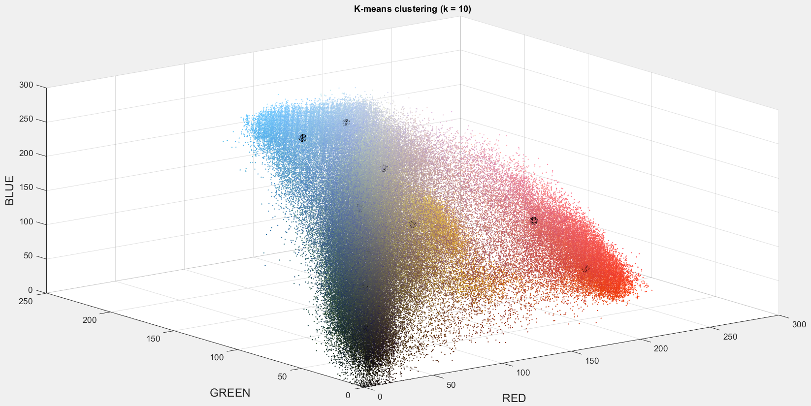 </p>

**When the number of cluster is decreased, the centroids will move further away and only represent the three most dominant regions - dark blue, red and shaded brown. Wheras increasing k would create multiple dots closer together in the same colour such as light blue and dark blue regions.** 

<p align="center"> 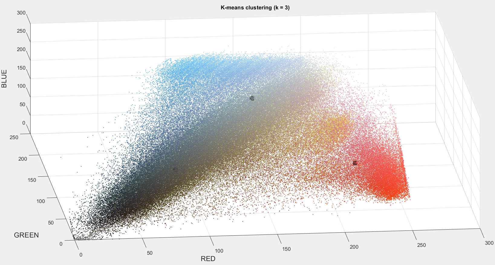 </p>
<p align="center"> 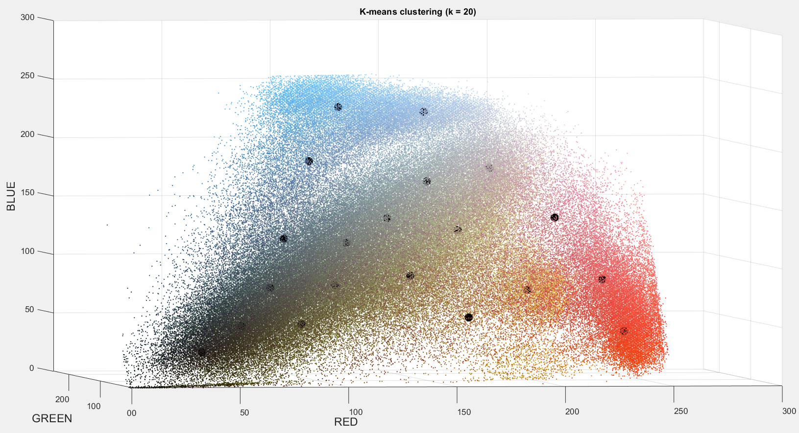 </p>

> Explore the outputs **_L_** and **_centers_** from the segmentation fucntion.  Explore different value of k.

**The data type of L is uint8 because there is 10 clusters (k <= 255). The label on each pixel represents the cluster it belongs to. Therefore, all the labels within L is between 1 to 10 and it has the same dimensions (512 x 512) as the original image.**

<p align="center"> 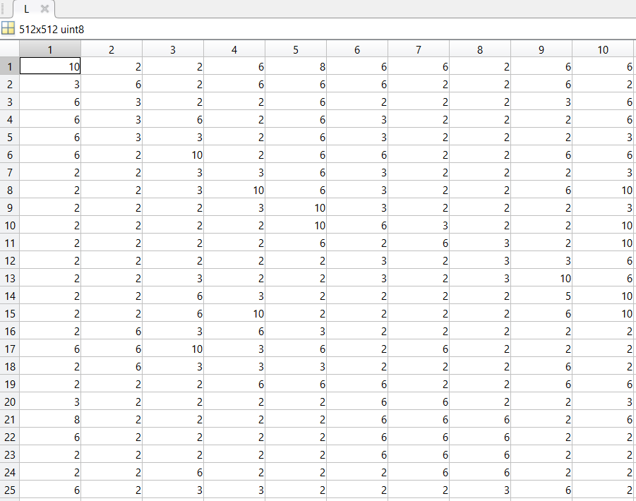 </p>

```
imshow(L, []);
```

**The label matrix can be visualised using imshow. MATLAB auto-scale the range where the minimum value in L (1) is mapped to black, and the maximum value in L (10) is mapped to white. All values in between are then mapped to distinct levels of grey. As seen in the image, pixels in the same region such as the nose have the same shade of grey, representing that they belong to the same cluster.**

<p align="center"> 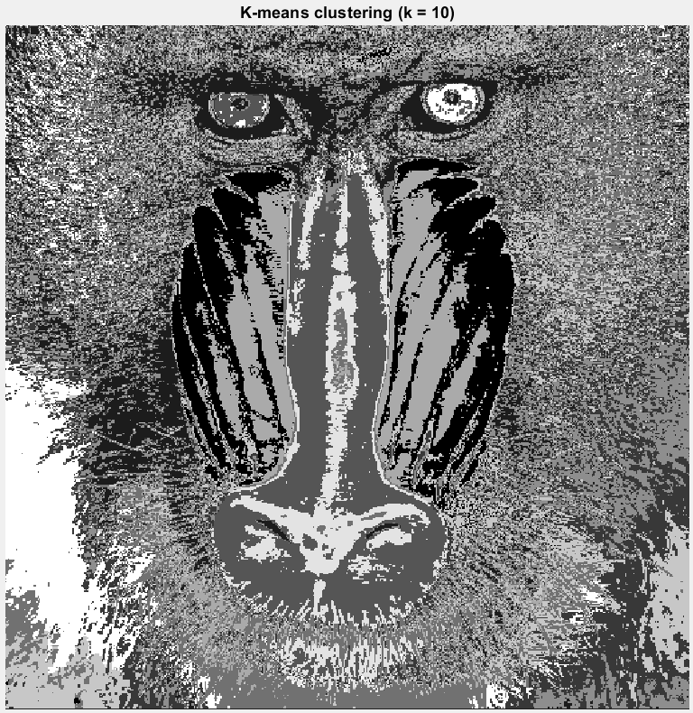 </p>

**When the number of cluster is now reduced to 5, there are less labels in the label matrix L. The algorithm is forced to group very different colours in the same category. As seen in the image below, it loses details and becomes more abstracted. For instance, the different shades of blue on the nose are now grouped in the same cluster. So decreasing the number of cluster simplifies the image and capture only its most dominant structural segments.**

<p align="center"> 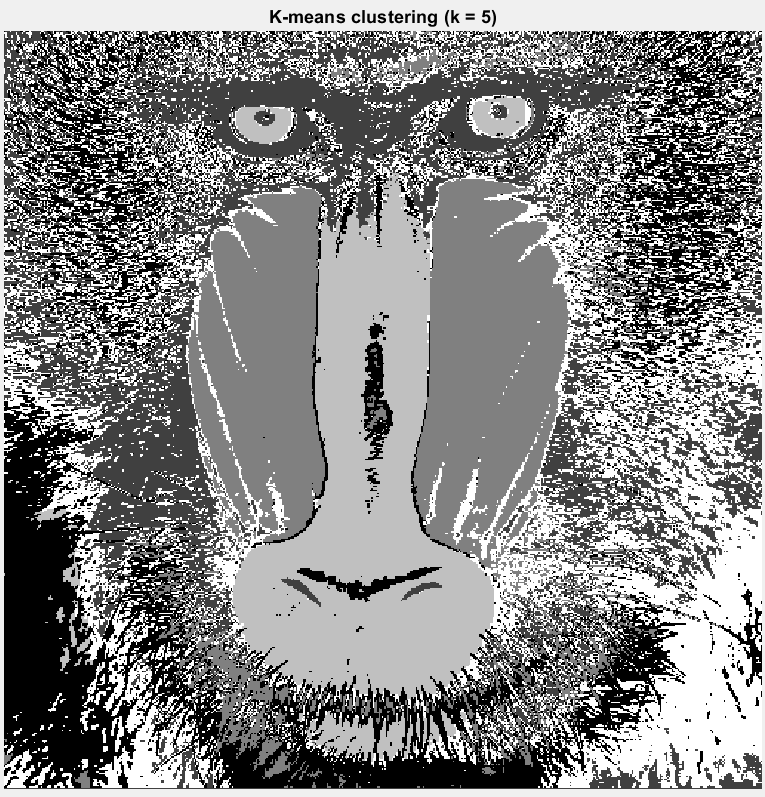 </p>
<p align="center"> 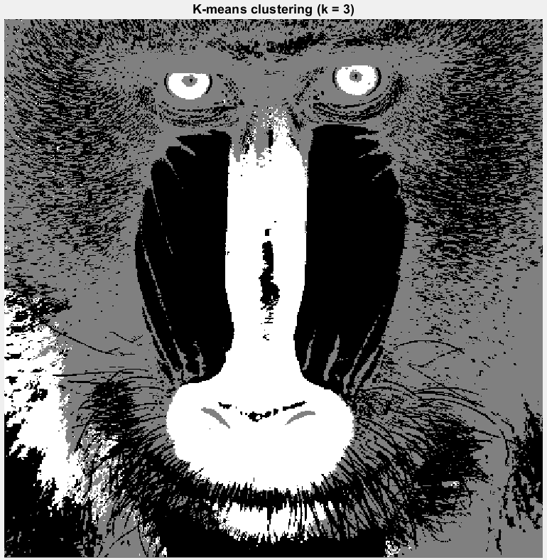 </p>

**Whilst increasing the cluster number helps capturing the subtle gradients and texture variations in the image. It can capture more details and colour shades but it becomes harder to identify segments since there are so many sub-groups.**

<p align="center"> 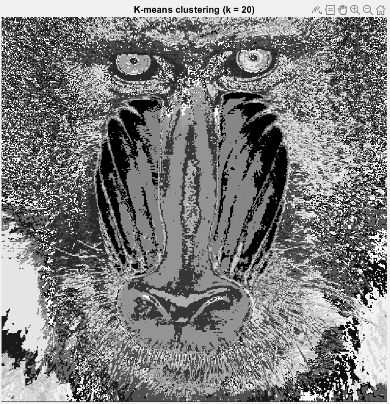 </p>

**The output center identifies the cluster centroid location and is a matrix of 10x3, since there are 10 clusters and there are 3 channels (rgb).**

<p align="center"> 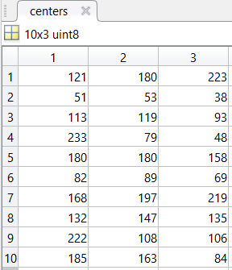 </p>

**As the number of cluster is reduced, the centroids coordinates move farther apart from each other because the algorithm is looking for the centers of the 3 most populated and different colour groups. Whilst, increasing the number of cluster moves the centroids away from the center and toward the local peaks, so that more unique rare colours are highlighted.** 

<p align="center"> 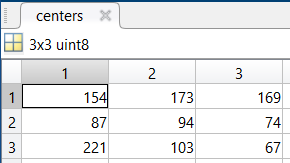 </p>
<p align="center"> 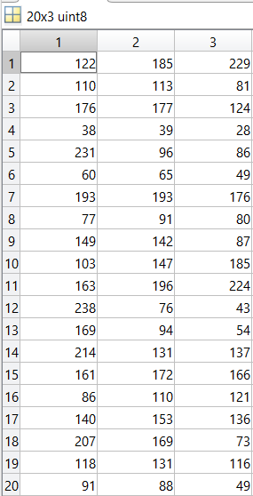 </p>


Finally, use the label matrix **_L_** to segment the image into the k colours:
```
% display the segmented image along with the original
J = label2rgb(L,im2double(centers));
figure(2)
montage({f,J})
```

The Matlab function **_labe2rgb_** turns each element in **_L_** into the segmented colour stored in **_centers_**.

**label2rgb would look up every pixel in label matrix L what its corresponding cluster ID is and replace it with the corresponding RGB triplet stored in the cneters matrix. This allows image J represents each segment using the average colour.**

<p align="center"> 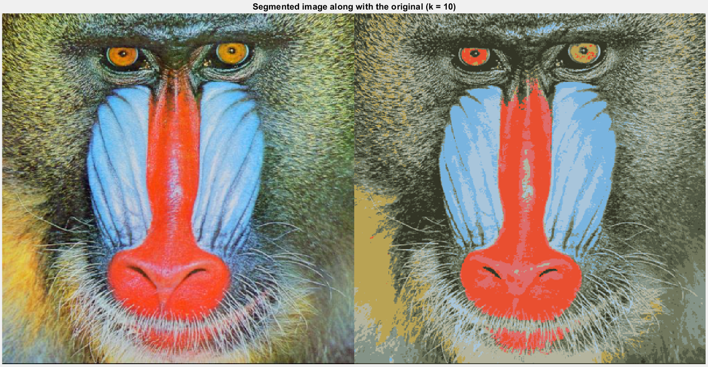 </p>

**With k = 10, the distinct features of the baboon, the yellow eyes, red nose, blue cheeks and various shades of brown and grey fur are separated into their own clusters. The tonal depth are highlighted, where within the same colour (e.g. red) have 2 clusters (bright red on nose, lighter red on highlighted nose region).** 


> Explore different value of k and comment on the results.

**When k = 3, the image is reduced to three dominant regions, the bright red nose and eyes, the light blue cheeks and lighter colour regions, and the dark brown fur and everything else. It captures only the essence segment in the image but loses fine details. For example, the blue nose and the white whiskers are categorised into the same cluster, and the textures on the cheek and the nose are lost.** 

<p align="center"> 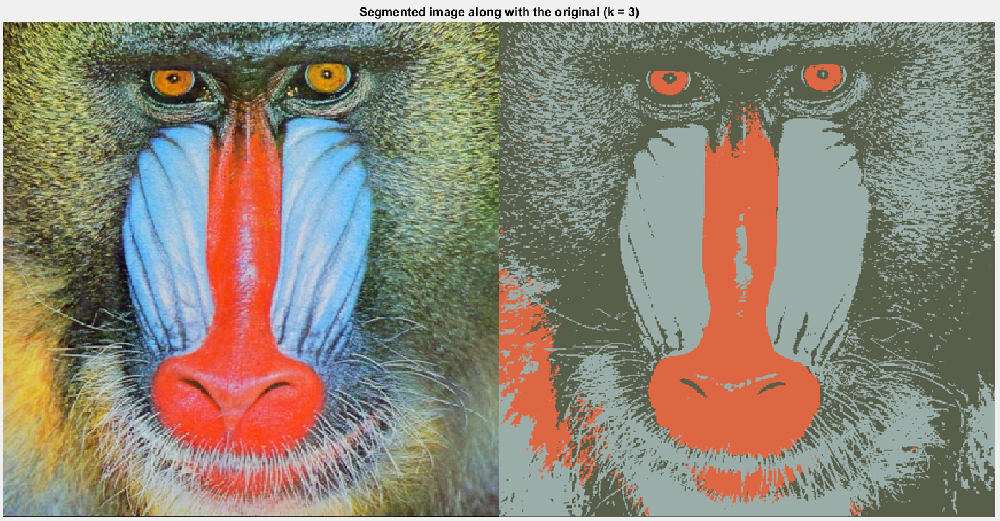 </p>

**With k = 20, the resulting image looks very similar to the original image. Subtle texture differences and lighting higlights are captured and it looks better visually. However, it becomes harder for segmentation because a single object now belongs to 3 or more clusters, so the algorithm can struggle to group them as one object.**

<p align="center"> 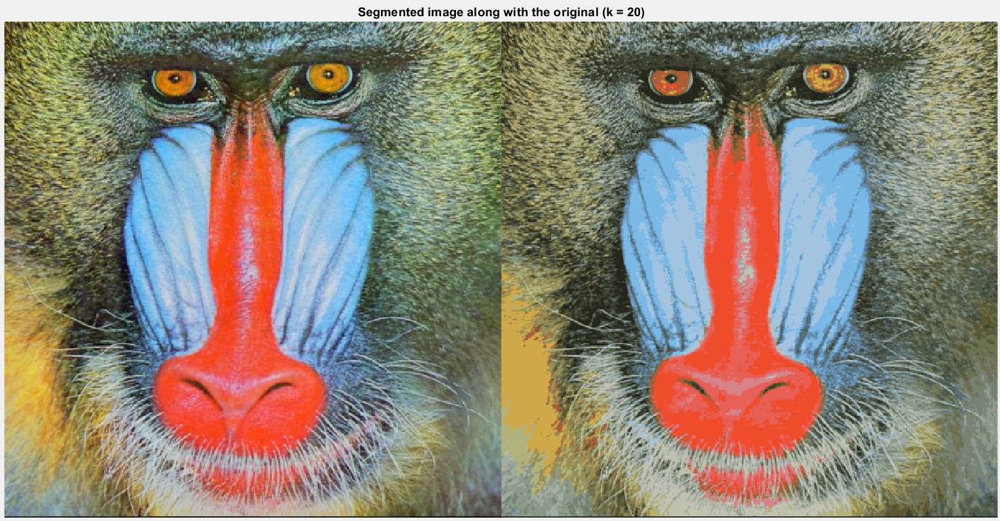 </p>


> Also, try segmenting the colourful image file 'assets/peppers.png'.

**Plotting the peppers.png pixel colours in a 3D RGB feature vector space reveals the range of colours present in the image. The dominanting colours are red, yellow, green, purple and white. The image has smooth colour transitions, the colours gradually blend into each other (green to yellow to red). Hence, the ideal segmentation must capture the main colour regions without breaking every gradual shade change into unnecessary segments.** 
<p align="center"> 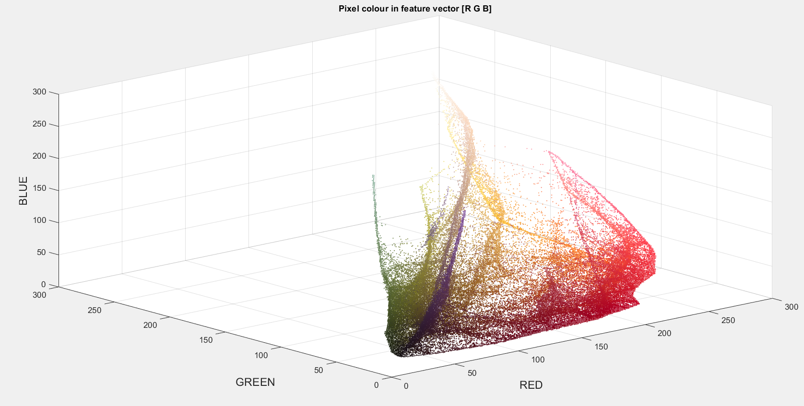 </p>

**At k = 5, the black centroids are mainly skewed toward the red colour region. As seen in the reconstructed image where the primary tone is red, yellow, white and dark purple, the algorithm fails to assign a cluster to the green colour space. The green peppers are misclassified in the dark purple and shadow clusters. Therefore, k needs to be increased further.** 
<p align="center"> 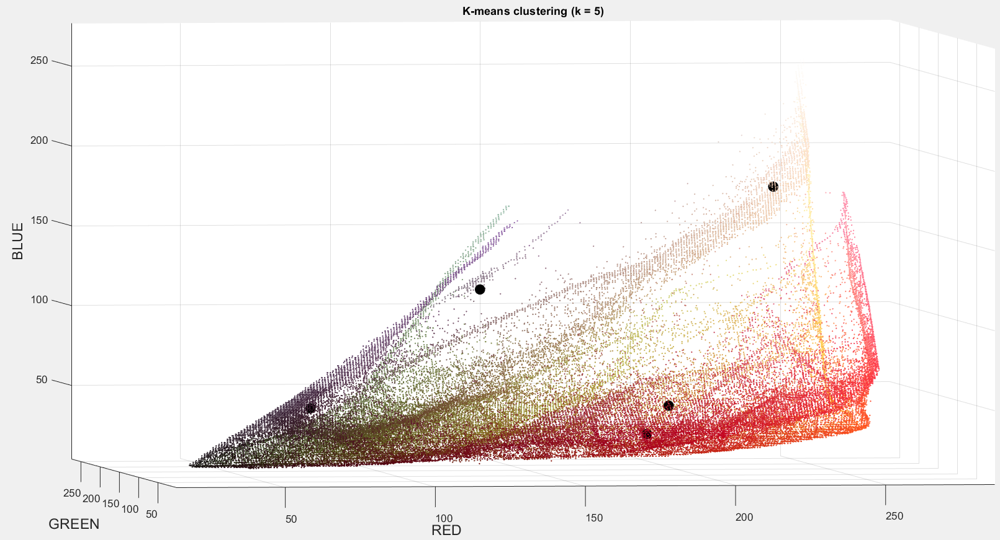 </p>
<p align="center"> 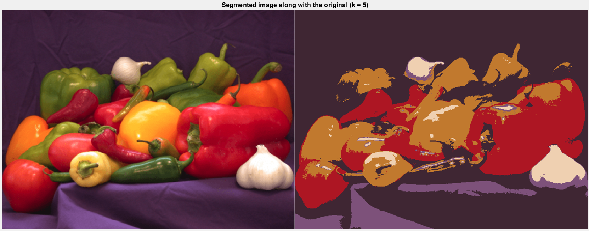 </p>

**At k = 12, the centroids disperse more evenly aross the space and are expanded to the green, orange and lighter purple regions. The reconstructued image has improved to distinctly segment the green peppers and every object in the image has been classified with the correct colour. Even with similar colours such as red and orange have now been isolated, so there are enough clusters to represent all major objects int eh image without execessive fragmentation.**
<p align="center"> 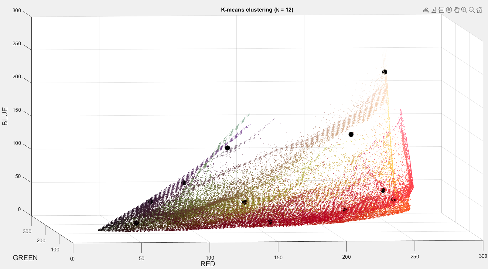 </p>
<p align="center">  </p>

**Increasing k to 15 dedicates centroids to capture "outlier" data and captures fine details such as lighting artifacts. As shown in the reconstructred image, the segmentation maps subtle shadows and colour reflections. For example, the lighting higlights on the yellow pepper (bottom left) are captured as distinct regions, as well as the purple-ish reflection on the skin of the garlic (bottom right). However, this leads to over-segmentation where single objects are brokwn into multiple segments based on lighting rather than being classified as one object.**  
<p align="center"> 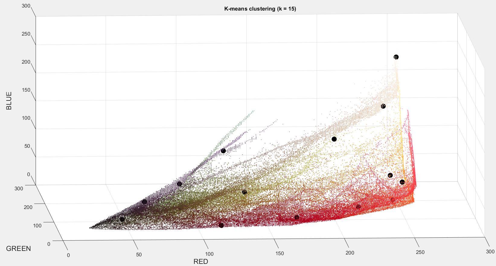 </p>
<p align="center"> 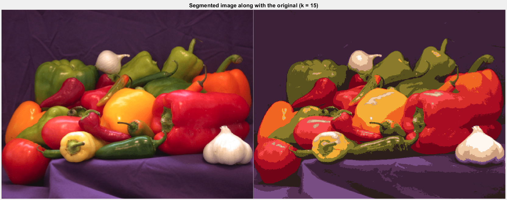 </p>


## Task 6 - Watershed Segmentation with Distance Transform

Below is an image of a collections of dowels viewed ends-on. The objective is to segment this into regions, with each region containing only one dowel.  Touch dowels should also be separated.
<p align="center"> 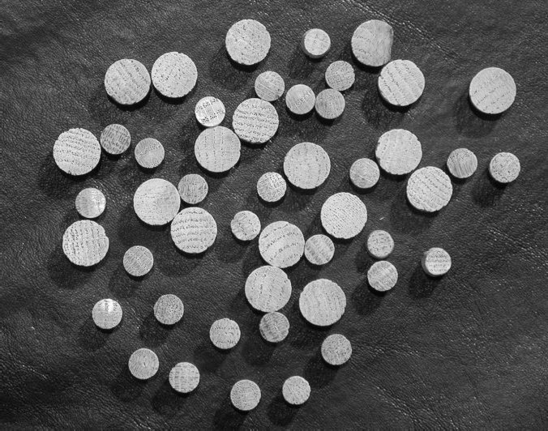 </p>
This image is suitable for watershed algorithm because touch dowels will often be merged into one object. This is not the case with watershed segmentation.

**In watershed segmentation, the pixel intensity of the image represents the altitude of the terrain. The landscape is flooded from below with water and as the water level rises, the catchment basins will be filled. Touching objects will not be merged into one object in watershed segmentation because as the water level continues to rise, when water from two different basins (object 1 and object 2) touch, the algorithm instantly builds a dam to prevent the waters from mixing. The dams become the boundaries of the segmentation of the image.**

Read the image and produce a cleaned version of binary image having the dowels as foreground and cloth underneath as background.  Note how morophological operations are used to reduce the "noise" in grayscale image.  The "noise" is the result of thresholding on the pattern of the wood.

```
% Watershed segmentation with Distance Transform
clear all; close all;
I = imread('assets/dowels.tif');
f = im2bw(I, graythresh(I));
g = bwmorph(f, "close", 1);
g = bwmorph(g, "open", 1);
montage({I,g});
title('Original & binarized cleaned image')
```

**The function graythresh automatically finds the optimal global threshold using Otsu's method. The image is then closed (dilation followed by erosion) to fill the gaps inside the dowels (caused by the wood pattern). A morphological opening operation is then carried out to remove small noise from the black background without shrinking the dowels. This results in a clean binary version of the original image.**
<p align="center"> 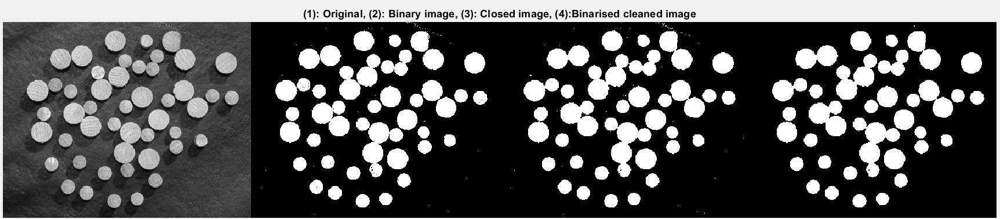 </p>
<p align="center"> 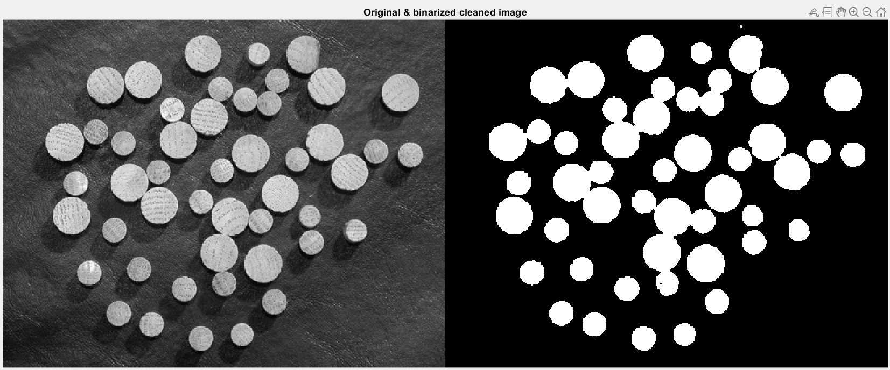 </p>


Instead of applying watershed transform on this binary image directly, a technique often used with watershed is to first calculate the distance transform of this binary image. The distance transform is simply the distance from every pixel to the nearest nonzero-valued (foreground) pixel.  Matlab provides the function **_bwdist( )_** to return an image where the intensity is the distance of each pixel to the nearest foreground (white) pixel.  

```
% calculate the distance transform image
gc = imcomplement(g);
D = bwdist(gc);
figure(2)
imshow(D,[min(D(:)) max(D(:))])
title('Distance Transform')
```

**Distance transform is needed for watershed segmentation because it tells the algorithm where the "centers" are so it knows where to start flooding. This is because watershed segmentation treats pixel intensity as altitude, without distance transform, the background's altitude is 0 and the white dowels' altitude is 1. This means if two dowels are touching, they will be represented as a flat figure-8 shaped plateau and there are no valleys for the water to start filling from. Distance transform creates topography out of a flat shape so the centers are the peaks since they are furthest away from the background. The points where dowels touch are closer to the background than the centers, so a saddle is formed between the two peaks.**   


> Why do we perform the distance transform on gc and not on g?   

**Distance transform is performed on gc (the inverted binary image of g) because of how the MATLAB bwdist() function works. bwdisct() function calculates the distance from every pixel to the nearest foreground (white) pixel. In g, the dowels are white, so if bwdist(g) is ran, every pixel inside will have a distance of 0, and the topology will be completely flat. By using gc where the white dowels become black (0) and the black background becomes white (1), the function now calculates the distance from the black pixels (pixels inside dowels) to the background and creating peaks and dips for the dowels.**

Note that the **_imshow_** function has a second parameter which stretches the distance transform image over the full range of the grayscale.

**The imshow function displays the result of distance transform as a grayscale image, where pixels with the shortest distance to the black background are stretched to black, and pixels with the furtherest distance to the black background (centers of dowels) are stretched to white. That explains why in the image below, that as you move inward from the edge of a dowel, the pixels get progressively lighter gray and the centers glow bright white. The faint, thin white lines connecting the bright centers are the topological ridges where two or more dowels are touching. These ridges act as saddle points between two peaks (centers of dowels) and will be where the watershed segemntation build the dams to separate the touching objects.**
<p align="center"> 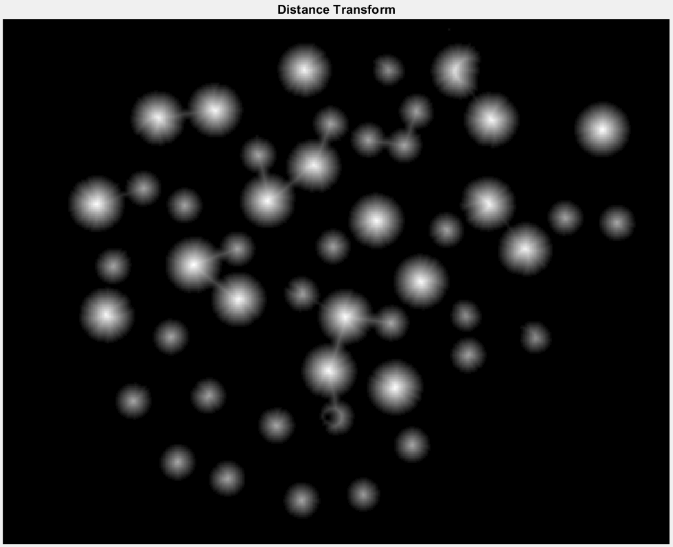 </p>


Now do the watershed transform on the distance image.

```
% perform watershed on the complement of the distance transform image
L = watershed(imcomplement(D));
figure(3)
imshow(L, [0 max(L(:))])
title('Watershed Segemented Label')
```

**So D stores the dowels' centers as bright white peaks whilst the background is flat basin. Since water flows downhill and watershed simulates rain falling in valleys which are local minima, the image is inversed so the dowels' centers are now valleys and the background is plateau. When the watershed() function runs, it starts flooding from the centers of the dowels until it hits the ridges where dowels touch and builds dam to separate them.** 
**The output L is a label matrix. Pixels along the boundaries of the dams are assigned 0, while each catchment basin is given a unique integer label. For instance, all pixels belonging to dowel 1 are labeled 1, and all pixels belonging to dowel 2 are labeled 2.** 
<p align="center"> 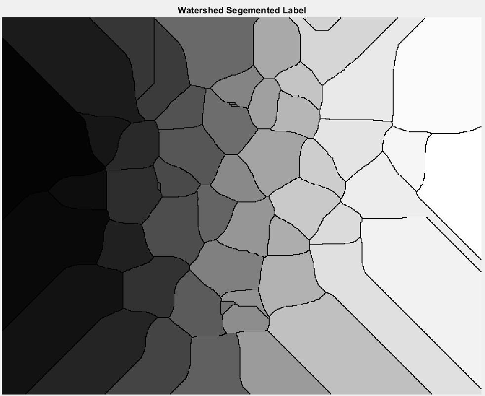 </p>


> Make sure you understand the image presented. Why is this appears as a grayscale going from dark to light from left the right? 

**The command [0 max(L(:))] finds the smallest number in L (which is 0, the boundary lines) and turns it to black, wheras the largest number in L (the last segmented dowel) is turned to white. All the labels in between them are converted evenly acorss the grayscale specturm. Therefore, the grayscale goes from dark to light from left to right because of the sequential order in which the dowels were identified. MATLAB is a column-major language so the watershed segmentation typically starts from the left-most column from top to bottom, then moves one column to the right. As it discovers new, unconected basins, it assigns them the next available sequential integer. Hence, the dowels on the left side receive the lowest numerical labels and appear dark gray, and the last dowels found on the right have the highest numerical labels and appear white.**


```
% Merge everything to show segmentation
W = (L==0);
g2 = g | W;
figure(4)
montage({I, g, W, g2}, 'size', [2 2]);
title('Original Image - Binarized Image - Watershed regions - Merged dowels and segmented boundaries')
```

> Explain the montage in this last step.

**The new binary image W isolates all the watershed boundary lines (where the pixels are labled as 0, where the dams are) as shown in the image below. The watershed algorithm assigns a unique integer label to each distinct dowel and specifically reserves the value 0 for the separation lines.**
**The logical OR operator (|) is used to combine g, the original cleaned binary image and W, the boundary image to create image g2. g2 = g | W dictates that a pixel will be white in g2 if it is white in g or if it is white so part of a boundary line in W. By overlaying the boundaries onto the cleaned binary image, we can see how the watershed transform drew lines to clearly separate touching objects.**

<p align="center"> 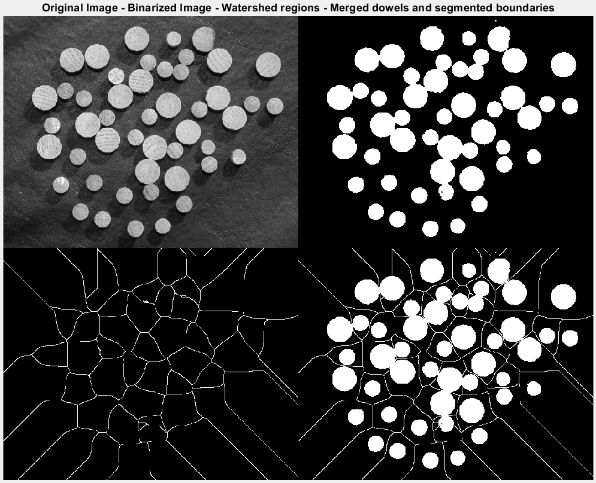 </p>

## Challenges

You are not required to complete all challenges.  Do as many as you can given the time contraints.
1. The file **_'assets/random_matches.tif'_** is an image of matches in different orientations.  Perform edge detection on this image so that all the matches are identified.  Count the matches.
   **To reduce noise from the texture on the table in the image, moropholocial closing and opening operations are used.** 
   ```
   g = bwmorph(f, "close", 1);
   g = bwmorph(g, "open", 1);
   ``` 
   
   **Sobel, LoG and Canny edge detection methods with default thresholds are then used to detect the edges in the matches image.**  
   <p align="center"> 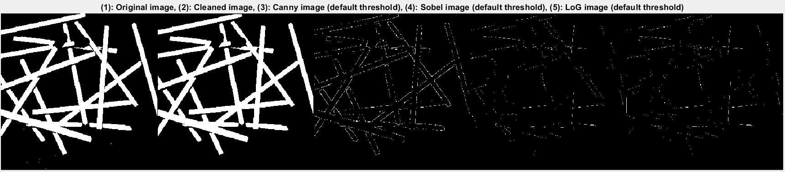 </p>
   **Counting the matches require morphological filling, which requires closed boundaries, so the edge detector that detects the most continuous edges is preferred. As shown in the above image, Canny edge detector is the most suitable. It creates the strongest and most continuous lines around the perimeter of every match. Although it picks up a massive amount of noise, these noise can be easily filtered out using morphological operations. For Sobel method, the edges of the matchsticks are broken, fragmented, and missing entirely. For example the match heads on the bottom blend into the background. As for LoG, the edges are not coherent and appeared as dashes.** 

   <p align="center"> 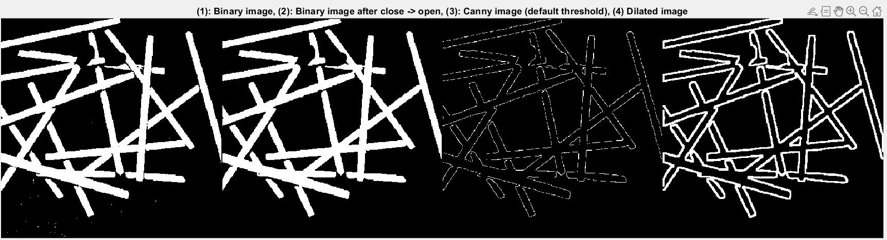 </p>
   **To improve visibility of the detected edges from Canny method, a structuring element of a disk of radius 3 is applied to dilate the image to thicken the edges. There are in total 15 matches. We have tried using Watershed segmentation, Hough Transform, and bwconncomp function to count the number of matches. However, we have failed to do so mainly because of the degree of overlap and intersection between matches. Nearly every match crosses or touches at least one other.**

   **bwconncomp fails because it operates on connected white pixel regions. imfill function cannot correctly isolate individual match regions because some of the edge boundaries are not completely enclosed. Hence, watershed segmentation was used instead to address this issue. However, watershed segmentation works well when objects are rounded and convex instead of long and thin shapes such as matches. When distance transform is performed, it produces a ridge line running along the length of the match, and incorrectly splitting one single match into multiple fragments. As the matches overlap, the distance transform creates an irregular saddle point and false dividing lines are created. Hough Transform is then used and produced the closest result (it counted 16 matches). However, due to the varying length nature of matches, the variable MinLength threshold that is high enough to suppress noise will disregard the shorter matches, whilst lowering it increase false detections.** 
   <p align="center"> 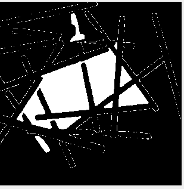 </p>
   <p align="center"> 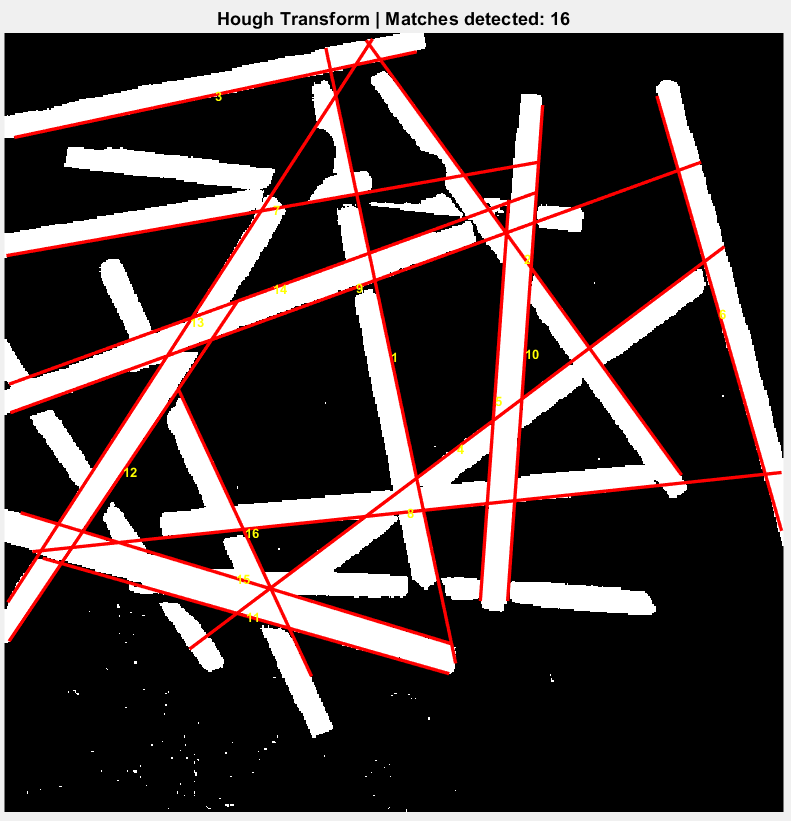 </p>

   To solve this, the endpoints rather than the bodies of the matches were counted. Since every matchstick, no matter how long it is and how it overlaps with others would have exactly two ends. 


2. The file **_'assets/f14.png'_** is an image of the F14 fighter jet.  Produce a binary image where only the fighter jet is shown as white and the rest of the image is black.
   **The f14 image is a grayscale image where the jet and the background share similar grayscale intensities which makes Otsu's method and k-means clustering difficult. They will inevitably group the lighter parts of the jet with the background. Since we can't separate the jet by its brightness, we use edge detection method to identify its boundary. As seen in the image below, Canny detector detects the most continuous and detailed edges, so it is used instead of Sobel and LoG.**
   <p align="center"> 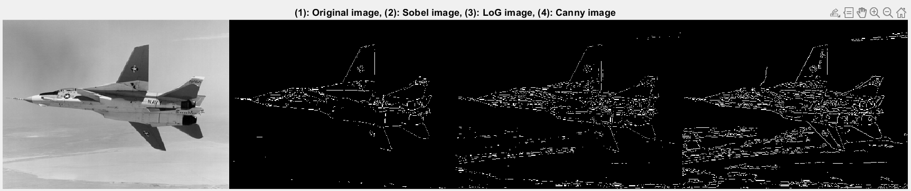 </p>
   
   **Since the default Canny threshold ([0.0125, 0.0313]) leaves gaps where the jet blends into the background, it was lowered to [0.01, 0.04] to make Canny more sensitive so that even faint intensity transitions can be identified. The side effect is that it makes the image incredibly noisy with plenty of edges around the lake and cloud, which can be processed later on.** 
   ```
   % Thicken all edges to ensure the jet boundary is fully closed
   se = strel('disk', 1);
   fDilate = imdilate(fEdge, se);

   % Fill the interior of the jet boundary 
   fFill = imfill(fDilate, 'holes'); 
   ``` 
   **The edges are thickened via morphological dilation to ensure a fully closed outline before filling. Morphological filling fills hollow outline into a solid white outline. Since it also fills small closed loops in the background such as the cloud and coastline, the bwareafilt function is used to keep the single largest connected white region - the jet, to remove the other irrelevant regions.**  
   ``` 
   fClean = bwareafilt(fFill, 1);
   % Close the gaps in jet boundary 
   se1 = strel('disk', 2);
   fClose = imclose(fClean, se1);

   % Fill one more time to ensure all jet interior is covered
   fFinal = imfill(fClose, 'holes');
   ``` 

   **Around the cockpit area, the edges are not connected so it is not filled. Morphological close is used to bridge these gaps using a disk of radius 2 before running imfill again to seal the region. As seen in the final image, the fighter jet is successfully shown as white and the rest of the image is black.**  
   
   <p align="center"> 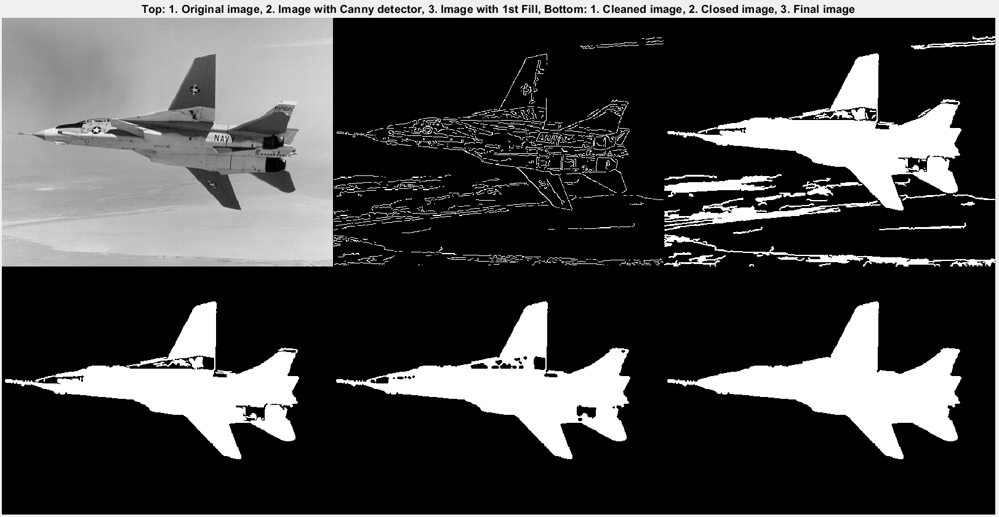 </p>


3. The file **_'assets/airport.tif'_** is an aerial photograph of an airport.  Use Hough Transform to extract the main runway and report its length in number of pixel unit.  Remember that because the runway is at an angle, the number of pixels it spans is NOT the dimension.  A line at 45 degree of 100 pixels is LONGER than a horizontal line of the same number of pixels.
   
4. Use k-means clustering, perform segmentation on the file **_'assets/peppers.png'_**.

**See Matlab/Task 5_2 and explanation in Task 5**
